# Now I know my A, B, Cs

<!-- ```{r input-setup-file_chap-01,child='_my-setup.Rmd'} -->

<!-- ``` -->

```{r fig-fig-chap-01-xkcd,fig.cap='From [xkcd](http://xkcd.com)',fig.margin=F, out.width='90%'}
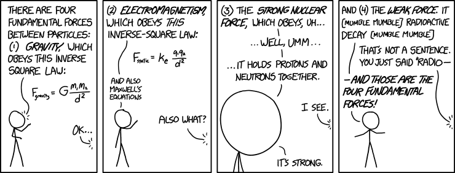
```


> ... I<br>a universe of atoms<br>an atom in the universe.'

> `r tufte::quote_footer('--- Richard P. Feynman')`


> 'The greatest enemy of knowledge is not ignorance, it is the illusion of knowledge' 

> `r tufte::quote_footer('--- Daniel J. Boorstin')`

## What we have in store for you

This chapter is devoted to fundamentals. 

We will introduce some new ideas and strengthen the ones we already know. We will use these ideas in the rest of the course for our journey from atoms to molecules.

We often have difficulty understanding certain concepts because the technical terms are also used in everyday life albeit with less precise meanings.

```{r embed2, out.extra='style="border: none;"', out.width='99%', fig.cap="ABCs for A2M", echo = FALSE}
knitr::include_url('https://www.youtube.com/embed/pyRlvIPN42Y')
```

<!-- <iframe width="560" height="315" src="https://www.youtube.com/embed/pyRlvIPN42Y" frameborder="0" allow="accelerometer; autoplay; encrypted-media; gyroscope; picture-in-picture" allowfullscreen></iframe> -->

## Vectors & scalars

```{r, child='_my-latex.Rmd'}

```

`r cap <- 'A vector has a size and a direction.'`

```{r fig-vector-arrow,fig.cap=cap, out.width='50%'}
knitr::include_graphics('./tex-figures/fig_vector_simple.png')
```

We can categorise quantities (e.g. temperature, force, energy, distance ) as being either a `r me.t("vector")` or `r me.t("scalar")`. 

A `r me.hi("scalar")` is 'something' that can completely be defined by `r me.hi("just a number")`(i.e. a size or magnitude). Examples are mass (50 kg), temperature (-20 $^\circ$C), distance (100 km), height (180 cm).   Scalar quantities are usually easier to use because they are just numbers. 

A `r me.hi("vector")` is 'something' that needs **two** things, to be completely defined. One is a **number** (called the magnitude or modulus), and the other is a **direction**. 
A vector quantity will not make sense without both these bits of information. Examples are a force (10 N downwards), velocity (50 km/h due north), displacement (10 m to the left). 

It is usual to indicate a vector using an arrow (see figure \@ref(fig:fig-vector-arrow)). The length and direction of the arrow represent the magnitude and direction of the vector, respectively.

We indicate that somethig is a vector by drawing a tiny arrow over the symbol like this: $\v{X}$. The magnitude of this vector $\v{X}$ is usally written (without the arrow) as $X$ or as $|\v{X}|$

`r cap <- 'Two or more vectors can be added to give a single resultant vector. In this examples the resultant $\\v{R}$ produces the same effect as the combination of vectors $\\v{F}_1$ and $\\v{F}_2$.'`

```{r fig-vectorResultant, fig.cap=cap,out.width='50%'}
knitr::include_graphics('./tex-figures/fig_vector_simple-addition.png')
```

### Components & resultant of a vector

```{r, child='_my-latex.Rmd'}

```

Adding and subtracting vectors are interesting since we need to take the direction into account. Two important concepts related to vectors are `r me.t("resultant")` and `r me.t("components")`. 

#### Resultant {-}

As shown in figure \@ref(fig:fig-vectorResultant), two vectors can be combined (added) to give one vector. This single vector is called the **resultant** of the two vectors and brings about the **same result** as the other vectors combined. The usual way to add vectors is to draw them **end to end** as shown. The vector completing the shape (shown in colour) in figure \@ref(fig:fig-vectorResultant) is the resultant.

#### Components {-}

`r sn <- '^[If we like we can split into many (i.e. more than two) components. This is usually not necessary.]'`

Just as we can combine different vectors to give one vector, we can do the reverse and split one vector into many parts or **components**. Figure \@ref(fig:fig-vectorComponents) shows three ways one vector ($\v{F}$ shown in colour) is being split into two other vectors`r sn`. 

One of the most **useful** ways to split is into two **perpendicular** directions as shown in the leftmost instance. 
<!-- However, we may split the vector parallel and perpendicular any other direction. $\alpha$ and $\beta$ below are two such examples. -->

`r cap <- 'Three ways the same vector (shown in <span class="new-term">colour</span>) is split into components.'`

```{r fig-vectorComponents,fig.fullwidth = T,fig.margin = F,  fig.cap=cap}
knitr::include_graphics('./tex-figures/fig_vector_components.png')
```

#### Perpendicular components {-}

`r cap <- 'Resultant of two perpendicualr vectors.'`
```{r fig-perpendicular-components, fig.cap=cap, out.width='50%'}
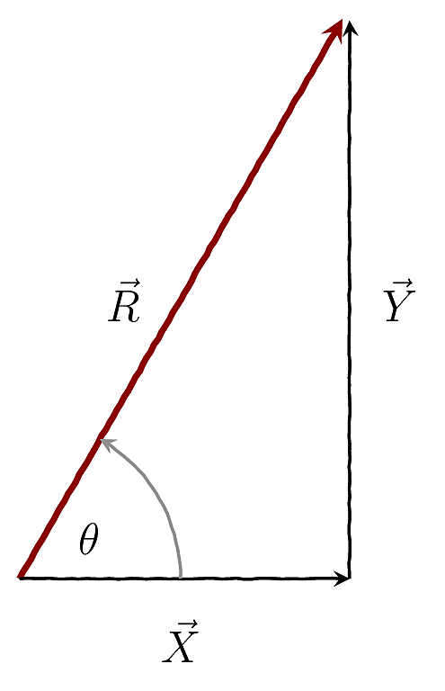
```

One of the most convenient ways to split a vector (e.g. force) is into two (or three, in 3D) perpendicular components. In such a situation we can obtain the resultant vector using Pythagoras' theorem. For the situation shown in figure \@ref(fig:fig-perpendicular-components) the size and direction of the resultant is obtained as

\begin{equation}
R = \sqrt{X^2 + Y^2} (\#eq:resultant-of-x-and-y)
\end{equation}

\begin{equation}
\tan \theta = \dfrac{Y}{X} (\#eq:resultant-of-x-and-y-angle)
\end{equation}

If you have three perpendicular ($\v{X}, \v{Y}, \v{Z}$) components then $R$ is given by:
\begin{equation}
R = \sqrt{X^2 + Y^2 + Z^2} (\#eq:resultant-of-x-y-z)
\end{equation}

#### Play with vectors {-}
You can try out all the ideas mentioned above using the following applet (from [PheT](https://phet.colorado.edu/)).

`r msmbstyle::question_begin(label = "ques:two")`

Use the applet (Lab) to find the resultant of the set of vectors shown in the adjoining figure. 

```{marginfigure,echo=T,out.width='50%'}
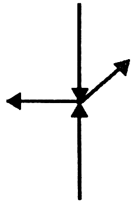
```

`r msmbstyle::question_end()`

<iframe src="https://phet.colorado.edu/sims/html/vector-addition/latest/vector-addition_en.html" width="800" height="600" scrolling="no" allowfullscreen></iframe>

```{r fig-forceWhat, fig.cap='A force is a push or a pull.'}
knitr::include_graphics('./my-figures/a2m_push-pull.png')
```

```{r fig-forceDo,fig.cap='A force can change the velocity of a mass.'}
knitr::include_graphics('./my-figures/a2m_force-do.png')
```
<!------------------------------------------------------>
## What is a force?
<!------------------------------------------------------>

### A simple definition

:::definition
A force is simply a push or a pull.
:::


```{r}
sn0 <- '^[What we mean here is a net or resultant force.]'
sn1 <- '^[**Velocity** is speed with a direction (e.g. 50 Km/h due north).]'
```

A force is a vector. Therefore we need to specify both the direction and magnitude to describe it completely. As shown in figure \@ref(fig:fig-forceDo), when a force`r sn0` acts on a mass it changes the velocity`r sn1` of the mass. I.e. a force can change the speed and direction of a mass.

The unit of force is the Newton (N)^[1 N is equivalent to the weight of a typical apple].

### Newton's Laws

Newton's three laws of motion nicely summarise our understanding of forces. We already know, through everyday experience, many of the features mentioned in the laws.

```{r}
sn0 <- '^[**Acceleration** is tells us how velocity changes(i.e. the speed and/or direction).]'
```
For example, we know from everyday experience that more force means more acceleration`r sn0`. We also know that more mass means less acceleration. We usually capture these ideas mathematically as

<span class="marginnote my-margin">
**Newton's 1^st^ Law**: An object will continue in its state of rest or uniform (unaccelerated) motion in a straight line unless acted upon by an external force. <br>Also note that a 'force' here means a resultant force.
<br><br>
**Newton's 2^nd^ Law**: The acceleration of an object depends on the external force and object's mass.
<br><br>
**Newton's 3^rd^ Law**: When an object A exerts a force on an object B, object B exerts an equal and oppositely directed force on object A
</span>

\begin{equation}
a = \dfrac{F}{m} (\#eq:newton2)
\end{equation}

This is Newton's 2^nd^ law.

Newton's 1^st^ law tells us what a force can do. Its says that **a force changes motion** of an object. This law is related to the idea of inertia. See the next section (section \@ref(sec-mass)) for more details.

```{r fig-newton-3rd, fig.cap='Forces always occur in pairs. Note that only the forces relevant to the block are shown.'}
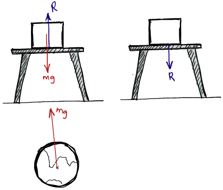
```

Newton's 3^rd^ law tells us that **all forces occur in pairs**.  There are **always two** objects involved with forces. 

Take a look at figure \@ref(fig:fig-newton-3rd) for an example of some action-reaction pairs. 

|        Force        |             Force             |           Force pair           |
| :-----------------: | :---------------------------: | :----------------------------: |
|    Weight ($mg$)    | On the block due to the Earth | On the Earth due to the block |
| Contact force ($R$) | On the table due to the block | On the block due to the table  |

```{r}
sd0 <-'^[There *are* situations where Newton\'s laws of motion do not work. A good example is when you are in an accelerating train (technically referred to as a frame-of-reference). We do not have to worry about these in A2M. However, this is an extremely interesting topic that leads to the concept of *fictitious forces*.]'
```

### Example: Constant force on an object {#sec-eg-constantForce}

Consider the situation shown in figure \@ref(fig:fig-constantForce) where a constant force acts on a mass over a distance $x$.

Lets first consider what our everyday experience tells us. We expect that the speed  of the mass should increase. Let see if a mathematical analysis based on Newton's laws gives a similar conclusion.

```{r fig-constantForce,fig.margin = F, out.width='100%', fig.cap='A constant force $F$ acting on a mass over a distance $x$.'}
knitr::include_graphics('./my-figures/a2m_constant-force-mass.png')
```

`r me.panic("If you are uncomfortable with calculus worry not! We will get you up to speed in the next chapter!")`

Starting with Newton's 2^nd^ law:

$$
\def\hi{\color{darkred}}
\def\hii{\color{darkgreen}}
\def\hiii{\color{darkblue}}
\def\ie{\text{I.e.}:}
\begin{aligned}
F = m \mathHigh{a}  &= m \mathHigh{\frac{d \hi v}{dt}}\\ 
%&= m \frac{d \hi v}{dt} \times\left( \dfrac {d  \hii x} {dx}\right) \\
&= m \frac{d  \hi v}{dx}\times\mathHigh{\dfrac {d \hii x} {dt} }  	\mnote{Using the chain rule: $\dfrac{dA}{dB}=\dfrac{dA}{dC}\times \dfrac{dC}{dB}$}\\
&= m \,\frac{d\hi v}{dx} \times \mathHigh{v}	\\%\label{eq:vdvdx}\eqn\\
\ie \dfrac {F} {m}&=v\dfrac {dv} {dx}\\
\Rightarrow  \mathHigh{\dfrac {F} {m}} \int _{0}^{x}dx &=\int _{u}^{v}vdv\\
\ie\mathHigh{a} \bigg[x \bigg] _{0}^{x}&=\left[ \dfrac {1} {2}v^{2}\right] _{u}^{v}\mnote{$a$ is constant}\\
\there ax&=\dfrac {v^{2}-u^{2}} {2} 
\end{aligned} 
$$
This leads to:

\begin{equation}
v^{2}=u^{2}+2ax (\#eq:v2u2)
\end{equation}


<!-- ```{r} -->
<!-- sd <-'^[If you are wondering; the maximum speed that can be attained in this simple model is infinite. However, this is not a very realistic situation as we have not included resistive forces such as air-resistance and friction. If you really, want to be picky, then you need to think of Einstein\'s Theory of Special Relativity which dictates that the maximum speed that anything can attain is the speed of light($c$).] ' -->
<!-- ``` -->

Notice how this equation *beautifully* explains what we knew intuitively but in the concise language of mathematics. 
For instance, that the speed will increase if the force acts for a longer distance. Or that the speed will remain steady if there is no force ($a=0$).

<!----------------------------------------------------------------------->
## Mass, Inertia & Momentum
<!----------------------------------------------------------------------->

### What is Mass {#sec-mass}

`r me.t("Mass")` indicates how much matter there is in an object and is a fundamental property^[Like `r me.t("charge")` and `r me.t("spin")`]. Mass also is a measure of how reluctant the object is to change its motion. More specifically, mass is an indication of how difficult it is to speed up, slow down or change the direction motion of the object. We call this property of matter (i.e. its 'stubbornness' to a change in motion) `r me.t('inertia')`.

`r sn0 <- '^[So you **do not** need a force to **maintain** motion. In everyday life it *appears* otherwise because of frictional forces.]'`

Due to this reluctance, objects like to maintain whatever state of motion they are in. This means objects at rest like to stay at rest and those in motion like to continue moving (in a straight line)`r sn0`. This is what is stated in Newton's 1^st^ Law. 

### What is momentum?

```{r fig-momentum,out.width='100%',fig.cap="A fast light, bullet can hurt you as much as a slow massive lorry."}
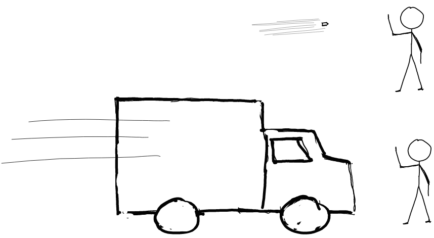
```

```{r fig-momentumConserved, fig.cap="Momentum is conserved. The total momentum before and after is the same if there are no external forces."}
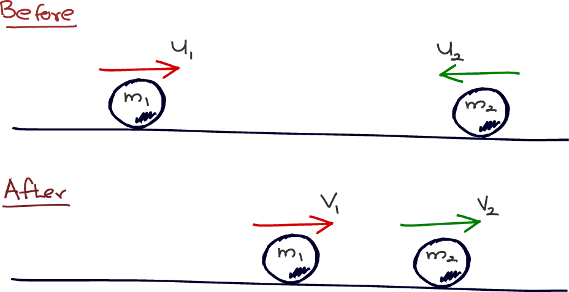
```

We know if a moving object hits us, it can hurt us by exerting a force. We know by experience that it is the combination of mass($m$) and speed($v$) that will determine how much 'hurt' we will experience (see figure \@ref(fig:fig-momentum)). I.e. it is the quantity $mv$ that decides how much hurt we experience. This vector quantity $m \vec{v}$ is called `r me.t("momentum")` and is given the symbol $\vec{p}$. 

The unit of momentum is kgm/s.

#### Momentum is conserved {-}

Very importantly **momentum is a conserved** quantity^[Just like energy.]. I.e. the total momentum of a system is constant provided there are no external forces present. 

For the system shown in figure \@ref(fig:fig-momentumConserved), we can write:
$$
\begin{aligned}
\text{momentum before}  &= \text{momentum after}\\
%m_{1} \vec{u_{1}}  + m_{2}\vec{u_{2}}  &= m_{1}\vec{v_{1}} +m_{2}\vec{v_{2}}  
\end{aligned}
$$

\begin{equation}
m_{1} \vec{u_{1}}  + m_{2}\vec{u_{2}}  = m_{1}\vec{v_{1}} +m_{2}\vec{v_{2}}   (\#eq:momentum-conservation)
\end{equation}

#### Momentum & Force {-}
The action of a force can be described using the idea of momentum. In fact Newton defined force, as *how fast momentum changes*.

This is easier to understand mathematically:

\begin{equation}
F = ma = m\dfrac{dv}{dt}= \dfrac{d(mv)}{dt}= \dfrac{dp}{dt} (\#eq:2nd-law)
\end{equation}

```{r}
sd0 <- '^[**Newton\'s 2^nd^ Law (using momentum):** The rate of change of momentum of an object is equal to the force acting on the object and takes place in the direction of the force.]'
```

This is exactly how a force is described in Newton's second law`r sd0`.

#### Momentum & $KE$ {-}

We can recast $KE$ (see section \@ref(sec:KE)) in terms of momentum:
\begin{equation}
\text{KE}  = \frac{1}{2} mv^2 = \frac{1}{2} \frac{(mv)^2}{m} = \frac{p^{2}}{2m}  (\#eq:KE-in-p)
\end{equation}

#### Example: $\Delta \vec{p_{}}$ for a bouncing ball {-}

```{r fig-bouncing-ball,out.width='85%',fig.cap="What is the change in momentum when a ball bounces off a hard wall?"}
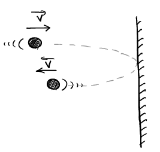
```

Consider the situation shown in figure \@ref(fig:fig-bouncing-ball). A ball of mass $m$ bounces off a hard surface. There is no loss in energy so the ball bounces back at the same speed.

The change in momentum of the ball is given by:
$$
%\newcommand{\v}[1]{\vec{#1_{}}}
\begin{aligned}
&\text{change in momentum}\\ &= \Delta \vec{p} \\
&= \vec{p_\text{after}} - \vec{p_\text{before}} \\
&= m\v{v} - m(-\v{v}) \\
&= 2m\v{v}
\end{aligned}
$$

If we know the time $\Delta t$ it took for this change in momentum, we can determine the force^[This is the force **on the ball** due to the wall.] using equation \@ref(eq:2nd-law) as

\begin{equation}
F = \dfrac{\Delta \v{p}}{\Delta t} (\#eq:xxx)
\end{equation}


<!----------------------------------------------------------------------->
## Energy & Work
<!----------------------------------------------------------------------->

```{r, child='_my-latex.Rmd'}

```

### What is energy?

```{r fig-useful-energy, fig.cap='The potential energy of the block being converted to do `something useful'}
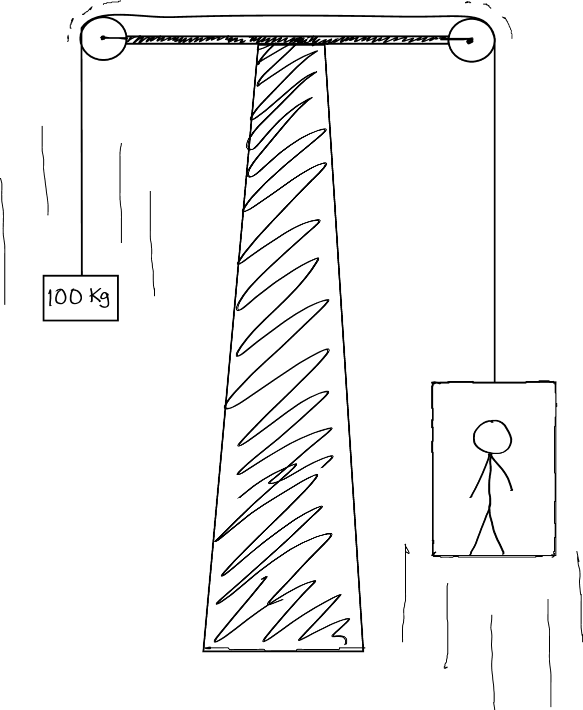
```

Lets start with the following simple (intuitive) description of `r me.t('energy')`^[Yes(!) this definition is a bit vague to say the least. Lets use this for the moment until we encounter the concept of `r me.t("work")`.]. 

:::definition
Energy can be described as the ability to do 'something' useful.
:::

There are many forms of energy (e.g. light, heat,  potential energy, kinetic energy). The forms of energy most important for A2M are potential energy\,($PE$) and kinetic energy\,($KE$).

`r sn0 <- "^[Energy cannot be created nor destroyed but can be converted from one form to another.]"`

**Energy** is also a **conserved quantity**`r sn0`. 

<!-- :::definition -->
<!-- Energy cannot be created nor destroyed but can be converted from one form to another. -->
<!-- ::: -->

The S.I. unit of energy is the Joule (J)

<!------------------------------------------------------>
### Forces can transfer energy
<!------------------------------------------------------>

If you recall an instant when you used a force, you will realise that forces also do another very important thing. 

:::definition
A force allows us to transfer energy!
:::

Whenever you lift an object or push an object you transfer energy from one form to another (e.g. lifting: chemical energy $\rightarrow$ $PE$, pushing: chemical energy $\rightarrow$ $KE$) through the action a force. Note, however, that a force **does not always** facilitate the transfer of energy (e.g. when you are pushing a wall). 

This idea of forces transferring energy is fundamentally essential to understand how energy makes our Universe work. We use the concept called `r me.t("work")` to quantify and understand the 'energy transferring ability' of a force. Work allows us to *elegantly* capture (and understand) our intuitive ideas of forces and energy mathematically.
 
 
<!------------------------------------------------------>
### The concept of work\label{sec:work}
<!------------------------------------------------------>

```{r fig-work-constant, fig.margin=F, fig.cap='A constant force acting on an object.'}
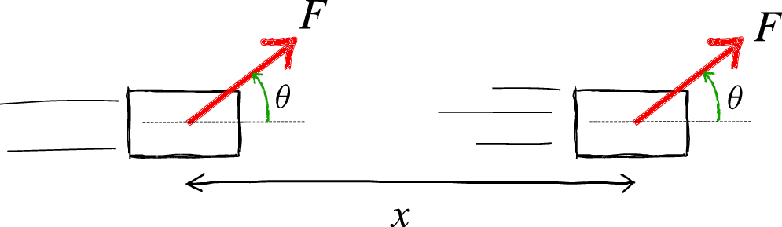
```

The amount of energy transferred by a force^[This is shorthand for saying: '*...transferred by the person applying the force...*'] is described by the concept of ($W$). The definition of work allows us to easily calculate the amount of energy transferred by a force^[E.g. to identify if a force  transfers energy or not].

`r me.panic("Again! If you are uncomfortable with calculus worry not! We will get you up to speed in the next chapter!")`

:::definition
\begin{equation}\label{equ:}
\displaystyle W=\left\{
\begin{array}{lll}
& \displaystyle F\,x \cos \theta &\text{(a constant force)}\\[10pt]
&\displaystyle \int F\,dx \cos \theta &\text{(a variable force)}\\
\end{array}\right. (\#eq:defineWork)
\end{equation}
:::

$\theta$ is the angle between the force and the direction in which the force is moving (i.e. the direction of $\vec{x}$ or $dx$) as shown in figure \@ref(fig:fig-work-constant).

```{r fig-work-variable, fig.margin=F, fig.cap='A variable force acting on an object.',out.width='85%'}
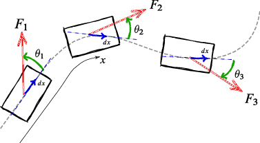
```

The most general definition of work is the one with the integral of equation \@ref(eq:defineWork). This is because calculus is able to handle situations where things (e.g. angle) change such as in figure \@ref(fig:fig-work-variable). 

It is important to note that **energy is a scalar** quantity! It is only a number. However, this number can be either **positive or negative**! We will talk more about this later.

<!------------------------------------------------------>
### Example: Work \& Kinetic Energy {#sec:KE}
<!------------------------------------------------------>


```{marginfigure,echo=T}

```

Let's convince ourselves of the power of the concept of work. Let's see if we can arrive at an equation for kinetic energy($KE$) using our definition of work. 

Remember the simple example of a force acting on a mass that we discussed in section \@ref(sec-eg-constantForce) and which was shown in figure \@ref(fig:fig-constantForce) (reproduced on the right).

The work done, $W$, by a constant force $F$ over a distance $x$ is given by:

<span class='marginnote'>
Using equation \@ref(eq:v2u2) for $a$.
<span>

$$
\begin{align*}
W &= \mathHigh{F} x  \cos 0^{\circ} = \mathHigh{ma}  x \\
&= m \left(\frac{v^{2}-u^{2}}{2x}\right) x \\%\mnote{using equation \@ref(eq:v2u2) for $a$}\\
&= \frac{1}{2}mv^{2}-\frac{1}{2}mu^{2} \mdescrip{Change in KE}
\end{align*}
$$

Viola! We see that the energy the force has transferred has gone into increasing a quantity defined by $\displaystyle \dfrac{1}{2}mv^{2}$ (i.e. a quantity that is determined by only mass and speed). This is in the origin of the mathematical expression for KE!

### Example: Who does work?

```{r fig-realConstantForce, fig.margin=F,fig.cap='Lets try to determine the work done by all the forces acting on the object.'}
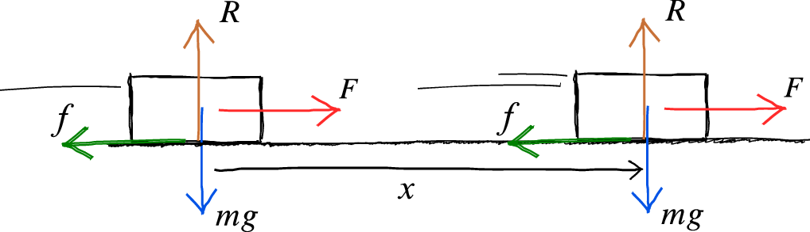
```

`r sn0 <- "^[What we call weight is the gravitation force on us due to the Earth. Our weight depends on our mass $m$ and a value $g$ (=9.8 m/s^2^) that represents the strength of gravity due to the Earth.]"`

Consider the situation shown in figure \@ref(fig:fig-realConstantForce). A constant force ($F$) is acting on a mass that is also being acted on by friction ($f$), weight ($mg$)`r sn0`  and a reaction from the ground ($R$). The work done by the various forces is shown in table \@ref(tab:workForces).

Table: (\#tab:workForces) The work done by the various forces acting on the object.

| Force               | Angle ($^\circ$) | Work                 |
| :------------------ | :--------------: | :------------------- |  
| Push ($F$)          |       $0$        | $Fx\cos 0 = Fx$      |  
| Contact force ($R$) |       $90$       | $R x \cos 90 = 0$    |  
| Weight ($mg$)       |       $90$       | $mg\, x \cos 90 = 0$ |  
| Friction ($f$)      |      $180$       | $f x \cos 180 = -fx$ |  
| **Total work**      |                  | $(F-f)x$             | 

Not all the forces do work. The one doing positive work transfers energy into making the object go faster. Those doing negative work (e.g. friction $f$) impedes motion by 'zapping' energy away from $KE$. In a situation such as this we say that *$F$ does work against $f$*. 

The total energy transferred and KE gained is given by:

\begin{equation}
\text{Total work done} = (F-f)x = \Delta(K.E) (\#eq:eg-work-total)
\end{equation}

## Back to Energy

Now that we understand what work is; let's improve on our previous vague definition of energy.

:::definition
Energy is the ability to do work.
:::

## A Worthy Digression

### Temperature

`r me.t('Temperature')` is a manifestation of the KE of the particles that make up an object. The more energy we give particles the more they move. The average KE ($\overline{K.E}$) that a population of particles have at temperature $T$ is given by:

\begin{equation}
\overline{K.E}=\frac{3}{2} k_B \,T    (\#eq:avgKE)%\mdescrip{The meaning of `temperature'} 
\end{equation}

$k_B$ is Boltzmann's constant ($k_B = 1.381\times10^{-23}\unit{J/K}$)

Notice how the concept of temperature has a meaning only when we speak of a larger number of particles.

The quantity $k_B T$ represents the amount of energy that molecules possess when at equilibrium at a given temperature. This quantity is **supremely** important in **all of science** as it allows us to quantify the effect of temperature on physical, biological and chemical systems.
 

<!-- ### {Energy Distributions} -->

<!-- \paragraph{Maxwell-Boltzmann Distribution} -->

<!-- \begin{figure} -->
<!-- \includegraphics[width=\linewidth]{./figures/maxwellBoltzman.pdf} -->
<!-- \caption[The Maxwell-Boltzmann distribution.]{As the temperature changes, the speed at which the particles in a system moves about also changes. The Maxwell-Boltzmann distribution of describes how many particles in a given population has a speed between $v$ and $v+dv$. Notice how the average KE increase and also how the distribution becomes becomes more flatter as the temperature rises.} -->
<!-- \label{fig:maxwellBoltzmann} -->
<!-- \end{figure} -->
<!-- Temperature only specifies the average KE of a population of particles. In fact the particles in the systems have a distribution of (i.e. a spread of different) speeds. This distribution is called the \q[+]{Maxwell-Boltzmann Distribution}. This distribution of speeds in shown in \fref{fig:maxwellBoltzmann} for three different temperatures. As you can see, the speeds at which the particles move change as the temperature changes. -->

<!-- \paragraph{Boltzmann Distribution} -->
<!-- The Maxwell-Boltzmann distribution relates to specifically to how the speeds of a population are distributed. However, this idea of particles having different energies and that the average energy is representative of the temperature is applicable to all the systems that we will encounter in A2M. This is irrespective of weather the energy is in the form of KE or  any other forms! This more general distribution of particles is given by the \q[+]{Boltzmann Distribution} which can be expressed as: -->
<!-- \begin{equation}\label{equ:boltzmannDistribution} -->
<!--  \frac{n_2}{n_1} = e^{-\left(\dfrac{E_2-E_1}{k_B T}\right)} = e^{-\Delta E/k_B T} -->
<!-- \end{equation} -->

<!-- \noindent $n_1$ is the number of particles with energy $E_1$ and $n_2$ is the number of particles with energy $E_2$ when the population is at a \emph{steady} temperature $T$. -->


<!-- This is \emph{one of the most important relations in all of science}. -->
 

## My 3 Cents

1. Have a clear picture of the **meaning** and the **inter-connections** between concepts. Examples from this section are force, energy, work, mass, inertia and momentum. <br>Try to see these concepts in as many perspectives as possible. Put your understanding to the **Aunty Test**.
2. There is a story behind everything. Try to understand the **story** behind mathematical **equations** (e.g. equation \@ref(eq:defineWork) ). Notice that mathematics can succinctly express our intuitive understanding of the world. Appreciate that it also empowers us to go beyond to develop insights and make predictions.
3. **Always** draw a big, clear diagram showing the relevant details when trying to solve a problem.
