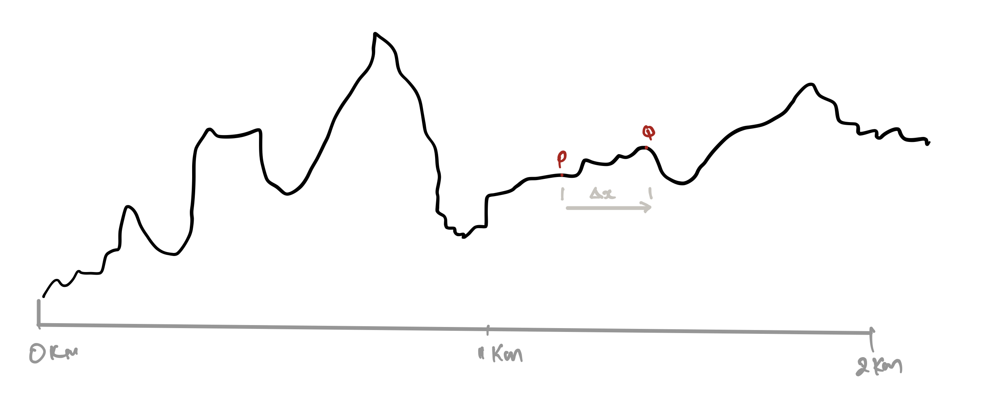
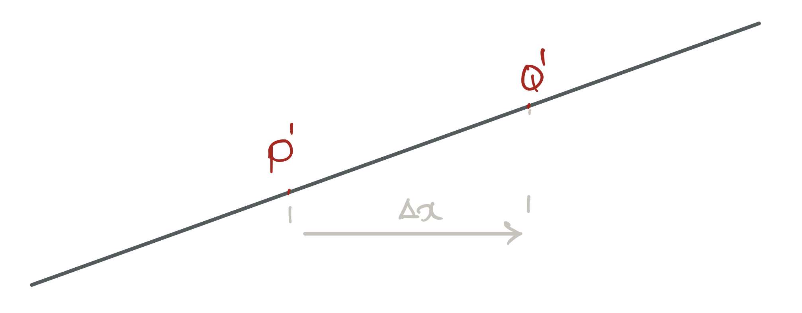
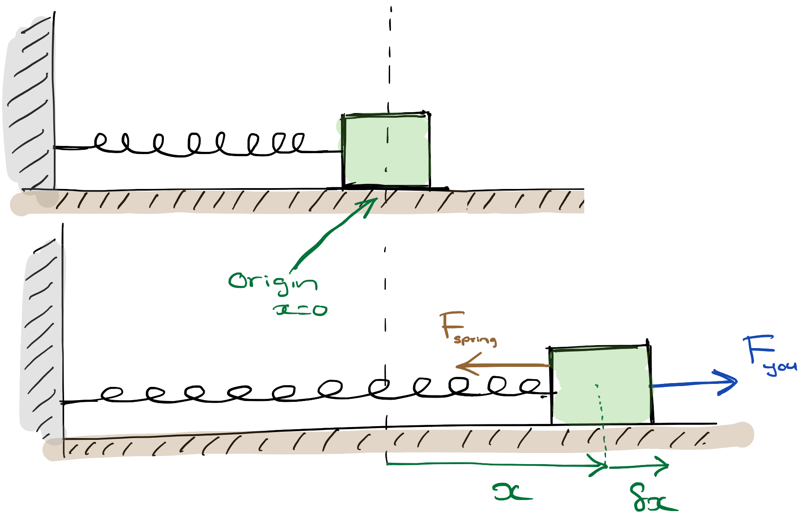

# Calculus: The Power to Tame Change

<!-- ```{r input-setup-file_chap-02,child='_my-setup.Rmd'} -->
<!-- knitr::opts_chunk$set(tidy = F, cache.extra = packageVersion('msmbstyle'), # msmb -->
<!--                       echo = F, warning=F, cache=F, -->
<!--                       fig.margin = T) -->
<!-- options(htmltools.dir.version = FALSE) -->
<!-- ``` -->

<br>

```{r fig-fig-chap-02-xkcd,fig.cap='From [xkcd](http://xkcd.com)',fig.margin=F}
knitr::include_graphics('https://imgs.xkcd.com/comics/newton_and_leibniz.png')
```


> 'God does not care about our mathematical difficulties - he integrates empirically.'

> `r tufte::quote_footer('--- Albert Einstein')`

> 'Oh, Calculus; Oh, Calculus,<br>
  How tough are both your branches.<br>
  Oh, Calculus; Oh, Calculus,<br>
  To pass what are my chances?<br>
  Derivatives I cannot take,<br>
  At integrals my fingers shake.<br>
  Oh, Calculus; Oh, Calculus,

> `r tufte::quote_footer('--- Denis Gannon')`

## What we have in store

```{r video-chap-02-main, out.extra='style="border: none;"', out.width='99%', fig.cap="ABCs for A2M", echo = FALSE}
knitr::include_url('https://www.youtube.com/embed/t4pZPcq1tHM')
```

As scientists, we try to observe, understand and then predict ‘things’ in our Universe. However, most (interesting) systems are dynamic in that they change in response to parameters that affect the system, often in intricate feedback loops^[One of the simplest examples is [Robert Malthus](https://en.wikipedia.org/wiki/Thomas_Robert_Malthus)‘ idea (way back in the 18th century) of how populations grow. He observed that the change in a population must depend on the present size of the population.]. 

If we are to understand how a system works fully, we need a **language that can help us think about change**. This will allows us to translate our observations into mathematics which in turn will lead to deeper insights into what we are studying. **Calculus is this language**.

### Differentiation and Integration: the two sides of the calculus coin

```{marginfigure,echo=T}
<br>
We will **not** pay much attention to these formulae. Instead we will use software for calculations and focus our energies on understanding **what** calculus is.
```


The two central ideas in calculus are **differentiation** and **integration**.

**Differentiation** describes how things change (e.g. large population means a large growth). **Integration** allows us to tame (capture, handle, understand) this change.

Our focus in this chapter is to understand the essence of calculus so that we can use it to understand science. We will be careful to make our discussion mathematically sound but we will **not** pay much attention to the ‘mechanics’ of differentiation or integration(see side). When necessary we will use software tools such as Wolfram Alpha and SymPy to work through the mathematics^[`r me.colour('If you are from a mathematical discipline, you should work these out by hand')`].

Specifically, by the end of this chapter we want to be able to:

1. think and talk about change using calculus without confusion and with mathematical rigour,
2. translate everyday observations into mathematical models than can then provide deeper insights.

### Why we fuss about change?

Consider the three examples below:

* The change in the height($h$) of a mountain terrain due to a change in the distance ($x$) from a town.
* How much the dilation of your eyes change($w$) in response to a change in the ambient light($I$).
* The change in the size($r$) of nitrogen bubbles in a SCUBA diver’s blood due to a change in her depth($y$).

Let me take one of these to highlight the need for calculus. 

In the case of the SCUBA diver; nitrogen bubbles can lead to a severe condition called the bends^[Caisson disease, decompression sickness.] if the diver comes to the surface too fast. It is, therefore, crucial to understand how the nitrogen bubbles dissipate as the diver surfaces. How fast a bubble dissolves depends on its size. If the size had remained the same, it would be easy to estimate the rate of dissipation, but this is not the case. Calculus gives us the tools to handle this change in size and calculate a safe rate of ascent.

The other examples above, all have a parameter that changes and needs to understood using the tools of calculus.

## Differentiation

### Symbols

* How fast something is changing (i.e. the idea of differentiation) is denoted by the **symbol** $\dfrac{dA}{dB}$. 
* We call $\dfrac{dA}{dB}$ the *'derivative of $A$ with respect to $B$'*
* $\dfrac{dA}{dB}$ tells us how $A$ reacts to a change in $B$. 

:::definition
$\dfrac{dA}{dB}$ is shorthand for  '***the rate of change of $A$ with respect to $B$***' and tells us **how much $A$ will change if we change $B$ by one unit**.
:::

Lets use this notation to rewrite the previous examples:

- $\dfrac{dh}{dx}$ = how much the height will change (in metres) if we move **away** from the village by **1** km.
- $\dfrac{dw}{dI}$ = how much the size of a pupil will change (in millimetres) in response to an **increase** in the ambient light by **1** Lumen.
- $\dfrac{dr}{dy}$ = how much the radius of the nitrogen bubble changes dues to an **increase** in the depth by **1** m.


### Some observations about differentiation

Consider the first example of the height in a  mountainous region.

*  $\dfrac{dh}{dx}$ expresses mathematically what we know as ‘steepness’. Sometimes we describe this same idea using terms such as *rise-over-run* or *gradient.*
*  The sign of $\dfrac{dh}{dx}$ has a meaning:

<div style="width:50%;margin-left: 15%;margin-right: auto;" class="my-table">
| $\dfrac{dh}{dx}$ | Meaning  |
| :--------------: | :------: |
|      +‘ ve       |  Uphill  |
|        0         |   Flat   |
|      -‘ ve’      | Downhill |
</div>

```{r fig-chap-02-calculus-mountain-w-points,fig.cap='The height ($h$) various as the distance ($x$) changes.',fig.margin=F}

```
* The greater the value of $\dfrac{dh}{dx}$ the steeper is the ascent (or descent). So the value of  $\dfrac{dh}{dx}$ tells us how the terrain changes.<br> It is important to convince yourself that  $\dfrac{dh}{dx}$ changes from **point to point** (see figure \@ref(fig:fig-chap-02-calculus-mountain-w-points)). This is how it tells us **how** 'up and down' the terrains is. 

### Let's look closer

Let's consider how we can **use** the idea of differentiation. 

Refer to figure \@ref(fig:fig-chap-02-calculus-mountain-w-points); say you are standing at point $P$ and you move to point $Q$ that is a distance $\Delta x$ away. If you want to calculate how much the height has changed ($\Delta h$) from $P$ to $Q$, you can do so by^[The symbol $\approx$ means ‘approximately’]:

\begin{equation}
\Delta h \approx \left.\dfrac{dh}{dx}\right|_{\text{(at P)}}\times \Delta x
(\#eq:calculus-approx-h)
\end{equation}

```{r fig-chap-02-calculus-slope,fig.cap='The height ($h$) various as the distance ($x$) changes.'}

```

For instance, if $\Delta x = 10 \text{ m}$  and  $\dfrac{dh}{dx}=50 \text{ m/km}$ at $P$, then $\Delta h \approx 0.5 \text{ m}$.

However, $\Delta h$ is an **approximation** which gets better the smaller we make $\Delta x$! Are you confused?! Before we discuss **why** this is an approximation and **why** things get better when $\Delta x$ is smaller, let's consider another example that is shown in \@ref(fig:fig-chap-02-calculus-slope). 

For this slope, when you move from $P'$ to $Q'$
\begin{equation}
\require{color}
\Delta h \textcolor{red}{=} \left.\dfrac{dh}{dx}\right|_{\text{(at P')}}\times \Delta x  (\#eq:chap-02-dummy-001)
\end{equation}

Notice the **equality** sign! Do you now see why the first is an approximation and the second an equality? Yes! the terrain between $P'$ and $Q'$ is a clean **straight** slope; not so between $P$ and $Q$. 

Now lets consider why the approximation \@ref(eq:calculus-approx-h) for $\Delta h$ gets better as you  make $\Delta x$ small. The answer is quite simple; the closer $P$ is to $Q$, the ‘straighter’ $PQ$ becomes! 


### Defining Differentiation

What if you wanted to calculate the value of $\dfrac{dh}{dx}$ at the point $P$? For this, you can stand at $P$ and take a **small** step $\delta x$ ^[We are using $\delta$  (and not $\Delta$) to highlight that we are interested in only very, very small, infinitesimal, changes] and measure the tiny change $\delta h$ of height. 

We can then write:
$$
\left.\dfrac{dh}{dx}\right|_\text{(at P)}\approx \dfrac{\delta h}{\delta x} (\#eq:chap-02-dummy-002)
$$

If you want to make the above into a equality, you have to make $\delta x$ even smaller. We can tell this story succinctly mathematically:
$$
\left.\dfrac{dh}{dx}\right|_\text{(at P)}= \lim_{\delta x \rightarrow 0} \left(\dfrac{\delta h}{\delta x}\right) (\#eq:chap-02-define-differentiation)
$$

You read the left hand side (LHS) as ‘*the limit  of $\dfrac{\delta h}{\delta x}$,  as $\delta x$ approaches zero*‘’

**Please** convince yourself that the LHS is a symbol and the RHS is a fraction.

#### Another way to say the same thing {-}

Sometimes, you will see people express the idea in equation \@ref(eq:chap-02-define-differentiation) as:
$$
dh =\left(\dfrac{dh}{dx}\right)dx (\#eq:chap-02-define-differentiation-alternate)
$$

- It is understood that there is a limit. 
- It tells us how to connect the $dh$  to the change $dx$.
- If you noticed, $\dfrac{dh}{dx}$ is **appearing** to act like a fraction^[However, the similarity to a fraction will make it easy to remember this relationship].

## An apple a day...

To proceed with our discussion we need to make a fruity digression…

```{r video-chap-02-apple, out.extra='style="border: none;"', out.width='99%', fig.cap="A fruity digression.", echo = FALSE}
knitr::include_url('https://www.youtube.com/embed/lTihh8rw2DY')
```

Let us summarise some of the main ideas:

1. We want to find the volume of an apple.

2. We cannot use the formula $\dfrac{4}{3}\pi R^3$ for a ball (sphere) because the apple is not spherical. It does not have one radius; the **radius changes** as we go across the apple.

3. So we use the strategy:
<div class="my-sublist">
   1.  Cut the apple into **cylindrical** slices so that each slice has **one** clear radius($r$) and thickness($t$).
   2. Use the formula $\pi\,r^2t$ to find the **small** volumes of the slices.
   3. We can then **approximate** the volume of the apple ($V$) as:
   $$
   \newcommand\f[1]{(\text{volume of slice #1})}
    \newcommand\g[1]{(\pi\, r^2_{#1} t_{#1})}
    \begin{align*}
    V &\approx \f{1} + \f{2}+ \f{3} + \ldots \\
    &\approx \g{1} +\g{2}+\g{2}+\ldots \\
    & \approx \sum \g{n}
    \end{align*}
   $$
</div>   
4. You must be careful how you cut your slices. You must end up with slices you know how to analyse (recall the ‘wrong’ type of slices in the video).

5. We can improve our result by cutting thinner slices (because this makes the radius and thickness better defined).


### The Strategy

Our strategy is to split an unknown problem (apple) into many known (cylindrical slices). We then increase the accuracy by making the ‘slices’ thin. This is **the** trick that makes all of calculus work; so you should understand and remember this mantra:

:::definition
Split an unknown problem into smaller known slices and then take the limit to increase accuracy.
:::

## Examples

```{r, child='_my-latex.Rmd'}

```

### Example 1: The Volume of a Sphere

In the case of the apple my laughable culinary skills made it impossible to make the slices very thin. However, we can make our slices as mathematical thin as we want if we do the calculation on paper. Let me demonstrate by proving that the volume of a sphere is given by $\dfrac{4}{3}\pi R^3$. This example will also show us how integration comes into the picture.

```{r video-chap-02-sphere, out.extra='style="border: none;"', out.width='99%', fig.cap="A fruity digression.", echo = FALSE}
knitr::include_url('https://www.youtube.com/embed/V6G7byS48aU')
```

#### The solution {-}

The volume of the slice at $x_n$ is given by

$$
\delta V_n \approx \pi\,y_n^2 \delta x=\pi\,(R^2-x_n^2)\delta x
$$

Lets add all the slices to get the total volume:

$$
\require{color}
\newcommand\f[1]{\delta V_{#1}}
\newcommand\m[1]{\qquad {\color{gray}\text{(#1)}}}
\begin{align*}
V &\approx \f{1} + \f{2} + \f{3}+\ldots \approx \sum_{x=-R}^{x=+R}\pi\,(R^2-x_n^2)\delta x \\
\Rightarrow V &\textcolor{red}{=}\lim_{\delta x\rightarrow 0}\left[\sum_{x=-R}^{x=+R}\pi\,(R^2-x_n^2)\delta x \right] \m{i.e. make the slices thin}\\
&= \int_{x=-R}^{x=+R}\pi\,(R^2-x_n^2)dx \m{Integration is the same as adding many slices} \\
&= \dfrac{4}{3}\pi R^3 \m{We can use software to get this}
\end{align*}
$$

This example introduced a new, crucial concept that connects a sum to integration^[This is called the Riemann integral].

:::definition
$$
\int_{a}^{b} dA = \lim_{\delta x\rightarrow 0}\,\sum_{a}^{b}\delta A (\#eq:riemann)
$$
:::

### Example 2: The Energy Stored in a Spring

Lets try to model a rubber band. Specifically lets see how much energy is stored in a stretched rubber band when it is extended to a length $l$.

First, some basic ideas. 

1. We know from everyday experience that if we stretch a rubber band that it gets harder to pull the more we stretch it. This idea was ‘discovered’ by Robert Hooke^[Newton’s nemesis] :

$$
F_\text{spring}= k x (\#eq:hookes-law)\m{Hooke’s Law} 
$$

2. The energy stored in the rubber band is the work that you do when you stretch the rubber. This is not difficult to calculate because we already know how to calculate work!

$$
W=F\,x \cos \theta (\#eq:defineWork)
$$

But, do you see why this problem is complicated? You cannot just simply combine the above equations because the **force changes** as you stretch the rubber. We need to figure out a way to make the force 'constant'.

#### The solution {-} 

```{r fig-chap-02-calculus-spring,fig.cap='Doing work to stretch a spring.'}

```

Consider the system when the spring is stretched by an amount $x$ from its position of equilibrium, as depicted in the lower drawing of figure \@ref(fig:fig-chap-02-calculus-spring). If you now stretch the spring farther, slowly, by an **infinitesimal** amount, $\delta x$, we can assume that the force in the spring remains constant.

The small amount of work $\delta W$ that **you** do is:
$$
\delta W \approx F_\text{you}  \times \cos 0 \times \delta x = F_\text{you}  \delta x
$$

The total work ($W$) you need to do to stretch the spring over a large length can now be obtained by:
$$
W \approx  \delta W_1+ \delta W_3+ \delta W_2\ldots = \sum_{x=0}^{x=l} \delta W_i
$$

We can improve the accuracy of this approximation by making the `slices', $\delta x$ very small.<br>
The best we can do is:
$$
\begin{align*}
 W = \lim_{\delta x\rightarrow 0} \sum_{x=0}^{x=l} \mathHigh{\delta W_i} &= \lim_{\delta x\rightarrow 0} \sum_{x=0}^{x=l} \mathHigh{F_\text{you}\delta x} = \int_{x=0}^{x=l} F_\text{you}d x
\end{align*}
$$
Since we are stretching the spring slowly, we can say that: \(F_\text{you}=F_\text{spring} = kx\)

Hence,
$$
W =  \int_{x=0}^{x=l}  F_\text{you}d x =  \int_{x=0}^{x=l}  F_\text{spring}dx =\int_{x=0}^{x=l}  kx\,dx = \dfrac{1}{2}k l^2
$$

## Some Other Topics

### A Chain Rule

Consider this scenario: 

1. The quality ($Q$) of my work depends on how much coffee ($C$) I consume, which is described by $\dfrac{dQ}{dC}$. 
2. The quality of my work also depends on how awake ($A$) I am, which is described by $\dfrac{dQ}{dA}$ 
3. How awake I am depends on how much coffee ($C$) I consume, which is described by $\dfrac{dA}{dC}$. 

Then I can say:
$$
\dfrac{dQ}{dC}=\dfrac{dQ}{dA}\times \dfrac{dA}{dC} 
$$

In case you want a proof:

* $\delta Q$ is the increment in quality due to me consuming a small amount of coffee $\delta C$.
* $\delta A$ is the increment my 'awakeness' due to me consuming a small amount of coffee $\delta C$.

$$
\begin{align*}
\dfrac{\delta Q}{\delta C}&=\dfrac{\delta Q}{\delta A} \times\dfrac{\delta A}{\delta C} \\
\Rightarrow\lim_{\delta C\rightarrow 0} \left(\dfrac{\delta Q}{\delta C}\right)&=\lim_{\delta C\rightarrow 0} \left(\dfrac{\delta Q}{\delta A}\right) \times\lim_{\delta C\rightarrow 0} \left(\dfrac{\delta A}{\delta C}\right) \\
\Rightarrow\lim_{\delta C\rightarrow 0} \left(\dfrac{\delta Q}{\delta C}\right)&=\lim_{\color{darkred}\delta A\rightarrow 0} \left(\dfrac{\delta Q}{\delta A}\right) \times\lim_{\delta C\rightarrow 0} \left(\dfrac{\delta A}{\delta C}\right) \m{Because $\delta A \rightarrow 0$ as $\delta C\rightarrow 0$}\\
\therefore \qquad\dfrac{dQ}{dC}&=\dfrac{dQ}{dA}\times \dfrac{dA}{dC} \\
\end{align*} 
$$


### Higher order derivatives

We can differentiate a function multiple times. Differentiating twice gives a 2nd order derivative, trice a 3rd order derivative and so on. Here is  how we write these:
$$
\begin{align*}
\text{1st order}&: \dfrac{dh}{dx}\\
\text{2nd order}&: \dfrac{d}{dx}\left(\dfrac{dh}{dx}\right) = \dfrac{d^2h}{dx^2}\\
\text{3rd order}&: \dfrac{d}{dx}\left(\dfrac{d^2h}{dx^2}\right) = \dfrac{d^3h}{dx^3}\\
\end{align*}
$$
Remember, that the $\dfrac{d^n h}{dx^n}$ is the symbol for the $n\,$th order derivative. We will encounter these when we discuss measurements in quantum mechanics

### Differential Equations

A differential equation is a story written using symbols from differentiation.
So, 
$$
\dfrac{dh}{dx} = 10
$$
is a differential equation that says that the rise-over-run (gradient) is 10.  

A solution to a differential equation is a function that will satisfy it (e.g. $h(x)=10x+50$). These solutions can either be **analytical**^[I.e. in functional form. E.g. \(y(t) = 3t^3 + 5t\)] or **numerical**^[I.e. a list of $(t,y)$ numbers.]. We will encounter many differential equations in A2M. But, we will be more interested in the story that they are saying than how we can solve them.

#### An Example
The differential equation below describes the decay of radioactive nuclei in a sample:
$$
\dfrac{dN}{dt}=-\lambda N
$$
Where $N$ is the number of nuclei present, $t$ is time and $\lambda$ is a constant (called the decay constant).  

Let's try to 'solve' this equation. Lets start with equation \@ref(eq:chap-02-define-differentiation-alternate).  We can then write
$$
\begin{align*}
dN&=\left(\dfrac{dN}{dt}\right)dt \\
\text{i.e.}\qquad dN&=-\lambda N dt \\
\text{i.e.}\qquad \dfrac{dN}{N}&=-\lambda dt \\
\Rightarrow \int \dfrac{dN}{N} &= -\lambda\int dt \\
\Rightarrow \ln N &= -\lambda t + C \m{$C$ is a constant}\\
N &= e^{-\lambda t + C} = e^{-\lambda t}  e^C  
\end{align*}
$$

At the start ($t=0$), $N=N_0$, which means $N_0 = e^C$. 

So our solution becomes:
$$
N=N_0e^{-\lambda t}
$$

Usually, one just combines several of the steps for brevity:

$$
\begin{align*}
\dfrac{dN}{dt}&=-\lambda N\\ 
\Rightarrow \int_{N_0}^N \dfrac{dN}{N} &= -\lambda\int_0^t dt \\
\text{i.e.}\qquad \left.\ln N \right|_{N_0}^N &= -\left.\lambda\right|_0^t\\
\text{i.e.}\qquad\ln\dfrac{N}{N_0}&=-\lambda t \\
\text{i.e.}\qquad N&=N_0e^{-\lambda t}
\end{align*}
$$

## My 3 cents

1. Differentiation tells us how fast something changes.  Integration is the same as adding a large number of thin ‘slices’.
2. The strategy to handle things that change: **split into smaller, suitable, known slices then take the limit and add** to turn into an integral.
3. Focus your attention on understanding the story that differential equations are saying and (if you are not from a mathematical discipline) leave the ‘mechanical’ part of calculus to a computer.