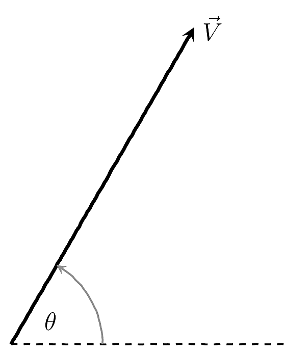
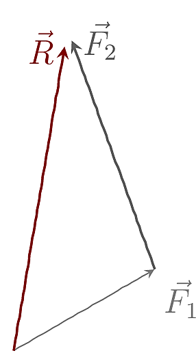
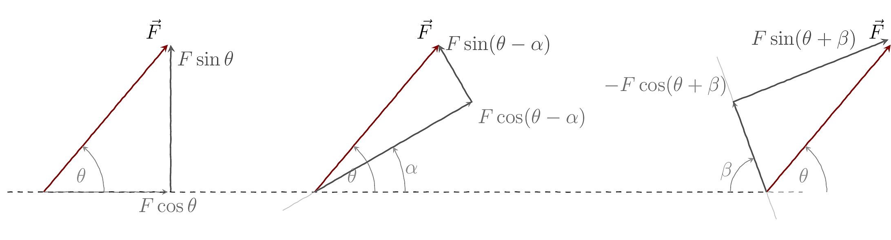
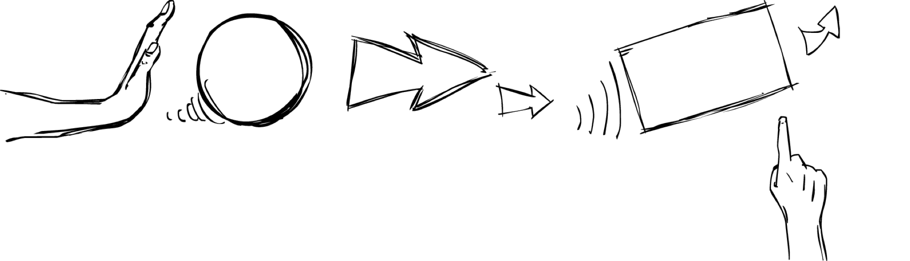
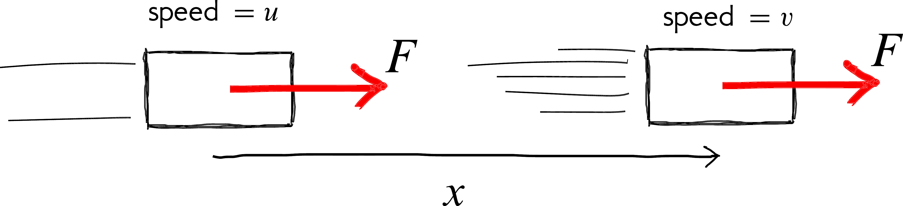

# ABC's

```{r, child='_my-functions.Rmd'}

```

## Vectors & scalars

We can categorise quantities (e.g. temperature, force, energy, distance ) as being either a `r me.hi("vector")` or `r me.hi("scalar")`. 

A `r me.hi('scalar')` is something that can *completely* be defined by just giving a number. Examples are mass (50 kg), temperature (-20 $^\circ$C), distance (100 km), height (180 cm).   Scalar quantities are usually easier to use because they are just numbers. 


```{r fig-vector-arrow,fig.margin = TRUE, out.width='75%', fig.cap='A vector has a size (magnitude) and a direction. It is usual to indicate a vector using an arrow. The length and direction of the arrow represents the magnitude and direction of the vector respectively.'}

```

A vector is something that needs *two* things, to be completely defined. One is a number (called the magnitude or modulus), and the other is a direction. A vector quantity will not make sense without both these bits of information. Examples are a force (10 N downwards), velocity (50 km/h due north), displacement (10 m to the left). 

A vector has a size (magnitude) and a direction. It is usual to indicate a vector using an arrow (see figure \@ref(fig:fig-vector-arrow)). The length and direction of the arrow represents the magnitude and direction of the vector respectively.

## Components & resultant of a vector

```{r fig-vectorResultant,fig.margin = TRUE, out.width='75%', fig.cap='Two or more vectors can be added to yield a single resultant vector. The usual way to add vectors is to draw them end to end as shown. The vector completing the shape colour is the resultant.'}

```
Adding and subtracting vectors are interesting since we need to take the direction into account. Two important concepts related to vectors are `r me.hi("resultant")` and `r me.hi("components")`. 

 
As shown in figure \@ref(fig:fig-vectorResultant), two vectors can be combined (added) to give one vector. This single vector is called the `r me.hi("resultant")` of the two vectors and *brings about the same result as the other vectors combined*.

Just as we can combine different vectors to give one, we can do the reverse and split one vector into many parts. One of the most useful ways is to split into two perpendicular directions as shown in figure \@ref(fig:fig-vectorComponents).

```{r fig-vectorComponents,fig.fullwidth = T, out.width='100%', fig.cap='Shown are three instances where the same vector (shown in <span class="high"><span class="high">colour</span></span>) is split into components.  First parallel and perpendicular to the horizontal and two directions at angles $\\alpha$ and $\\beta$. Often the most convenient is the split into two components that are perpendicular to each other.'}

```

<!------------------------------------------------------>
## What is a force?
<!------------------------------------------------------>

```{r fig-forceWhat,fig.margin = TRUE, out.width='100%', fig.cap='A force is a push or a pull.'}


```

`r me.def("A force is simply a push or a pull.")` 


```{r fig-forceDo,fig.margin = TRUE, out.width='100%', fig.cap='A force can change the velocity of a mass.'}

```
A force is a vector and we need to specify both the direction and magnitude to describe a force. As shown in figure \@ref(fig:fig-forceDo), when a force^[What we mean here is a net or resultant force.] acts on a mass it changes the velocity of the mass. I.e. a force can change the speed and direction of a mass.

We know from everyday experience that more force means more acceleration. We also know that more mass means less acceleration. These ideas^[This is Newton's 2^nd^ law of motion. It is usually written<br> \(F=ma\)] can be captured mathematically as 


$$a = \dfrac{F}{m}$$ 


<!----------------------------------------------------------------------->
## Mass
<!----------------------------------------------------------------------->
`r me.hi("Mass")` indicates how much matter there is in an object and is a fundamental property^[Like `r me.hi("charge")` and `r me.hi("spin")`] of matter. Mass also is a measure of how reluctant the object is to change its motion. More specifically, mass is an indication of how difficult it is to speed up, slow down or change the direction of the object. This property of matter (i.e. its 'stubbornness' to a change in motion) is referred to as `r me.hi('inertia')`.

Due to this reluctance, objects like to maintain whatever state of motion they are in. This means objects at rest like to stay at rest and those in motion like to continue moving (in a straight line). So *you do not need a force to maintain motion*^[In everyday life it *appears* otherwise because of frictional forces. ]. 

This is what is stated in Newton's 1^st^ Law^[Newton's 1^st^ Law: An object will continue in its state of rest or uniform (unaccelerated) motion in a straight line unless acted upon by an external force.]. 


## A Simple Example {#sec:eg:constantForce}

Consider the situation shown in \fref{fig:eg:constantForce} where a constant force acts on a mass over a distance $x$.

From our everyday experience we expect that the speed  of the mass should increase in the situation shown. Let see if a mathematical analysis of the situation yields a similar conclusion.

```{r fig-constantForce,fig.margin = F, out.width='100%', fig.cap='A constant force $F$ acting on a mass over a distance $x$.'}

```
 
Starting with Newton's 2^nd^ law:

$$
\begin{aligned}
\newcommand{\mathHigh}[1]{#1 }
\def\hi{}
\def\hii{}
\def\hiii{}
\def\ie{\text{I.e.}:}
\newcommand\mnote[1]{}
\def\there{}
F = m \mathHigh{a}  &= m \mathHigh{\frac{d \hi v}{dt}}\\ &= m \frac{d \hi v}{dt} \times\left( \dfrac {d  \hii x} {dx}\right) \\&= m \mathHigh{\dfrac {d \hii x} {dt} }  \times	\frac{d  \hi v}{dx}\\
&= m \,\mathHigh{v}  \,\frac{d\hi v}{dx}	\\%\label{eq:vdvdx}\eqn\\
\ie \dfrac {F} {m}&=v\dfrac {dv} {dx}\\
\Rightarrow  \mathHigh{\dfrac {F} {m}} \int _{0}^{x}dx &=\int _{u}^{v}vdv\\
\ie\mathHigh{a} \bigg[x \bigg] _{0}^{x}&=\left[ \dfrac {1} {2}v^{2}\right] _{u}^{v}\mnote{$a$ is constant}\\
\there ax&=\dfrac {v^{2}-u^{2}} {2} 
\end{aligned} 
$$
This leads to:
$$
v^{2}=u^{2}+2ax 
$$


```{r}
sd <-'^[If you are wondering; the maximum speed that can be attained in this simple model is infinite. However, this is not a very realistic situation as we have not included resistive forces such as air-resistance and friction. If you really, want to be picky, then you need to think of Einstein\'s Theory of Special Relativity which dictates that the maximum speed that anything can attain is the speed of light($c$).] '
```

<br><br>
Notice how this equation beautifully explains what we intuitivley knew, but in the succinct language of mathematics. 
For instance that the speed will increase`r sd` if the force acts for a longer distance. Or that the speed will remain steady if there is no force ($a=0$).


<!-- $$ -->
<!-- \begin{align*} -->
<!--  AR(p): Y_i &= c + \epsilon_i + \phi_i Y_{i-1} \dots \\ -->
<!--  Y_{i} &= c + \phi_i Y_{i-1} \dots -->
<!--  z = \mathHigh{x} -->
<!-- \end{align*} -->
<!-- $$ -->
