# Electrostatics: The Way Charges Talk

<!-- ```{r input-setup-file_chap-03,child='my-setup.Rmd'} -->

<!-- ``` -->
<br>
```{r fig-xkcd-urgent-mission, fig.cap='From [xkcd](http://xkcd.com)',fig.margin=F, out.width='50%'}
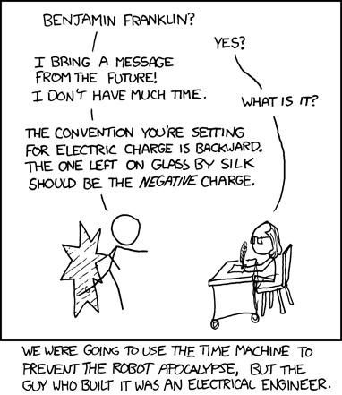
```

## What we have in store
<br>

```{r video-chap-03-main, out.extra='style="border: none;"', out.width='99%', fig.cap="Electrostatics", echo = FALSE}
knitr::include_url('https://www.youtube.com/embed/DpXi43yuFXQ')
```

Electrostatic forces between charges are fundamental to how atoms and molecules interact. In this chapter, we will try to understand the basics of this electrostatic interaction in terms of energy.  This will take us through electrostatic fields, electrostatic forces to electric potential energy. These concepts, in turn, will be crucial to understanding the quantum mechanical description of atoms and molecules.

<!----------------------------------------------------------------------->
## Charges \& Coulomb's law
<!----------------------------------------------------------------------->

```{r fig-chargeBasics, fig.cap='The basic interaction between charges.'}
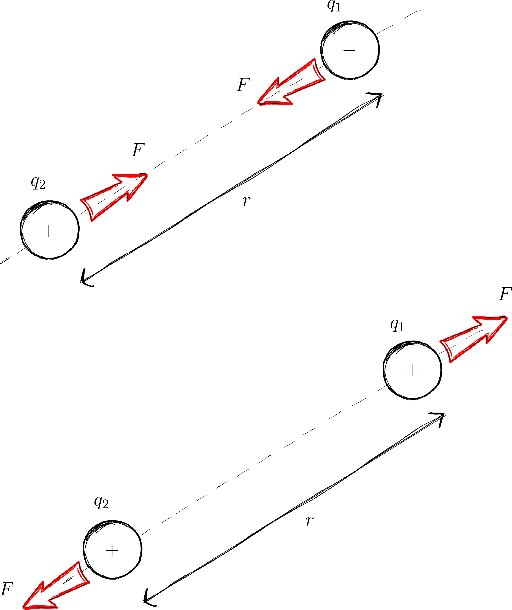
```

`r me.t("Charge")` is a fundamental property of matter (just like mass & spin). There are two types of charges: what proton's have (+'ve) and what electrons' have (-'ve). The SI unit for charge is the Coulomb (C).  

Particles with charge modify the space around it by creating electric forces on other charges! There are a few fundamental observations about charges:

**Observation 1:** Unlike charges love (attract) each other. 

**Observation 2:** Like charges hate (repel) each other.

**Observation 3:** The strength of the force is given by `r me.t("Coulomb’s law")`

\begin{equation}
F = \frac{1}{4\pi \varepsilon_0} \frac{q_1\,q_2}{r^2} (\#eq:coulomb)
\end{equation}

$$
\begin{array}{clll}
{\varepsilon_0}  & & 8.854\times10^{-12} \text{$C^2/N\cdot m^2$} &\text{Permittivity of vacuum}\\
 k_c= \frac{1}{4\pi \varepsilon_0}& & 8.988\times10^{9} \text{ N$\cdot m^2/C^2$}& \text{Coulomb constant}\\
\end{array}
$$

The strength of the electrostatic forces between charges depends on the medium they are in. $\varepsilon_0$ is a constant that tells us how strong the electrostatic force between charge can be in a vacuum^[In our Universe!]. 

When we are thinking of electrostatic forces in a medium (e.g. charges in a liquid in a biological cell) we need to use a different $\varepsilon$. The electrostatic forces are usually weaker than they would be in a vacuum.

<!------------------------------------------------------>
## Fields {#sec:fields}
<!------------------------------------------------------>
<br>
```{r fig-fieldImbues, fig.cap='Four points in the vicinity of a charge $+Q$.',fig.margin=F}
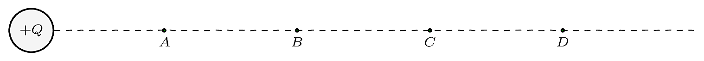
```

The presence of a charge 'changes' the region around it because now, other charges will experience an electrostatic force. We call this 'presence' of electrostatic forces around a charge an electrostatic `r me.t("field")`. Consider the points $A, B, C, D$ in figure \@ref(fig:fig-fieldImbues). Before we bring the charge $+Q$ there is no 'specialness' to any of these points. However, in the presence of the charge $+Q$, these points in space are now modified. They are now different from each other! All of these points exhibit electrical properties (i.e. if you bring another charge to any of these points, there will be an electric force present). Due to their different distances from $Q$, the strength of the forces at points $A, B, C, D$ are different. Pushing this argument further, we can argue that *all* the points around $Q$ have now modified. It is as if the space surrounding $Q$ has been 'filled' with 'something' that causes electric effects to be experienced. This phenomenon is called a 'field'.

Generally, a field is a region where one experiences gravitational, electric or magnetic 'effects'. The field **imbues** points within it with 'properties' (e.g. ability to have potential energy). Electric and magnetic fields play a fundamental role in atomic, molecular, cellular and chemical domains. For instance, the atom is held in place by electrostatic forces,  DNA is charged,  chemical reactions are really the breaking and making of electrostatic bonds^[All of chemistry is really Physics? Hahaha...].

<!----------------------------------------------------------------------->
## Visualizing an Electric Field
<!----------------------------------------------------------------------->
```{r, child='_my-latex.Rmd'}

```

```{r fig-tangentTolines, fig.cap='The electric field, $E$ is tangential to the field line.'}
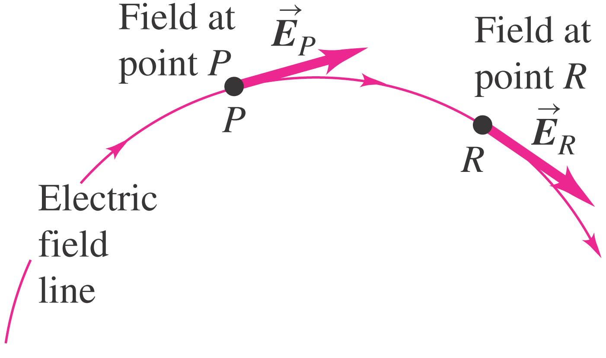
```

`r sn0 <- "^[Yes, I know! I haven't told you exactly what $\\vec(E)$ is. Lets pretend its a vector related to the field strength till we get to section \\@ref(sec:electricFields) ]"`

It is very useful to be able to visualise a field. One way to do this is by using `r me.t("electric lines of force")` or `r me.t("field lines")`. We draw the lines of force such that the electric field (i.e. $\v{E}$)`r sn0` at any point is along the tangent to the field line at that point. This is shown in figure \@ref(fig:fig-tangentTolines). 

When there are more than one charge, the final pattern of field lines you see is a result of (vectorial) **addition** (i.e. superposition;  section \@ref(sec:superposition)) of the **individual effects** of the various contributing charges. Figure \@ref(fig:fig-fieldLinesOfTwoCharges2) shows how the final pattern of field lines is formed for the case of two +'ve charges. 

Figure \@ref(fig:fig-fieldLinesOfTwoCharges1) shows a field pattern for a +'ve and -'ve charge.

`r cap<-"Electric field lines due to two  +'ve charges.<br> *Top panels*: fields due to the individual charges. *Bottom left*: Overlay the top images. *Bottom right*: The result of the superposition of the two individual fields. "`

```{r fig-fieldLinesOfTwoCharges2, fig.cap=cap,fig.fullwidth=T,fig.margin=F}
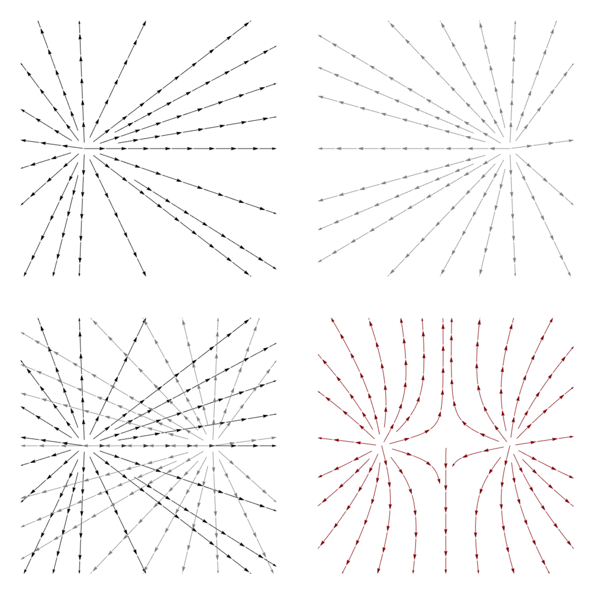
```

```{r fig-fieldLinesOfTwoCharges1, fig.cap="Electric field lines due to a +'ve and -'ve charge.",fig.margin=F}
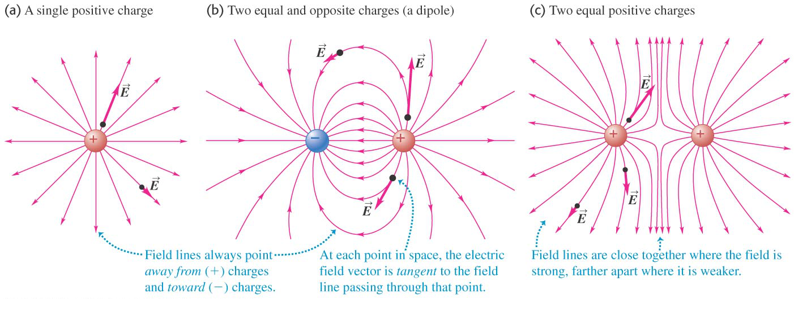
```

```{r fig-linesofForce, fig.cap='Field lines also indicate the field strength.'}
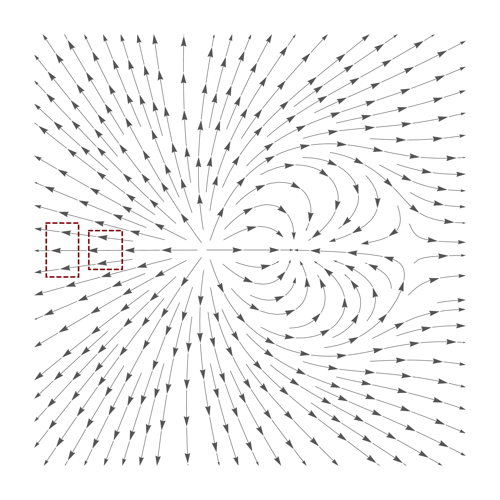
```

Please note that:

*  the lines of force are **not** the tracks along which a particle will move. 
*  the **field exists everywhere**; not just at the places where the lines are drawn.^[If we want we can draw more lines. The idea is to get a general picture of the field.] 

Lines of force give us more than just a pictorial sense of the field. Lines of force also indicate the strength of the field with their density. In figure \@ref(fig:fig-linesofForce) the number of lines in both dashed boxes is the same, but one is denser than the other: more the density, stronger the field.

<!------------------------------------------------------>
## Bringing charges together {#sec-energyInAField}
<!------------------------------------------------------>

```{r, child='_my-latex.Rmd'}

```

```{r video-chap-03-derivation-of-pe, out.extra='style="border: none;"', out.width='99%', fig.cap="ABCs for A2M", echo = FALSE}
knitr::include_url('https://www.youtube.com/embed/4vjS8rHszxI')
```

When you move one charge in an electric field created by another charge, it is necessary for an external force (i.e. you) to do (positive or negative) work. Let us now investigate this critical aspect of fields. This will lead us to realise that a field can store energy!

`r cap <- "Forces acting on a charge $q$ (at a separation of $r$) that is being brought, slowly, towards another charge $Q$."`

```{r fig-electric-work, fig.cap=cap,fig.margin=F}
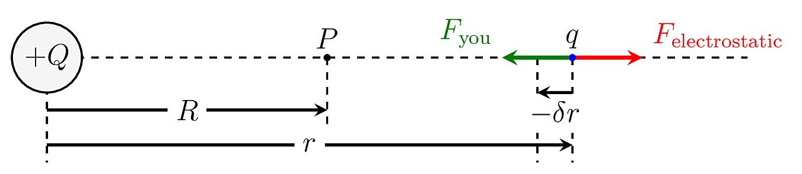
```

Consider the situation depicted in figure \@ref(fig:fig-electric-work). We are moving a charge $q$ to the location $P$ situated in the electric field generated by $Q$. 


$$
\require{color}
\renewcommand\emph[1]{\textbf{#1}}
\begin{align*}
\left.
\begin{array}{l}
\text{The small amount of work($\delta W$) that $\emph{you}$} \\
\text{must do to move the charge $q$ a small}\\
\text{distance $\delta r$ $\emph{towards}$ the charge $Q$}
\end{array}
\right \}	\delta W    &\approx F_{\text{you}} (\textcolor{red}{-}\delta r)\\
		                  &= F_{\text{electrostatic}} (-\delta r)\\
 		                  &= -\left(k_c\frac{Q q}{r^2}\right) \delta r
\end{align*}
$$

Note that:

* The -'ve sign is necessary because mathematically $\delta r$ is in the direction of $r$ increasing, which is *away* from the charge.
* $F_{\text{you}}= F_{\text{electrostatic}}$ in size (but opposite in direction).

Whence,
$$
\begin{align*}
\left.
\begin{array}{l}
\text{The total work done ($W$) by $\emph{you}$} \\
\text{in moving a charge $q$ from}\\
\text{$r=\infty$ to $r=R$}
\end{array}
\right \}\quad	W 	
			&= \lim_{\delta r \rightarrow 0}\sum_{r=\infty}^{r=R} \delta W\\
			&= \int_{r=\infty}^{r=R} dW\\
			&= -k_c Q q\int_{r=\infty}^{r=R} \frac{1}{r^2}dr\\
			&= -k_c Q q\left[-\frac{1}{r} \right]_{r=\infty}^{r=R}dr\\
\end{align*}
$$

\begin{equation}
		W= k_c\,\frac{Q q}{R}  (\#eq:electricWorkdone)
\end{equation}

This work $W$ that we have done is 'stored away'. We cannot specify to whom ($Q$ or $q$) it belongs to nor where it is stored. It is usual to say that this energy is 'stored in the field'.


<!------------------------------------------------------>
## Potential energy (PE) due to a point charge
<!------------------------------------------------------>
```{r, child='_my-latex.Rmd'}

```

```{r fig-electricPotential, fig.cap='A chargeq brought to the point P in the field of Q has PE given by equation \\@ref(eq:potentialDuetoPoint)'}
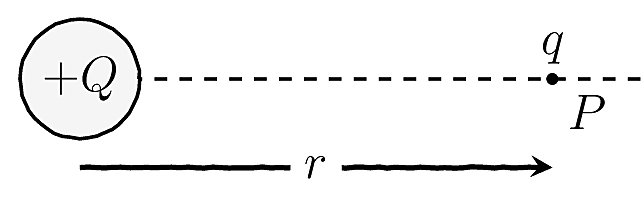
```

The previous section established the necessity to do (positive or negative) work to move charges around in a field. We also found a mathematical expression (equation \@ref(eq:electricWorkdone)) to quantify the amount of work necessary.  We said that this work is 'stored' in the field. 

We can interpret this stored energy as `r me.t("potential energy")` (PE) of the charge ($q$) due to it being in the field of $Q$^[This concept is no different from the potential energy stored in a stretched or compressed spring. Work is stored in the system!]. That is, we can define the potential energy ($U$) of a charge $q$ in an electric field due to **a point charge** $Q$ as:

:::definition
\begin{equation}
U = k_c\,\frac{Q q}{r}  (\#eq:potentialDuetoPoint)
\end{equation}
:::

A few things we need to take note:

* This formula applies **only** to a field due to a point charge. If you have more than one point charge, we can use superposition (see section \@ref(sec:superposition)) to understand the situation. 
<!-- (e.g. the question discussed in IS\_$02$) -->

* Any positive charge will naturally `fall' from a point of higher PE to a point lower PE.
*  $U$ is the work that an external person (e.g. you) need to do to bring a charge $q$ from infinity to the point P. The potential energy of a charge is zero at infinity ($U\rightarrow0$ as $r\rightarrow\infty$).
* We can use PE to efficiently 'tag' points in space^[Why is it more convenient to use the potential energy than the Coulomb force, to `tag' the point?] with a number which tells us how much work (energy) we need to put in to get a charge to that point.


<!------------------------------------------------------>
##  Principle of Superposition {#sec:superposition}
<!------------------------------------------------------>
```{r, child='_my-latex.Rmd'}

```

In spite of the bombastic sounding name, the idea behind the `r me.t("principle of superposition")`  is simple and supremely powerful.

:::definition
The resultant effect of many charges is the sum of the effects of the individual charges.
:::

<br>

We can demonstrate the use of the principle of superposition with a simple example.

#### Example: Self energy of a collection of charges. {-}

`r cap <-"It requires external energy to assemble charges into a configuration. This energy is stored as the self-energy of the system which is easily calculated."`

```{r fig-selfOfThree, fig.cap=cap,out.width='75%'}
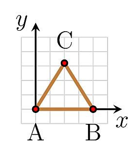
```

Since charges affect each other, we need to supply energy (in the form of work) if we want to assemble them. This energy is then stored in the assembled field. We call this the `r me.t("self-energy")` of the assembled object. Let's understand self-energy using an example.

Let's calculate the work that you need to do to assemble the three charges of $+q$ at the vertices of an equilateral triangle of length $a$ as shown in figure \@ref(fig:fig-selfOfThree).

```{r tab-electric-self-energy, fig.margin=F,out.width='100%'}
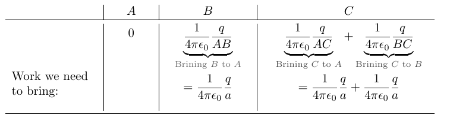
```

Whence, the total work we need to assemble the configuration is $k_c{\dfrac{3q}{a}}$. Therefore the self-energy of the system is also $k_c{\dfrac{3q}{a}}$. <br>We can recover this energy by allowing the system to 'break apart' to infinity.


<!----------------------------------------------------------------------->
## The Electric Field {#sec:electricFields}
<!----------------------------------------------------------------------->
```{r, child='_my-latex.Rmd'}

```

`r cap <- 'The forces $F_{1}$ and $F_{2}$ depends on the charges $q_{1}$ and $q_{2}$. But the field is the same for both.'`

```{r fig-EnotF, fig.cap=cap}
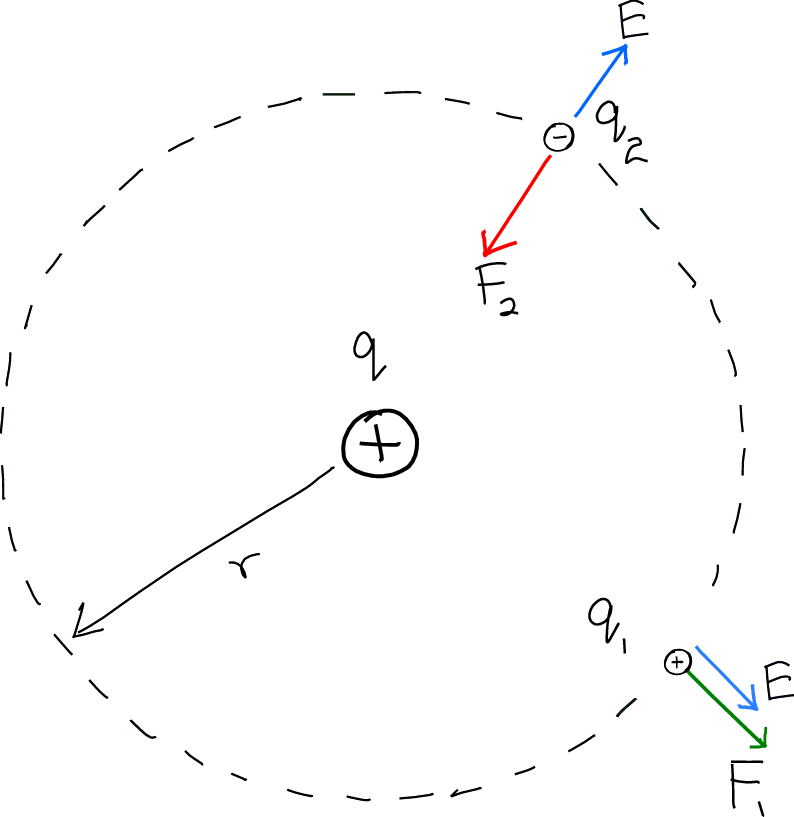
```

<span class="marginnote">
\[
\begin{array}{c|cccc}
& \textbf{Force}  & \textbf{Dir}  &\textbf{Field}  &\textbf{Dir} \\
% \toprule
q_{1} & \vec{F_{1}} = k_{c} \dfrac{q q_{1}}{r^{2}} & \swarrow&
\v{E}=k_{c} \dfrac{q}{r^{2}} & \nearrow \\[0.5cm]
q_{2} & \vec{F_{2}} = k_{c} \dfrac{q q_{2}}{r^{2}} & \searrow &\v{E}=k_{c} \dfrac{q}{r^{2}} & \searrow \\
%\bottomrule
\end{array}
\]
</span>

So far we have characterised electric fields using energy (i.e. the amount of work necessary to move charges). However, we can also use the more fundamental Coulomb force to describe the field. 

The strength and direction of the electric field at a point is denoted by $\v{E}$. Figure \@ref(fig:fig-tangentTolines) shows a few examples of some electric fields. The electric field strength (i.e. $\v{E}$) is defined as the force per unit charge acting on a small positive test charge^[We use a small test charge so as not to `disturb' the already existing field. The test charge is positive by convention.], $\delta q$.

\begin{equation}
\v{E} =\frac{\v{F}}{\delta q}
\end{equation}

$\v{F}$ is the Coulomb force and $\v{E}$ is the field.

Figure \@ref(fig:fig-EnotF) highlights the usefulness of defining $\v{E}$ this way. Notice how $\v{E}$ describes the field at a *point* independent of the charge there. 
<!-- * $\v{E}$ is similar to the potential $V$ while $\v{F}$ is similar to the potential energy ($U$). The former describes a point in space while the latter the force on a charge at that point. -->

<!------------------------------------------------------>
## A Deep Connection
<!------------------------------------------------------>

```{r, child='_my-latex.Rmd'}

```

```{r fig-forceIsPotential, fig.cap='In a field, you experience a force if there is a change in potential energy.',fig.margin=F}
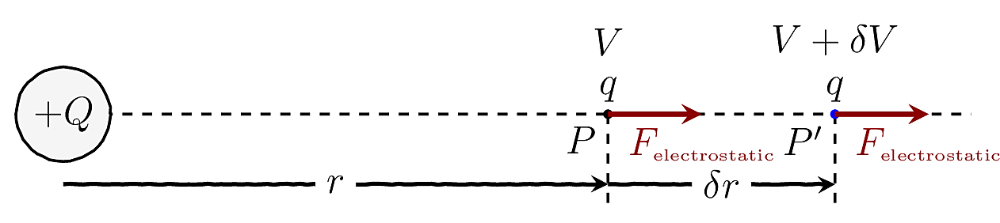
```

Consider the situation shown in \@ref(fig:fig-forceIsPotential). Here an electric force $\textcolor{Maroon}{{F}_{\text{electrostatic}}}$ acts on the charge $q$. If it is now released (from point $P$), after traveling an infinitesimal distance $\delta r$ it arrives at $P'$. Since $\delta r$ very small, we can reasonably assume that the force is constant throughout the journey $P\rightarrow P'$.

For the $P\rightarrow P'$ journey, we may use the law of conservation of energy to say:
$$
\begin{align*}
\text{loss in PE } &\approx \text{gain in KE} \\
&= \text{work done by ${F}_{\text{electrostatic}}$} \\
&\approx {F}_{\text{ electrostatic}} \times \delta r \\
\ie -\delta U &\approx {F}_{\text{ electrostatic}} \times \delta r \\
\ie {F}_{\text{ electrostatic}} &\approx  - \dfrac{\delta U}{\delta r}
\end{align*}
$$

In the limit $\delta r \rightarrow 0$ we arrive at the the deep connection^[You can easily connect this to real life: think of a slope! You experience a gravitational force because the gravitational PE is changing when you take a step.] between force and PE:

:::definition
\begin{equation}
F =  - \da{U}{r} (\#eq:forceIsPotential)
\end{equation}
:::

<!------------------------------------------------------>
## Energy Curves
<!------------------------------------------------------>

```{r, child='_my-latex.Rmd'}

```

`r cap<-'The Lennard-Jones potential exhibits the characteristics of a bond between two particles. The shaded regions indicate the repulsive and attractive regimes of the potential.The dashed line (obtained from $F=-\\da{V}{r}$) shows the force. When the system has an energy $E_{\text{total} }$, it can only oscillate within the range indicated by the arrows.'`

```{r fig-LJ-Potential, fig.cap=cap,out.width='100%'}
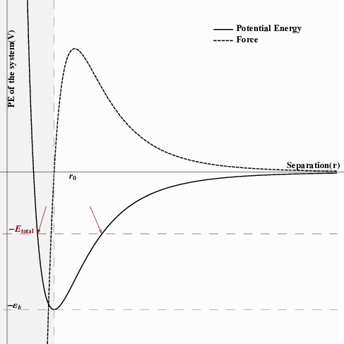
```


`r cap <- 'We can picture the bond between two particles A and B as been represented by a spring. The bond length is $r_{0}$ but thermal energy causes the particles to vibrate.'`
```{r fig-energyCurves-bond, fig.cap=cap}
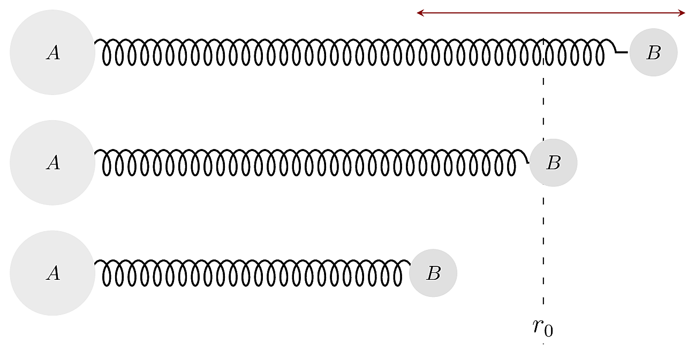
```


A plot of the variation of the PE of a system can be a very powerful tool in understanding the properties of the system. Let us explore the concrete example of a two-particle system that has a bond between them (HCl, for instance). We can think of the bond, as shown in figure \@ref(fig:fig-energyCurves-bond). Notice that in such an interaction, it is necessary for the bond to be repulsive when the particles are closer (else the molecule will collapse) and attractive when they farther apart. A model for such potential is shown in figure \@ref(fig:fig-LJ-Potential). This potential is called the Lennard-Jones potential The mathematical form of the Lennard-Jones potential is given by:

\begin{equation}
U(r)=\varepsilon_b \left[\lr{\dfrac{r_0}{r}}^{12}-2\lr{\dfrac{r_0}{r}}^{6}\right] (\#eq:lennard)
\end{equation}

If the system were placed at a separation of $r_0$, there would be no force, and it will be stable. However,  thermal energy (i.e. temperature, which is really KE) disturbs this and causes the molecule to vibrate. During these vibrations, the system continually exchanges PE and KE (just like a simple pendulum). If the system has a total energy of $E_{\text{total} }$, as shown in figure \@ref(fig:fig-LJ-Potential), then it can vibrate between the points indicated by the arrows. At the extreme positions, all the energy is in the form of PE. If we add more energy (e.g. by heating), the system is allowed to vibrate over a broader range. Eventually, if the system is heated so that the KE is $\varepsilon_b$, the bond will be broken. Notice also that as the temperature rises, the average separation between $A$ and $B$ increases. Thus, this model predicts thermal expansion^[Note that thermal expansion occurs only if the potential is asymmetrical.].
 


## My 3 Cents
 1. When we combine the definition of work together with Coulomb's Law using calculus we can define the concept of electrical potential energy ($U$).  This in turn leads us to the deep connection between a force and potential energy though the relationship $F=-\dfrac{dU}{dr}$.
2. The principle of superposition allows us to extend out understanding of a single charge to multiple charges simple by taking a vector sum!
3. Potential energy curves are sooooo important! They allow us to understand the properties (e.g. stability, thermal expansivity) of a material.
 
