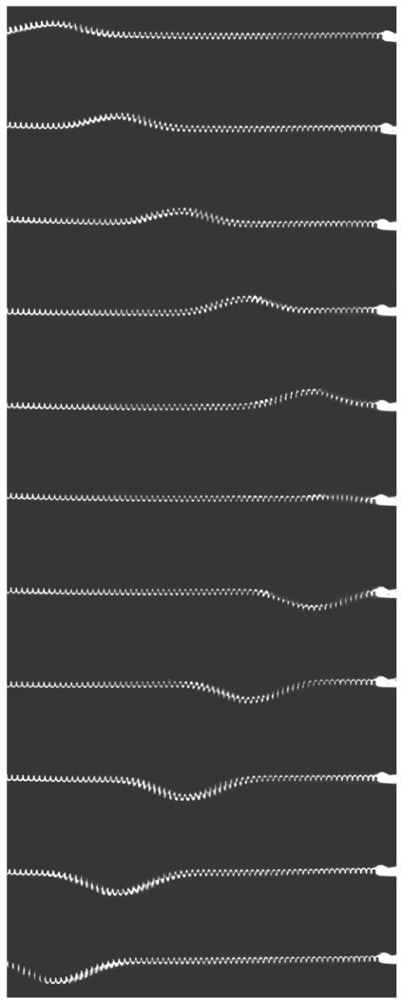
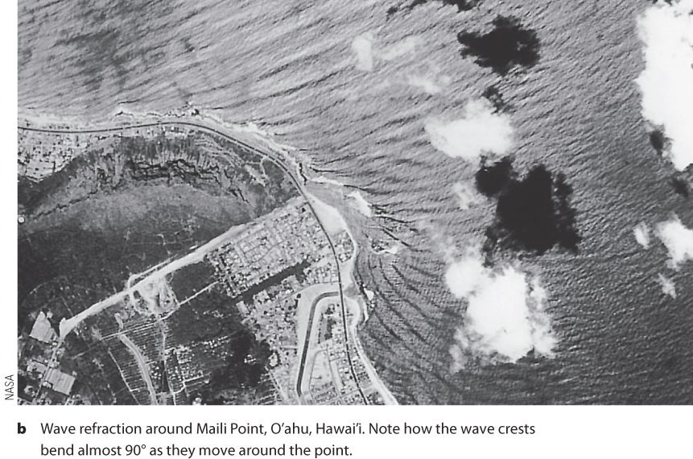
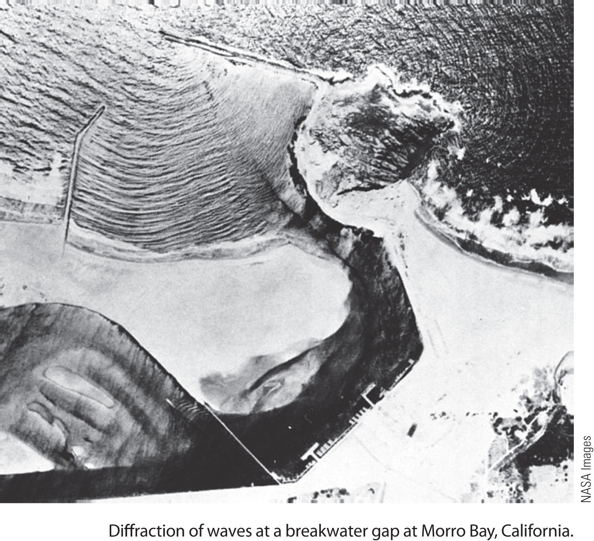
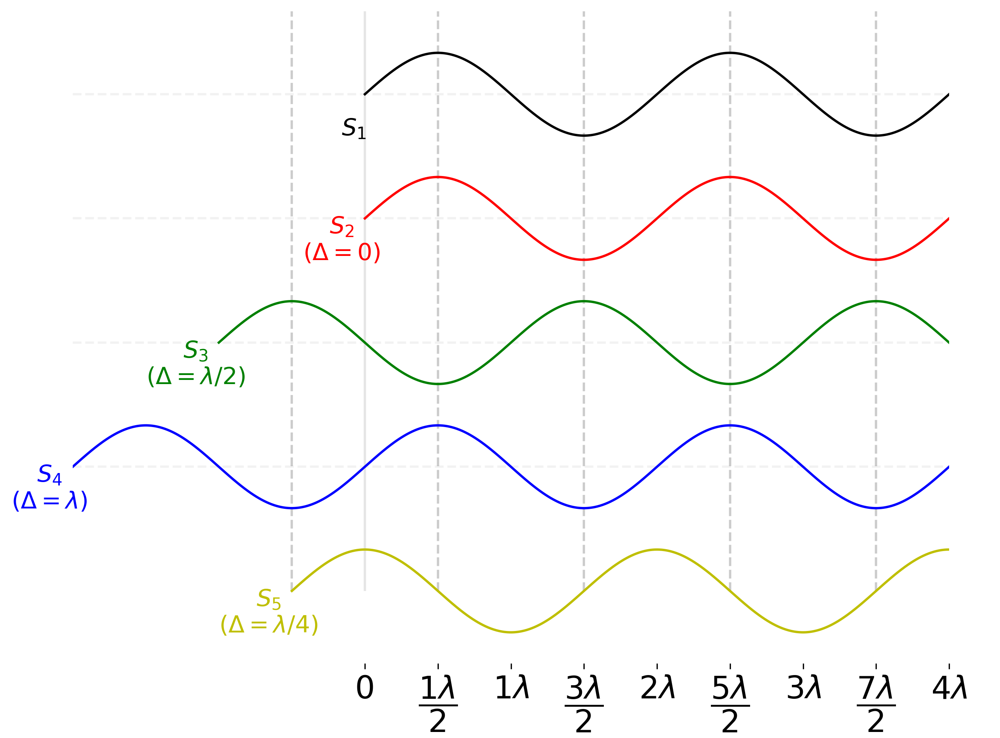

# Waves: Poetry in Motion

<!-- ```{r input-setup-file_chap-03,child='my-setup.Rmd'} -->

<!-- ``` -->
<br>
`r cap <- cap <- me.credit('"The Great Wave Off Kanagawa" by Katsushika Hokusai','Wikipedia','https://en.wikipedia.org/wiki/The_Great_Wave_off_Kanagawa',F)`

```{r fig-waves-kanagawa, fig.cap=cap,fig.margin=F}
knitr::include_graphics('my-figures/how_The_Great_Wave_off_Kanagawa.jpg')
```

> "I stand on my sand dune top watching a great wave coursing in from the sea, and know that I am watching an illusion, that the distant water has not left its place in the ocean to advance upon me, but only a force shaped in water, a bodiless pulse beat, a vibration."

> `r tufte::quote_footer('--- Henry Benson ---')`

## What we have in store
<br>

```{r video-chap-04-main, out.extra='style="border: none;"', out.width='99%', fig.cap="Hello waves!", echo = FALSE}
knitr::include_url('https://www.youtube.com/embed/JeWqXs6kzpU')
```

The mention of the word 'waves' might probably make you think of waves in the ocean. However, waves are not just confined to the seas. Waves are all around us in many different forms! We use them every day! For instance, every time we see or hear, we use waves.

We routinely use the knowledge of waves in labs. Every time we use a microscope, collect a spectrum or look at the stars, we are using waves. **Fascinatingly**, we also need the ideas of waves to understand how the atomic domain works. So, this is a whirlwind tour of the uber-cool phenomenon of waves.

<!----------------------------------------------------------------------->
## What is a wave?
<!----------------------------------------------------------------------->

:::definition
Waves are an ingenious way to transport energy, without transporting matter!
:::

A ‘wave’ is usually caused by a disturbance of a medium (e.g. water, air, the ground). A ‘wave’ is created because the medium is trying to ‘return’ to its original (happy) state, after been disturbed. Typically ‘waves’ require a **medium**^[Electromagnetic waves are unique in that they do not need a medium.] (i.e. a material that can transmit a force), a **source of energy** (the cause of the disturbance) and a **restoring force** (to ‘bring things back to the original state’). A wave **propagates**  when the medium ‘passes on’ the disturbance from one molecule to another like when you drop a pebble into a pond (see the Wave on a String simulation below for a visualisation). If you think of waves in the ocean, the restoring force is gravity, and the source of energy (disturbance) is the wind.

<br><br>
<iframe src="https://phet.colorado.edu/sims/html/wave-on-a-string/latest/wave-on-a-string_en.html" width="800" height="600" scrolling="no" allowfullscreen></iframe>
<br><br>

Notice how the ‘wave’ moves from left to right, but the particles only move (oscillate) up and down^[A wave such as the one in the string is called a **transverse** wave because the particles move perpendicular to the direction of motion of the wave.<br><br>A wave where the particles oscillate parallel to the direction of movement of the wave is called a **longitudinal** wave.<br><br>An example of a transverse wave is electromagnetic waves. An example of a longitudinal wave is sound. ]. A wave can be thought of as an (exquisitely) coordinated dance of the ‘participants’ (i.e. the particles) that results in the transfer of energy. 

### Waves vs. Particles

It will be useful for our journey to note the differences between waves and particles. Particles can also transfer energy (think of throwing a brick at someone), but it also transfers mass. Particles have a well-defined position, whereas we cannot say 'where' a wave is. We will soon discuss more properties of waves (e.g. interference) that particles do not share.

<!------------------------------------------------------>
## Describing a Wave
<!------------------------------------------------------>
<br>
`r cap <- me.credit('The various parameters of a wave.','UBC:ATSC113','https://www.eoas.ubc.ca/courses/atsc113/',T)`
```{r fig-chap-04-wave-parameters, fig.cap=cap,fig.margin=F,out.width='85%'}
knitr::include_graphics('https://www.eoas.ubc.ca/courses/atsc113/sailing/met_concepts/08-met-waves/8b-wave-characteristics/img-8b/8-wave-characteristics.gif')
```

**All** waves (e.g. electromagnetic, seismic, sound) have several standard parameters and features (see figure \@ref(fig:fig-chap-04-wave-parameters)). We need to specify a few of these parameters to uniquely identify a wave and understand what it can do.  The following table shows these parameters.

<div class="my">
| Parameter                     | Description                                       | Unit                        |
| ----------------------------- | ------------------------------------------------- | --------------------------- |
| Amplitude ($A$)               | Maximum vertical displacement of a particle.      | metre                       |
| Frequency ($f$)               | How many ‘waves’ pass you in one second.          | Hertz (Hz) = 1/second       |
| Period ($T$)                  | Waiting time between two crests (or troughs).     | second                      |
| Celerity or Phase speed ($v$) | Speed at which the wave ‘shape’ moves.            | metre/second                |
| Wavelength ($\lambda$)        | Distance between two crests (or troughs)          | metre                       |
</div>

**Wavelength** is the most useful measure of wave size. **Frequency**  and **amplitude**  are useful measures of the **energy** contained in a wave. 

**All** waves obey the following simple relationships:

$$
v=f\lambda   (\#eq:visfl)
$$
$$
f=\dfrac{1}{T}  (\#eq:fandT)
$$

## Wave Phenomena

There are four^[actually five; the fifth phenomenon is polarisation and applies only to transverse waves] phenomena that waves exhibit. `r me.t("Reflection")`, `r me.t("Refraction")`, `r me.t("Diffraction")` and `r me.t("Interference")`^[Interference is the most fundamental. It can be shown that the other three are due to interference].

```{r fig-wave-reflection, fig.cap='Wave reflection.',fig.margin=T,out.width='65%'}

```

### Reflection & Refraction

```{r fig-wave-refraction, fig.cap='Wave refraction. Water waves travel slower in shallow water.Therefore, water waves refract when waves approach the beach from the deeper part of the ocean.',fig.margin=F}

```

```{r fig-wave-diffraction-sl, fig.cap="A simulation of the 2004 Indian Ocean tsunami. Notice how the wave bends around Sri Lanka and 'hits' cities on the western side of the island",fig.margin=T}
knitr::include_graphics('http://www.tsunami2004.net/wp-content/uploads/animation.gif')
```

**Reflection** is the bouncing of waves off of an obstacle as in figure \@ref(fig:fig-wave-reflection). 

**Refraction** is the bending of waves at a boundary due to a change in speed as in figure \@ref(fig:fig-wave-refraction).

### Diffraction

```{r fig-wave-diffraction, fig.cap='Wave diffracting as they pass through the gap in the breakwater.',fig.margin=F,out.width='85%'}

```

**Diffraction** is the bending of a wave when passing a gap or an obstacle as in figure \@ref(fig:fig-wave-diffraction). How much 'bending' takes place, depends on the size of the gap/obstacle in comparison to the wavelength. 

As an example, we hear people around the corner because of diffraction. Another example is a Tsunami. Since, tsunami are waves they exhibit diffraction. Figure \@ref(fig:fig-wave-diffraction-sl) shows a simulation of the 2004 Indian Ocean tsunami. Notice how the wave bends around Sri Lanka and 'hits' cities on the **western** side of the island.

Please see the simulation (from [Phet](https://phet.colorado.edu/)) below for other examples of diffraction.

### Interference and Superposition

When two or more waves occupy the **same space**, their effects add up (see the simulation below from oPhysics). The ability of waves to interact with each other is called 'Interference'.  

We also use the term `r me.t("superposition")` ^[Yes, similar to electric fields] to describe the 'combining' of one or more waves. The `r me.t("Principle of Superposition")`^[You may think of superposition as the (mathematical) operation that leads to the phenomenon of interference] tells us **how** waves interfere.

:::definition
**Principle of Superposition**<br> *The resultant displacement of  two or more waves in the same region is the vector sum of the displacements of the individual waves.*
:::

### Simualation to play with Diffraction & Interference

#### Interference from oPhysics {-}

```{r,fig.fullwidth=T,out.width='100%'}
knitr::include_url('https://ophysics.com/waves4.html',height = '800px')
```

#### Interference & Diffraction from Phet {-}

<iframe src="https://phet.colorado.edu/sims/html/wave-interference/latest/wave-interference_en.html" width="800" height="600" scrolling="no" allowfullscreen></iframe>


## Phase Difference, Path Difference & Interference
`r cap <-"Five identical sources placed at different locations along a straight line. We have separated them vertically for clarity. Also indicated is the path difference with respect to $S_1$"`

```{r fig-waves-phase,fig.cap=cap,out.width='100%',fig.margin=F}

```


Consider two waves that occupy the same space so that they end up interfering. The result of this interference depends^[in addition to amplitude and wavelength] on the 'alignment' of their crests (or troughs). We use the terms `r me.t("phase difference")` and `r me.t("path difference")` to describe this 'alignment'. Knowing the phase difference or path difference between waves is crucial to predict how they will interfere.

Both phase difference ($\phi$) and path difference ($\Delta$) describes the **same** feature but in different units. The phase is an angle and path difference is a length. These two are related by:
$$
\phi = \left(\dfrac{2\pi}{\lambda}\right)\Delta (\#eq:phase-Path)
$$

Lets use figure \@ref(fig:fig-waves-phase) to understand the idea $\phi$ and $\Delta$ represents. The figure shows five identical sources placed at different locations (we have separated them vertically for clarity). 

### Constructive Interference

Since $S_2$ is perfectly aligned with $S_1$, they will interfere maximally. This situation is called **constructive interference**.

If you look at $S_4$ you will see that it has been shifted back by $\lambda$ so that the path difference is given by $\Delta = S_1S_4=\lambda$. You will also notice that a path difference that is an integer multiple of $\lambda$ will lead to the same conclusion. 
So the general condition for constructive interference is:
$$
\Delta = n\lambda  (\#eq:constructive-interference)
$$

### Destructive interference

$S_3$ is shifted by $\dfrac{\lambda}{2}$ so that $S_3$ is perfectly **mis**-aligned with $S_1$. The resulting interference will perfectly cancel each other out. This situation is called **destructive interference**.
Notice that the path difference here is $\Delta = S_1S_3=\dfrac{\lambda}{2}$ .  You will also notice that any path difference that is an odd multiple of $\dfrac{\lambda}{2}$ will lead to the same conclusion. 
So the general condition for destructive interference is:
$$
\Delta = (2n+1)\,\dfrac{\lambda}{2} (\#eq:destructive-interference)
$$

### Neither
$S_5$ has a path difference of $\dfrac{\lambda}{4}$ with $S_1$. So, the resulting interference is something between constructive and destructive.

<!------------------------------------------------------>
## Electromagnetic Waves
<!------------------------------------------------------>

```{r, child='_my-latex.Rmd'}

```

`r cap<-" The wavelengths of the ‘electromagnetic spectrum’."`

```{r fig-em-spectrum,fig.cap=cap,out.width='100%',fig.margin=F}
knitr::include_graphics('https://upload.wikimedia.org/wikipedia/commons/thumb/c/cf/EM_Spectrum_Properties_edit.svg/2880px-EM_Spectrum_Properties_edit.svg.png')
```

```{r fig-em-spectrum-xkcd,fig.cap='The xkcd version of the EM spectrum!',out.width='100%',fig.margin=T}
knitr::include_graphics('https://imgs.xkcd.com/comics/electromagnetic_spectrum_small.png')
```

Visible light is a unique type of wave. The ‘things’ that oscillates in light are the **strength** of electric and magnetic fields.  Light is therefore, an `r me.t("electromagnetic(EM) wave")`.  EM waves **always** travel at the speed  $c=3 \times 10^8$ m/s^[in a vacuum] and **do not** require a medium. This is why we can receive light from the Sun through the emptiness of the vacuum separating us.

In the case of light, it turns out that wavelength corresponds to what we perceive as colour. For example, the reds have a wavelength of about 600 nm, whereas the blues about 400 nm. There are far more EM waves than the light visible to us. All these possible wavelengths are referred to as the `r me.t("electromagnetic spectrum")`.  This is shown in figure \@ref(fig:fig-em-spectrum).

Different wavelengths of the EM spectrum show different properties (e.g. like in the case of colours). Mother nature has set things up so that shorter wavelengths (like x-rays) have more energy than longer wavelengths (like microwaves).


## Diffraction Grating

`r cap<-"The intensity(i.e. brightness) pattern from a single slit  (*single slit diffraction pattern*)<br>[From [HyperPhysics](http://hyperphysics.phy-astr.gsu.edu/hbase/index.html)]."`

```{r fig-single-slit,fig.cap=cap,out.width='100%',fig.margin=T}
knitr::include_graphics('http://hyperphysics.phy-astr.gsu.edu/hbase/phyopt/imgpho/muls1.png')
```

`r cap<-"The effect of having more slits on the diffraction pattern.<br>[From [The University of Tennessee](http://labman.phys.utk.edu/phys222/)]."`

```{r fig-multiple-slits,fig.cap=cap,out.width='100%',fig.margin=T}
knitr::include_graphics('http://labman.phys.utk.edu/phys222core/modules/m9/images/ipat.jpg')
```

We learnt that diffraction causes a wave to spread out when it passes through a gap or slit. Figure \@ref(fig:fig-single-slit) shows the intensity (i.e. brightness) pattern you expect when you send light through a (single) slit. It turns out that there is a clear relationship between the spacing between the peaks and the wavelength of the light used. Meaning, we can use this pattern to **measure the wavelength of the light**! This is a handy thing because knowledge of the wavelengths present in light can tell us about processes that created the light^[For example in the Alzheimer that you studied for 71, the wavelength of the x-rays can tell us what metals are present.]

`r cap<-"How a diffraction grating 'splits' the different wavelengths<br>[From [HyperPhysics](http://hyperphysics.phy-astr.gsu.edu/hbase/index.html)]."`

```{r fig-diffraction-grating,fig.cap=cap,out.width='100%',fig.margin=T}
knitr::include_graphics('http://hyperphysics.phy-astr.gsu.edu/hbase/phyopt/imgpho/diffgrat.png')
```

It has also been observed (see figure \@ref(fig:fig-multiple-slits)) that the more slits you have, the more well defined are the positions of the peaks. This has lead to the idea of a **diffraction grating** that has thousands of slits. 

As shown in figure \@ref(fig:fig-diffraction-grating) we can measure the angular separation $\theta$ produced by a diffraction grating to eventually calculate the wavelength. For this we need to use the relationship:

$$
d \sin\theta = m \lambda (\#eq:diff-equ)
$$
<style>
#my-wave-table table{
border-collapse: collapse;
border:none;
width:600px;
margin-left:100px;
}

#my-wave-table table tr{
	height:2.25em;
}

#my-wave-table table td:first-of-type{
width:50px;
}
</style>

<div id='my-wave-table'>
|          |                                                              |
| -------- | :----------------------------------------------------------- |
| $d$      | is the separation of the slits                               |
| $m$      | in an integer that is like a label for the bright spots. It is called the **order** of the spot. the $\theta$ |
| $\theta$ | Is the angle between the zeroth ($m=0$) order and the $m$th order |
</div>

The zeroth-order (i.e. $m=0$) is the brightest and indicates the direction the light would have gone if it had not been diffracted. Now you see how a diffraction grating can split a mixture of different wavelengths.

## My 3 Cents
1. Waves are an ingenious way that Mother Nature has come up to transfer energy from one place to another without transferring matter.
2. Waves exhibit phenomena such a reflection, refraction, diffraction and interference. Where interference (and the Principle of Superposition) is the most fundamental.
3. Interference will occur **only** if the waves occupy the **same space**. The idea of the path difference is useful to understand how two waves will interfere. The extent of the interference can range from destructive ($\Delta=$ odd multiple of $\lambda/2$) to constructive ($\Delta=$ multiple of $\lambda$).
 
