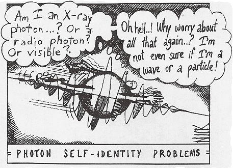
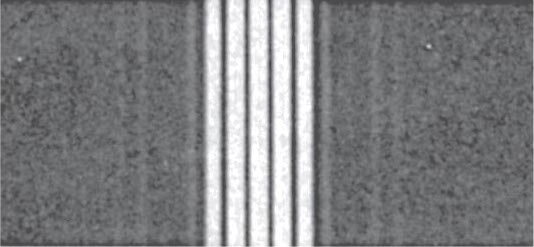
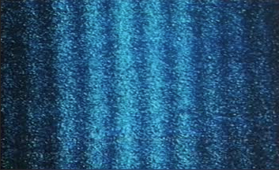
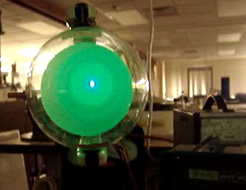
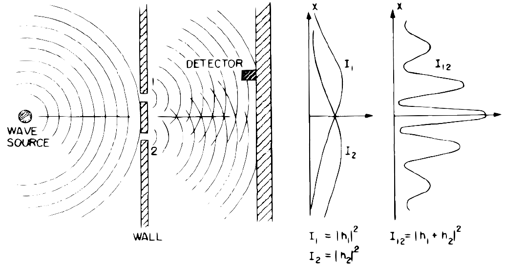
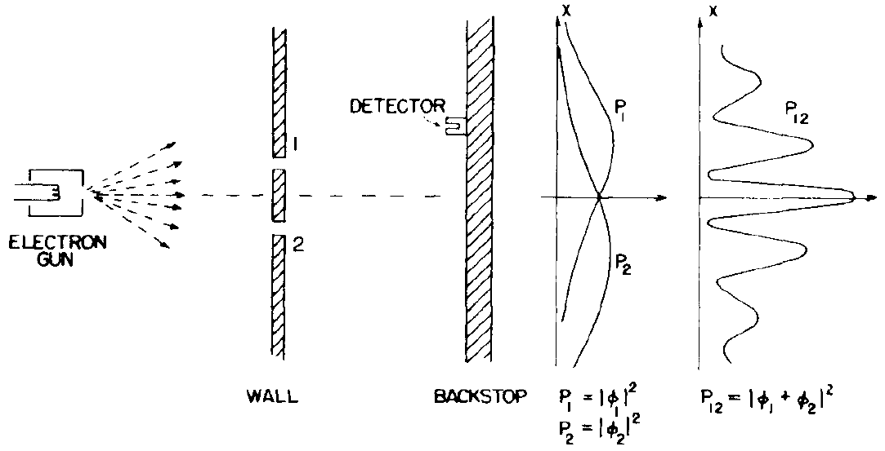
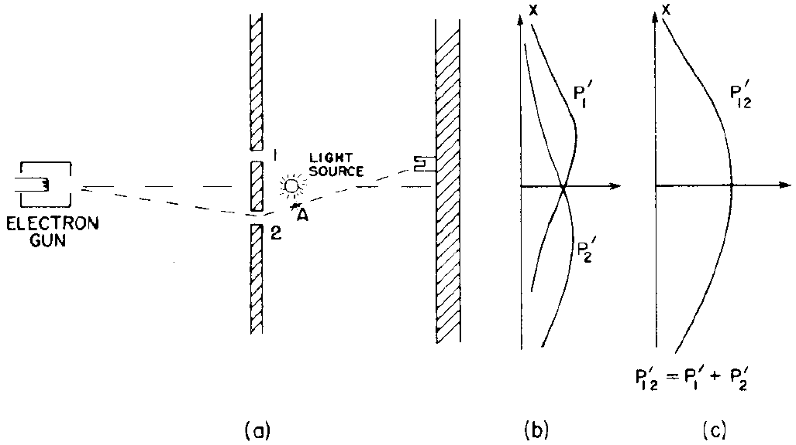
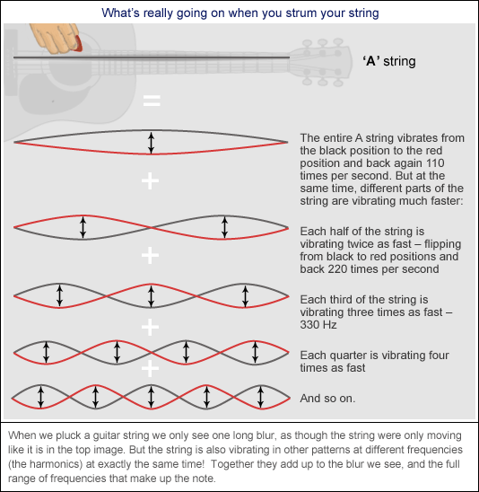

# <span class="my-sub-header">QM I: </span> Hello, My Quantum Universe!

<!-- ```{r input-setup-file_chap-03,child='my-setup.Rmd'} -->

<!-- ``` -->

```{r fig-qm-1-xkcd-start, fig.cap='From [xkcd](http://xkcd.com)',fig.margin=T}
knitr::include_graphics('https://imgs.xkcd.com/comics/quantum_mechanics.png')
```

<br>

`r cap <- cap <- me.credit('"The Great Wave Off Kanagawa" by Katsushika Hokusai','Wikipedia','https://en.wikipedia.org/wiki/The_Great_Wave_off_Kanagawa',F)`

```{r,out.width='75%',fig.cap='Photons have feelings too.', fig.margin=F, out.width='85%' }

```

`r me.quote('We are all agreed that your theory is crazy.<br> The question that divides us is whether it is crazy enough to have a chance of being correct','[Niels Bohr](https://en.wikipedia.org/wiki/Niels_Bohr)')`
<br>
`r me.quote('Anyone who is not shocked by quantum theory has not understood it.','[Niels Bohr](https://en.wikipedia.org/wiki/Niels_Bohr)')`

## What we have in store

<br>
```{r video-chap-05-main, out.extra='style="border: none;"', out.width='99%', fig.cap="Hello waves!", echo = FALSE}
knitr::include_url('https://www.youtube.com/embed/UuxG3SgtSBc')
```

Quantum mechanics (QM) is a beautiful theory that explains the working of Mother Nature in the atomic domain. It is one of the most successful ideas of science. QM has paved the way to many (many) technological breakthroughs in many fields (e.g. medicine - NMR, spectroscopy-  STM, electronics- blue diode). So QM has an unquestionable **practical**, everyday side. Uber fascinating is that QM also has a very (very) **spooky** side, that has forced us to reassess the nature of reality.

There are many things we can discuss in QM. However,  we will focus on some basic ideas of QM that will allow us to **understand** how it is **used**. Especially in understanding molecular bonding and spectroscopy. Let's start by discussing two fundamental ideas of QM: the `r me.t("wave-particle duality")` and the phenomenon of `r me.t("quantisation.")`

## Wave-particle Duality

```{r fig-qm-1-diffraction-of-light, fig.cap='Diffraction patter formed by passing **light** through multiple slits.',out.width='85%'}

```

```{r fig-qm-1-realTwoSlit, fig.cap='Two-slit experiment with **electrons** conducted by [Hitachi](http://www.hitachi.com/rd/portal/highlight/quantum/#anc04).',out.width='85%'}

```

Figure \@ref(fig:fig-qm-1-diffraction-of-light) shows a diffraction pattern formed by passing **light** through multiple slits. This pattern is not unexpected. We can easily make sense of it by recalling that light is a wave and that waves can interfere. 

Now consider figure \@ref(fig:fig-qm-1-realTwoSlit) which is also a diffraction pattern. This time, however, it was formed by **electrons** passing through a double-slit! Notice the dark regions where there are no electrons detected! Since electrons are particles, we should not see the dark regions in-between! 

Figure \@ref(fig:fig-qm-1-dbRings) and the video below shows another instance of the wave nature of electrons. Here electrons pass through the gaps in the lattice of graphite to form diffraction rings^[called **Debye-Scherrer rings**].  

`r cap <- 'Debye-Scherrer rings formed by sending **electrons** through a sample of polycrystalline graphite. The rings and the dark region between them is an **interference pattern** formed by electrons. This is due to the ‘wave nature of electrons’;  if electrons were purely particles, we should not see the dark regions. The pattern emerges because the electrons scatter and interfere like waves.'`
```{r fig-qm-1-dbRings, fig.cap=cap,out.width='85%'}

```

```{r video-chap-05-electron-rings, out.extra='style="border: none;"', out.width='99%', fig.cap="Electron diffraction & interference!", echo = FALSE}
knitr::include_url('https://www.youtube.com/embed/DfPvf77dtEQ')
```


So, are electrons waves or particles? We will return to the wave-particle duality when we discuss The **Two Slit Experiment** in section \@ref(sec:qm-two-slit) and the `r me.t("Heisenberg Uncertainty Principle")`.

## Quantisation {#sec-quantisation}

```{r}
sd0 <- '^[The <span class="high">electron volt</span> (eV) is a unit of energy. $1$ eV = $1.6023\\times10^{-19}$ J]'
```

We experience the concept of `r me.t("quantisation")` in everyday life. For example, the amount of money in your pocket is quantised! You will only observe amounts that are discrete values (i.e. you can have $2.10$, $2.20$, $2.50$  but **never** $2.09$, $2.36$ or $2.99$)^[This is assuming that the smallest coin in circulation is 5 cents.].  Interestingly this idea also applies to certain properties of quantum systems ^[One could argue that all systems are quantum systems. This is true; quantisation applies to all systems. But, we **notice** it only in atomic systems!]. For example, the energy of the electron in a hydrogen atom can accept only discrete values ($–13.6$ eV`r sd0`, $-3.4$ eV, $-1.5$ eV,…). Or the rotational energy of an HCl molecule.

The birth of QM can be traced back to 1900 when [Max Planck](https://en.wikipedia.org/wiki/Max_Planck) offered a  successful mathematical formulation of blackbody radiation. Central to his explanation was the assumption that light energy comes in the form of packets. That is, light is quantised.

:::definition
**Quantisation**<br>You will only **observe** (i.e. when you make a measurement) discrete values for certain properties of a system (e.g. energy, momentum).<br> What these values are specified by the rules of QM.
:::

### Franck-Hertz Experiment

`r cap <- 'The Franck-Hertz experiment that demonstrated quantisation.'`

```{r video-chap-05-frank-fertz, out.extra='style="border: none;"', out.width='100%', fig.cap=cap}
knitr::include_url('https://www.youtube.com/embed/ETi4XgMaWZc?rel=0')
```

This experiment demonstrates how atoms only absorb energy in fixed, discrete amounts. I.e. it won't accept **any** value of energy. 

The experimental setup is such that electrons are emitted from the bottom, and a uniform electric field accelerates them upwards. The longer the electrons move, the more energy they will gain from the electrical force and the more KE they will have. The tube is also filled with a gas^[at a low density] (e.g. mercury)  so that the electrons can collide with these atoms. **If** an atom absorbs energy, it eventually emits light^[due to an electronic transition.]. 

When the experiment is running, we notice light (hence energy absorption) from the atoms only at specific locations in the tube. These are the locations where the electrons have KE that exactly matches the excitation energy of the atoms. Once an electron interacts with an atom, its KE is reduced to zero^[so, it essentially restarts]. This is one of the reasons why the distance between bright bands are (almost) equal. If we increase the electrical field strength, the bands move down as the electrons now acquire the necessary energy within a shorter distance. 
Please refer to the article @Kash1994 for more details of the experiment. You should also visit [this website](https://www.kippenbergs.de/app/#/mint-franckhertz) to play with a simulation that will help you understand the experiment better.

### The Photon

This is a good time to introduce ourselves to the `r me.t('photon')`. 

Light (and all EM waves) can be viewed as consisting of discrete packets of energy. This quantum of light is called a **photon**. Photons are **massless**(!) particles that carry energy an amount of energy $E$ given by:

$$
E = \dfrac{hc}{\lambda} (\#eq:photon-energy)
$$
$h$ is the `r me.t("Plank's constant")` and has the value $6.626 \times 10^{-34}$ J.s .

`r sn0 <- "^[You might be wondering how a massless particle has momentum? The answer is related to the fact that a photon has energy. This gives it momentum according to Einstein's theory of Relativity.]"`

Photons also have momentum(!)`r sn0` given by:

$$
p = \dfrac{h}{\lambda} (\#eq:photon-momentum)
$$

## The Two Slit Experiment {#sec:qm-two-slit}

```{r, child='_my-latex.Rmd'}

```
<style>
.temp{
font-variant: small-caps
font-weight:bolder;
}
</style>

```{r}
sa <- '<span class="temp">slit 1</span>'
sb <- '<span class="temp">slit 2</span>'
```

The `r me.t("two-slit experiment")` is famous for highlighting the weirdness of the quantum world. It is also useful to **understand** the meaning of the wave-particle duality.  I stole the following argument from @Feynman2010. It compares an experiment conducted with bullets, waves and electrons.

### With bullets

```{r fig-qm-1-two-slit-particles, fig.cap='Bullets through two slits.[From Feynmann]',fig.margin=F,out.width='85%'}
knitr::include_graphics('my-figures/t03_double_01.png')
```

Let's start by considering figure \@ref(fig:fig-qm-1-two-slit-particles) that shows a not so accurate gun shooting bullets at a wall. The wall has two slits. In the course of passing through the slits, the bullets scatter in various directions.  Upon reaching the backstop, the bullets are collected by a bucket (this is our detector).  If we count the number of bullets collected at each point at the backstop, we can estimate the **probability of a bullet reaching that point**.

\begin{equation}
P(x)=\dfrac{N_{x}}{N_{\text{total} }} (\#eq:two-slit-bullets)
\end{equation}

$P_{1}$ shows the probability curve for a bullet reaching a point **due only to** `r sa` (i.e. with `r sb` closed).<br>
$P_{2}$, similarly, shows the probability curve for a bullet reaching a point **due only to** `r sb` (i.e. with `r sa` closed).

We can now calculate the probability of a bullet reaching a point $x$ due to **either** `r sa` (i.e. with `r sa` closed). or `r sa` (i.e. with `r sb` closed). as:

$$
\begin{align*}
 P_{12}(x)&= \dfrac{N_1(x)+N_2(x)}{N_{\text{total}}}= \dfrac{N_1(x)}{N_{\text{total}}}+\dfrac{N_2(x)}{N_{\text{total}}}\\
% \Rightarrow P_{12}(x) &= P_1(x)+P_2(x)
\end{align*}
$$

\begin{equation}
P_{12} = P_1+P_2\mdescrip{Particles, with both slits opened} (\#eq:two-slit-particles)
\end{equation}

### With waves

```{r child='_my-latex.Rmd'}

```


```{r fig-qm-1-two-slit-waves, fig.cap='Waves through two slits[From Feynmann].',fig.margin=F,out.width='85%'}

```

Now let's consider a similar experiment but with waves (e.g. in a pond) as shown in figure \@ref(fig:fig-qm-1-two-slit-waves). Once the waves have passed through the slits we can measure the intensity ($I_1$ and $I_2$) of the waves at the back by measuring the displacements $h_{1}$ and $h_{2}$ and using the fact that $I \propto \left|h\right|^{2}$.

$I_{1}$ is the intensity for a wave **due only to** `r sa` (i.e. with `r sb` closed).<br>
$I_{2}$, similarly, is the intensity for a wave **due only to** `r sb` (i.e. with `r sa` closed).

Since we are dealing with waves when we have both slits opened, we get interference. The resulting intensity $I_{12}$ is given by:

$$
 I_{12} \propto \left|h_1+h_2\right|^2\mdescrip{Waves, with both slits opened} (\#eq:two-slit-waves)
$$

### With electrons {#sec:electron-double-slit}

```{r fig-qm-1-two-slit-electrons, fig.cap='Electrons through two slits behave like waves and not particles!',fig.margin=F,out.width='85%'}

```

Now let's consider a third instance of the experiment, this time with electrons.  Since we believe electrons to be particles, we would expect them to behave like the bullets and respect equation \@ref(eq:two-slit-particles). However, a weird and wonderful thing happens! **The electrons show a pattern similar to the waves and not the bullets!**.

It is essential to note that electrons (i.e. particles) are sent into the apparatus, and electrons (i.e. particles) are detected at the other end. What is **wave-like** is **where**  the electrons are found (or not found). The electron **distribution** follows the intensity curve of an **interference pattern**. This is what we mean when we say *"particles exhibit wave properties"*.


### The weirdness {#sec:two-slit-wierdness}

`r cap <-'A real electron diffraction experiment.<br> Use [this link](https://rdg.ext.hitachi.co.jp/rd/moviee/doubleslite-n.mpeg) to download a version of the video that includes a narration.'`

```{r vid-two-slit-OneByOne,fig.cap=cap}
knitr::include_url("https://www.youtube-nocookie.com/embed/_oWRI-LwyC4?rel=0")
```


```{r fig-qm-1-two-slit-OneByOne, fig.cap='The interference pattern occurs even if electrons are sent one at a time! The number of electron accumulated on the screen: (a) 8 electrons, (b) 270 electrons, (c) 2000 electrons, (d) 160,000. The total exposure time from the beginning to the stage (d) is 20 min.'}
knitr::include_graphics('my-figures/hitachi_two-slit_one-by-one.jpg')
```

Let's try to appreciate how bizarre the results of the two-slit experiment are. If we were to close one of the slits, the interference pattern disappears, and a single slit particle pattern (e.g. $P_{1}$ or $P_{2}$) appears (like in the case of the bullets). However, when both slits are opened, we observe an interference pattern of where the electrons are located. 

If you suspect that such an effect occurs because there are many electrons pushing each other around, think again! Figure \@ref(fig:fig-qm-1-two-slit-OneByOne) shows what happens when electrons are sent one at a time. The electrons 'know' where to go and where not to go! If you are not convinced watch the video above, of a real experiment conducted by [Hitachi](https://www.youtube.com/redirect?redir_token=LWiibaF-hA4RXUmQmWr6jbTXEQp8MTUzODU2MjE0MkAxNTM4NDc1NzQy&q=http%3A%2F%2Fwww.hitachi.com%2Frd%2Fresearch%2Fem%2Fmovie.html&event=video_description&v=_oWRI-LwyC4).

Since the interference pattern forms with even single electrons,  it is an unavoidable conclusion that **a single electron must go through both slits**! 

#### Lets look and confirm? {-}

```{r fig-qm-1-two-slit-spying, fig.cap='Spying on the electrons going through two slits.',fig.margin=F,out.width='85%'}

```

Consider figure \@ref(fig:fig-qm-1-two-slit-spying). We have set up a detector (here the photons from the light source bounce off the electrons to let us know which slit the electron went through) to 'spy' on the electrons. Now we can find out which slit each electron goes through! But (!), now the interference pattern disappears, and the electrons behave as particles! I.e. if we measure a particle property (i.e. the position of the electron) the electron behaves like a particle (so no interference)!


### A quick summary of the two slit experiment

We have encountered a lot of weird results so far. Let's try to summarise what we should take away from this discussion.

*  Electrons exhibit wave properties (the wave properties exist even for single electrons).
*  We can conclude that each electron 'experiences' both slits.
*  Between emitting and detecting (figure \@ref(fig:fig-qm-1-two-slit-electrons)), we do not know if the electron is a particle or a wave.
*  The act of measuring which slit the electron goes through, **forces** the electron to act as a particle and destroys the interference pattern!

The following video, also summaries these ideas.

```{r vid-two-slit-summary}
knitr::include_url("https://www.youtube-nocookie.com/embed/wsq7qXr9Hl0?rel=0")
```

## de Broglie’s wavelength

```{r fig-qm-1-de-Broglie, fig.cap=' Louis de Broglie (from [Wikipedia](http://en.wikipedia.org/wiki/Louis_de_Broglie))'}
knitr::include_graphics('https://upload.wikimedia.org/wikipedia/commons/d/d2/Broglie_Big.jpg')
```

We now have an idea as to what is meant by the `r me.t("wave nature of matter")` (or wave-particle duality). However, what is the wavelength of these `r me.t("matter waves")`?  [Louis de Broglie](https://en.wikipedia.org/wiki/Louis_de_Broglie) answered this question (in 1925)^[In his PhD thesis] by putting forth his (now famous) `r me.t("de Broglie relationship")`.

:::definiton
The wavelength ($\lambda$) of these 'matter waves' is given by:
\begin{equation}
\lambda=\frac{h}{p} (\#eq:de-Broglie)
\end{equation}
:::

$h$ is the Plank's constant and has the value $6.626 \times 10^{-34}$ J.s .

Although this relation (clearly) applies to photons, de Broglie postulated that it applies to **all** matter. I.e. electrons, protons, neutrons, you and me!

## The reason for quantisation (QM is like music)

```{r child='_my-latex.Rmd'}

```

```{r fig-qm-1-guitar, fig.cap='QM is like music.You can understand quantisation by understanding music in a string! (Image from [this](http://www.abc.net.au/science/articles/2011/04/27/3201318.htm) website.)',out.width='100%'}

```

```{r vid-qm-1-qm-is-like-music}
knitr::include_url('https://www.youtube-nocookie.com/embed/ttgLyWFINJI?rel=0')
```


Figure \@ref(fig:fig-qm-1-guitar) (and the above video) show how waves propagate in a guitar string. What you observe are `r me.t("standing waves")` or `r me.t("stationary waves")`. They get their name because their 'shape' does not travel (e.g. the points of no vibrations called `r me.t('nodes')` remain fixed). Only certain wavelengths are allowed to 'stand' for a given string. The allowed values are decided by the `r me.t("boundary conditions")` of the string. The video below shows the formation of standing waves in a string.  

```{r video-chap-05-standing, out.extra='style="border: none;"', out.width='99%', fig.cap="Standing waves in a string!", echo = FALSE}
knitr::include_url('https://www.youtube.com/embed/AyXvE40hxWc')
```

This (i.e. boundary conditions) are the reason for quantisation in quantum mechanics! **So quantum mechanics is very much like music!**

<!-- Notice the similarities with how the wave function\,($\psi$) tries to satisfy the boundary conditions. -->

### Example: Allowed energies for a Particle-in-a-Box (PIB) {#sec:PIB-01}

```{r fig-qm-1-PIB-wavelengths, engine='python',out.width='95%',echo=FALSE, fig.cap='Some possible matter waves for the 1D particle-in-a-box system.'}
import matplotlib.pyplot as plt
import numpy as np

L = 1

x = np.linspace(0,L,100)
s = lambda n: np.sin(n*np.pi*x/L)

plt.figure(figsize=(4,4))

for n in range(1,4):
    plt.subplot(3,1,n)
    plt.plot(x,s(n),'k')

    plt.ylim(-1.1,1.1)
    plt.axis('off')


    plt.vlines([0,L],-1,1,linestyles='solid',colors='brown')

    grid_points = np.array([i*L/16 for i in range(2,16,2)])
    plt.vlines(grid_points,-1,1,linestyles='--',colors='lightgray')

    plt.text(0,-1.5,'$0$',horizontalalignment='center')
    plt.text(L,-1.5,'$L$',horizontalalignment='center')


    if n == 1:
        label = '$\lambda = 2\,L$'.format(1)
    elif n == 2:
        label = '$\lambda = L$'.format(1)
    else:
        label = '$\lambda = 2/{}\,L$'.format(n)

    plt.title(label)

plt.tight_layout()
plt.show()
```


The 1D `r me.t("particle-in-a-box")` (PIB) is a simple system consisting of a particle of mass $m$, trapped in a 1D box of length $L$. The 'box' has infinitely hard walls that the ball cannot penetrate. The potential energy (PE) inside the box is taken to be zero, so the particle has only kinetic energy (KE). This is one of the simplest systems that still allow (an almost rigorous) discussion of quantum ideas.

Let's see what the wave-nature of matter combined with de Broglie's relationship can say about the allowed energies of this system.

The possible standing waves that can exist within the box must have nodes (i.e. points with no oscillation) at the ends^[Remember the wall is infinitely hard]. This restricts the possible wavelengths the matter-wave can have within the box. Three possibilities are shown in figure \@ref(fig:fig-qm-1-PIB-wavelengths).

Notice that the possible wavelengths are given by:
$$n\times \dfrac{\lambda}{2} = L \Rightarrow \lambda = \dfrac{2L}{n}$$
Using the de-Broglie relationship we can recast this as:
 $$
 p = \dfrac{h}{\lambda} = \dfrac{n h}{2 L}
 $$
 Since the energy that the particle has is purely KE we can write:
 $$
 \begin{align*}
 E &= \dfrac{1}{2}m v^2 = \dfrac{1}{2\,m}(m v)^2 =\dfrac{p^2}{2\,m}\\
\Rightarrow  E_n &= \dfrac{n^2 h^2}{8 m L^2}
 \end{align*}
 $$
Notice that the wave nature of matter together with the boundary conditions has lead to quantisation of energy! If you make an observation (i.e. a measurement) of the system's energy, you will only measure the values $E_n$!

## To Quantum or not to Quantum

Do we always have to use quantum mechanics? How do we decide when to go quantum mechanical and when to go classical? In general, quantum mechanics is relevant **when the de-Broglie wavelength of the particle ($h/p$) is comparable to the characteristic size of the system**. Let's try to understand this by looking at some typical cases.


### Example: Apples & Electrons

If you look at table \@ref(tab:de-broglie-table) and apply this rule, you will see that we don't need quantum mechanics for most everyday objects.

<style>
#qm-1-to-quantum-or-not table{
border:none;
}

#qm-1-to-quantum-or-not table td{
border-bottom:1px solid lightgray;
}
</style>

<div id="qm-1-to-quantum-or-not" class="fullwidth">
| |                     |                    |       |       |           |  |  |
| :--------------------------- | :-----------------: | :-----------------: | :-------------------------: | :-------------------------: | :--------------------: | :----------------------------------------: | :------------------------------------------: | ----------------------- |
| **Mass (kg)** |                     |                    | Car<br /> 1500       | Person<br /> 50       | Apple<br /> 0.1          | Proton <br />$1.7 \times 10^{-27}$ | Electron <br />$9.1 \times 10^{-31}$ |                     |      |
| **Size of a typical environment** | |                    | (tunnel)<br />$10$ m | (door)<br />$1$m | (box)<br />$0.5$m |(nuleus) <br />$10^{-5} \mathring{A}$ | (atom)<br />$1 \mathring{A}$ | |
|  | km/h | m/s |$\mathring{A}$  | $\mathring{A}$ | $\mathring{A}$ |$\mathring{A}$  | $\mathring{A}$ |
| **Fast walking** | $10$ | $2.8$ | $10^{-27}$                 | $10^{-26}$                 | $10^{-23}$            | $10^{+3}$                                 | $10^{+6}$                                  |                         |
| **Speed limit on high way** | $90$                | $25$                | $10^{-28}$                 | $10^{-27}$                 | $10^{-24}$            | $10^{+2}$                                 | $10^{+5}$                                   |      |
| **Sound barrier** | $1188$              | $330$               | $10^{-29}$                 | $10^{-28}$                 | $10^{-25}$            | $10^{+1}$                                 | $10^{+4}$                                   |      |
| **$1$% speed of light** | $108\times10^{+5}$ | $30\times10^{+5}$ | $10^{-33}$               | $10^{-32}$              | $10^{-29}$        | $10^{-3}$                             | $1$                                 |      |
| **$10$% speed of light** | $1080\times10^{+5}$ | $300\times10^{+5}$ | $10^{-34}$              | $10^{-33}$              | $10^{-30}$        | $10^{-4}$                            | $10^{-1}$                               |            |
</div><br>
`r me.table(label='de-broglie-table',caption='Some examples of the de-Broglie wavelengths. Notice how the wavelengths for \'everyday\' objects are significantly smaller than the typical sizes of the environment they are in.')`


### Example: de Broglie & temperature

Lets try to find out if we should treat electrons and nuclei in a material, classically or quantum mechanically. It turns out that the answer depend on temperature. 

**de Broglie wavelength due to thermal motion**

In thermal equilibrium at temperature $T$ , the average kinetic energy of a particle of mass $m$ is given by
$$
\begin{align*}
KE = \frac{1}{2}mv^2&=\frac{p^2}{2m}= \frac{3}{2}k_B T\\\\ \Rightarrow p &=\sqrt{3 m k_B T}
\end{align*}
$$
The de Broglie wavelength of such a particle is:

$$
\lambda= \frac{h}{p} = \frac{h}{\sqrt{3 m k_B T}}
$$

**Quantum-classical temperature**

Notice that cooling the system results in an increase in the de Broglie wavelength. Quantum effects will become significant when the temperature is low enough that  $\lambda \geq d$, where $d$ is the characteristic length of the system. This temperature can be found as:

$$
\begin{align*}
\lambda &\geq d \\
\text{i.e.}\quad \frac{h}{\sqrt{3 m k_B T}} &\geq d \\
\Rightarrow \dfrac{3mk_BT}{h^2}&\leq \dfrac{1}{d^2}\\
\text{i.e.}\quad T &\leq \dfrac{ h^2}{3mk_Bd^2}
\end{align*}
$$

|                    |       |                                                         |
| :----------------- | :---: | :------------------------------------------------------ |
| Boltzmann constant | $k_B$ | $1.4\times 10^{-23}\text{  m$^2$ kg s$^{-2}$ K$^{-1}$}$ |
| Plank's constant   |  $h$  | $6.6 \times 10^{-34} \text{ m$^2$kg s$^{-1}$}$          |
| Mass of electron   | $m_e$ | $9.1 \times 10^{-31}\text{ kg}$                         |
| Mass of proton     | $m_p$ | $1.7 \times 10^{-27}\text{ kg}$                         |


**Electrons of a solid**

The typical lattice spacing in a soIid is around $d =3$ nm. This give the temperature for the observation of quantum phenomena as:
$$
T < \displaystyle \frac{(6.6 \times 10^{-34} \text{ m$^2$kg s$^{-1}$})^2}{3(9.1 \times 10^{-31}\text{ kg})(1.4 \times 10^{-23}\text{  m$^2$ kg s$^{-2}$ K$^{-1}$})(3 \times 10^{-9}\text{ m})^2} \approx 1300 \text{ K}
$$

(Please refer to the table for the various values of the constants)

Since 1330 K is a very high temperature, it follows that in most situations electrons need to be studied using quantum mechanics.

**Nuclei of a solid**

Now lets use sodium ($m=23 \,m_{p}$) as a typical case to determine below what temperature are the **nuclei** in a solid quantum mechanical.
$$
T < \displaystyle \frac{(6.6 \times 10^{-34} \text{ m$^2$kg s$^{-1}$})^2}{3(23\times1.7 \times 10^{-27}\text{ kg})(1.4 \times 10^{-23}\text{  m$^2$ kg s$^{-2}$ K$^{-1}$})(3 \times 10^{-9}\text{ m})^2} \approx 0.03 \text{ K}
$$
So, we can safely analyse the nuclei in a lattice classically. I.e the free electrons in solids are almost always quantum mechanical; the nuclei are almost never quantum mechanical.


## My 3 Cents
1. You should understand the wave nature of matter (or the wave-particle) duality using the two-slit experiment. 
2. The de Broglie relationship $p=\dfrac{h}{\lambda}$ tells us the 'wavelength' associated with matter.
3. **Quantisation** occurs because we **constrain matter waves**.
 

## Recommended reading {-}

**The New World of Mr Tompkins** by @StannardRussellEditorandBozhe tries to explain quantum weirdness is a fun and friendly way. 

**Thirty years that shook physics** by @Gamow1985 talks about the history of quantum mechanics.

