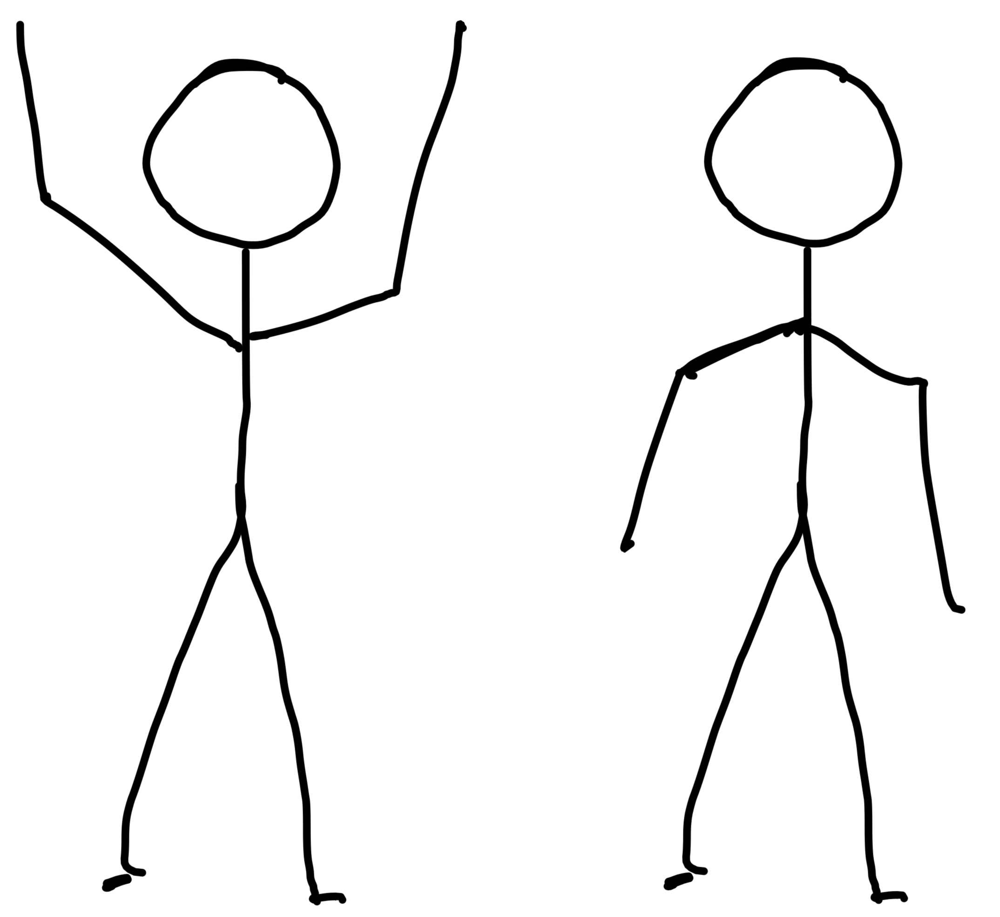
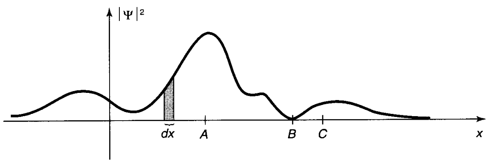
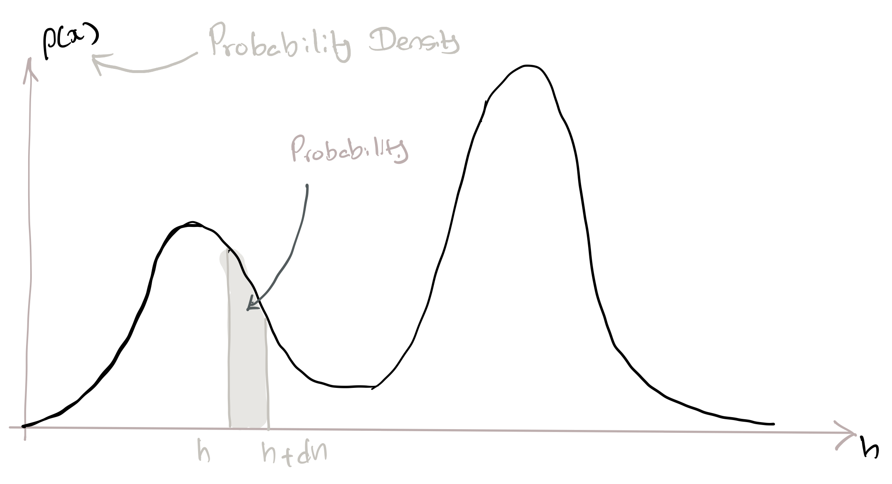
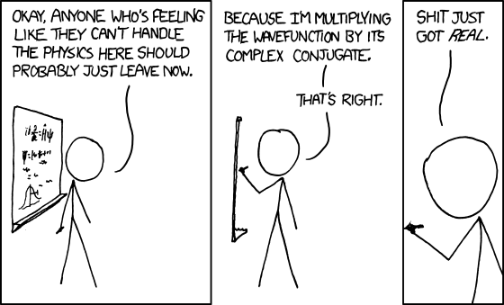

# <span class="my-sub-header">QM II: </span> Don't be Afraid of the Wave Function

<br>
```{r fig-qm-2-qm-2-solvay,out.width='95%',fig.cap='Some \'giants\' of Science at the Fifth [Solvay Conference](http://en.wikipedia.org/wiki/Solvay_Conference) (1927).[Image from Wikipedia].',fig.margin=F}
knitr::include_graphics('https://upload.wikimedia.org/wikipedia/commons/thumb/6/6e/Solvay_conference_1927.jpg/1280px-Solvay_conference_1927.jpg')
```

`r me.quote('As I have said so many times, God doesn\'t play dice with the world.','[Albert Einstein](https://en.wikipedia.org/wiki/Albert_Einstein)')`
<br>
`r me.quote('I think I can safely say that nobody understands quantum mechanics','[Richard P. Feynman](https://en.wikipedia.org/wiki/Richard_Feynman)')`

## What we have in store

<br>
```{r video-chap-06-main, out.extra='style="border: none;"', out.width='99%', fig.cap="Hello Wave Functions!", echo = FALSE}
knitr::include_url('https://www.youtube.com/embed/eHrVAov2Kn8')
```

In the previous chapter,  we began our journey into the quantum realm. However, the discussions were mind-boggling, vague and lacked rigour. The weirdness of QM becomes easier to understand once we cast these ideas in the language of mathematics.

This chapter introduces the all-important `r me.t("wave function")` which is at the heart of our recipe for understanding quantum systems. You will be pleasantly surprised to learn that the wave function is not as complicated nor as intimidating as you would have thought! 

Our focus in this chapter is only to understand **how to use** the wave function. We will deal with where the wave function comes from in the next chapter. 

A2M tries to understand QM through how QM predicts the results of measurements. We will slowly build the foundations for this from this chapter onwards. For this, we will introduce some the essential mathematical concepts of complex numbers, probability, probability distributions we need to understand QM. These are given at the end of the chapter in section \@ref(sec:qm-2-mathematics). You should look at these mathematical concepts before reading the QM portion^[I put it at the end so as not to interfere with our main story.].

## The Wave function

```{r fig-qm-2-psi, fig.cap='The wave function, denoted by $\\Psi$, is at the heart of quantum mechanics.<br>[From Physics World (May 2013)](www.physicsworld.com.uk)}'}
knitr::include_graphics('my-figures/t04_psi.png')
```

One of the fundamental ideas of QM is that **everything** about a system is contained within a 'thing' called the `r me.t("wave function")`. We usually use the Greek letter $\Psi$ to represent this wave function. 

$\Psi$ generally depends on **space** (e.g. $x ,y, z$) and **time** ($t$)^[This means that $\Psi$ changes as you move around in space and as time 'flows'.]. It is also usually a mathematical **complex**^[Again(!), complex does **not** mean complicated ]. Due to it being complex function, $\Psi(x,y,z,t)$ **cannot be directly measured** but it nevertheless exists!

:::definition
$\Psi(x,y,z,t)$ is a complex function that contains everything you are allowed to know about a system. 
:::
 
## States of a system

```{r fig-qm-2-updownMan, fig.cap="There are many ways for system to 'exist'. For example, two possible states for the man are 'both arms up' or 'both arms down'. The wave function of a system depends on the state of the system. The wave function for 'both arms up' ($\\Psi_\\uparrow\\uparrow$) is not same as the wave function for 'both arms down'($\\Psi_\\downarrow\\downarrow$)."}

```

We usually discuss QM in the context of a well defined system. We can define a system by describing the **potential energy** ($U$) and the **boundary conditions**. For example, we can describe the particle-in-a-box (PIB) system (previously mentioned in section \@ref(sec:PIB-01)) with:

$$
U(x) = \left\{\begin{array}{lcl}
    \infty & for & x \leq 0 \\
    0 & for & 0\lt x \lt 0 \\
    \infty & for & x \geq L \\
\end{array}\right.
$$

A system can exist in many `r me.t("states")` . A simple example is the man in figure \@ref(fig:fig-qm-2-updownMan). He has the option of being in one of four different states depending on if his arms are up or down. A more quantum mechanical example is, again, the particle-in-a-box system. There,  every energy state, $E_{n}$ of the particle (characterised by the quantum number $n$) is a state.

In general, every different state has a unique wave function. For example for the man, $\Psi_{\downarrow\downarrow}$ is different from $\Psi_{\downarrow\uparrow}$. For the particle-in-a-box, each energy state $E_n$ has its own wave function $\Psi_n$^[Which we will meet in the next chapter.].

## How to use the wave function

Since the wave function is complex, it cannot be measured. However, remember that the modulus or the absolute value of a complex number, $|z|$ (see section \@ref(sec:complex-numbers)) is **always** real and non-negative. This lead [Max Born](https://en.wikipedia.org/wiki/Max_Born) to offer the following 'operational' **interpretation** of the wave function.

:::definition
$\Psi(x,t)$ is related to reality (i.e. to measurements and observations) through `r me.t("Born's statistical interpretation")`<br>
$$
\int_a^b \left| \Psi(x,t)\right|^2 \,dx = \left \{\begin{array}{l}\text{probability of finding the particle}  \\ \text{between $a$ and $b$, at time $t$} \end{array} \right. (\#eq:born)
$$
:::

`r cap<-'Giving $\\Psi$ a meaning$\\ldots$ The plot shows the probability distribution of finding the particle at a location $x$. Image from Griffiths.'`


Notice how the square of the modulus ($|\Psi|^{2}$) of the wave function **plays the role of a probability density function**^[I.e. $|\Psi|^2dx$ is the probability of finding the particle between $x$ and $x+dx$]. 

With this **interpretation**, we can use the wave function (more accurately the square of the wave function) to make predictions about reality. For example, the particle in figure \@ref(fig:fig-qm-2-interpretingPsi)(from @Griffiths2005) has the greatest probability of being observed around the point $A$. It will **never** be observed around point $B$. 

```{r fig-qm-2-interpretingPsi, fig.cap=cap,fig.margin=F,out.width='85%'}

```

The whole edifice of quantum mechanics^[Copenhagen Interpretation] is built atop Born's interpretation. Some have described QM as 'quantum cookery'. From this point of view, Born's statistical **interpretation**  is one of the most crucial steps of the recipe.


<!----------------------------------------------------------------------->
## The Wave Function for Identical Particles
<!----------------------------------------------------------------------->
$$\renewcommand{\temp}[1]{\large\underbrace{(n_#1,m_#1)}_{\begin{array}{c}
\text{parameters}\\
\text{describing}\\
\text{particle #1}
\end{array}}}$$

A given elementary particle, for examples an electron, is identical to any other electron. This has some fascinating consequences in quantum mechanics.

Consider a system whose wave function is $\Psi$ and consists of two identical particles. Let's say that each particle in the system is fully described by specifying two parameters $(n,m)$  that requires just two numbers. Compare this to the man with his arms up or down in the previous section.

Let's look at the system when it is in the state given by the wave function:

$$
\Psi_{\temp{1},\temp{2}} (\#eq:xxx)
$$

$$\renewcommand{\temp}[1]{(n_#1,m_#1)}$$

Lets make our writing a bit simpler by adopting the notation $\Psi(1,2)$ to represent $\Psi_{\temp{1},\temp{2}}$.

Lets now swap the ($1 \leftrightarrow 2$) particles so that, particle 1 takes $n_2$ and particle 1 takes $n_2$. Since they are identical, we will not be able to **measure** any difference. This ultimately means that:

$$
|\Psi(1,2)| = |\Psi(2,1)| (\#eq:identicalSwap)
$$

Notice that even though we cannot see it in equation \@ref(eq:identicalSwap), the wave function **can** change during the ($1 \leftrightarrow 2$) swap but still respect equation \@ref(eq:identicalSwap). I.e. the wave function can change but we won’t be able to measure it because we ‘see’ only $|\Psi|^2$.


There are **only** two ways that the wave function can change without us 'seeing'.

\begin{align*}
\Psi(2,1) &= +\Psi(1,2) \quad\text{Symmetric} (\#eq:wf-symmetric) \\[1em]
\Psi(2,1) &= -\Psi(1,2) \quad\text{Anti-symmetric} (\#eq:wf-antisymmetric) 
\end{align*}

It turns out that there are two types of fundamental particles in our Universe corresponding to the two possibilities. Those particles that abide by the $-1$ (anti-symmetric) version of the swap rule are called `r me.t("fermions")`. The other type of particles that abide by the  $+1$ (symmetric) swap rule are called `r me.t("bosons")`. 

It has been shown that **bosons** have **integer** `r me.t("spin")`^[*Spin* is another fundamental, intrinsic property of matter just like charge or mass.] and **fermions** have **half-integer** spin. Both protons and electrons are fermions (and have a spin of $\frac{1}{2}$) while photons are bosons (with spin $1$).

<!----------------------------------------------------------------------->
### Pauli's Exclusion Principle
<!----------------------------------------------------------------------->

```{r, child='_my-latex.Rmd'}

```
$$\renewcommand{\temp}[1]{(n_{#1},m_{#1})}$$

Consider a system of $N$ identical particles with properties described by parameters $(n,m)$. We can write the wave function of this system as^[Remember; this is shorthand for $\Psi_{\temp{1},\temp{2},\temp{3},\ldots\temp{N}}$.] $\Psi(1,2,3,4,\ldots,N)$ where the numbers indicate the state that each particle is in. 

Now let's see what happens if we have two particles in the same state (i.e. the same parameters). 

For example lets say that  $(n_2,m_2) = (n_3,m_3)$ so that the wave function for the system will now be $\Psi(1,\textcolor{myGreen}{3},\textcolor{myGreen}{3},4,\ldots,N)$.

If we now exchange particle $2$ and $3$ equations \@ref(eq:identicalSwap) insists that:
<!-- \begin{subequations}(equ:pauli) -->
\begin{align}
\Psi(1,3,3,4,\ldots N) &= +\Psi(1,3,3,4,\ldots N) \quad\text{for bosons}\\ \\
\Psi(1,3,3,4,\ldots N) &= -\Psi(1,3,3,4,\ldots N)\quad \text{for fermions} % (equ:pauliFermions)
\end{align}
<!-- \end{subequations} -->

Since these particles are identical, there can be no difference between the $\Psi$ on the left-hand side and the right-hand side of equations. This poses no problem for bosons.
However,  the only way fermions can satisfy the above equation is if $$\Psi(1,3,3,4,\ldots N)=0$$

Which means **we cannot have two fermions with the same parameters in the same system**. This is the celebrated `r me.t("Pauli's Exclusion Principle")`! 

<!---------------------------------------------------------------------------->
## Some mathematical necessities {#sec:qm-2-mathematics}
<!---------------------------------------------------------------------------->
```{r, child='_my-latex.Rmd'}

```

`r me.quote('The miracle of the appropriateness of the language of mathematics for the formulation of the laws of physics is a wonderful gift which we neither understand nor deserve.','[Eugene Wigner](https://en.wikipedia.org/wiki/Eugene_Wigner)')`

### Probability Distributions


Let's say you woke up one morning with a great urge to measure heights. You walk around town meeting people and measuring their height ($h$). You now have a nice set of $N$ values  $h_1,h_2,h_3,\cdots h_N$

You can do a few things with your data. You can provide a representative height for your data set by calculating the  `r me.t("average")` or `r me.t("expectation")` of the heights.

$$
\ex{h} = \dfrac{1}{N}\sum_{i=1}^{i=N} h_i
$$

You can go further and give an indication of the spread of the heights by calculating the `r me.t("standard deviation")` , $\sigma_h$ defined as:
$$
\sigma_h=\sqrt{\dfrac{1}{N} \sum_{i=1}^N (h_i-\ex{h})^2}
$$

We can combine the above equations to get a more useful form for $\sigma_h$ 
$$
\sigma_h^2=\ex{h^2}-\ex{h}^2 (\#eq:sd-easy-equation)
$$

Please see section \@ref(sec:qm-2-proofs) at the end of the chapter for the proof.


```{r fig-qm-2-prob-dist,fig.cap='A probability distribution for your height measurements.'}

```


But all these are descriptive of your data. Can we do something to predict stuff? (For example, what is the probability that the next person you meet has a height between 1.65 m and 1.75 m?) To do this, you need to know the `r me.t("probability distribution")` (like that shown in figure \@ref(fig:fig-qm-2-prob-dist)) that describes your population’s heights. How such a distribution works is by defining a function $\rho(h)$ called the `r me.t("probability density function")`. Once you do that  $\rho(h)dh$ will tell you the probability of finding a height between $h$ and $h+dh$. If you want a more broader height range (say between $H_a$ and $H_b$) then the probability is given by $\displaystyle \int_{h=H_a}^{h=H_{b}} \rho(h)dh$. 

So, in general,

:::definition
For a probability density function $\rho(h)$ related to a variable $x$:
$$
\begin{align*}
\rho(x)\,dx &= \left\{\;\text{probability of getting a value between $x$ and $x+dx$}\right.\\[1em]
\int_a^b \rho(x)\,dx &= \left\{\;\text{probability of getting a value between $x=a$ and $x=b$}\right.
\end{align*}
$$
:::

Notice that this way, the area under the curve represent the probability. Note also that it does not make sense to speak of the probability of an **exact** height because it will be zero.

These ideas are very useful to understand how measurements in  QM works.  You will see that the wave function is related to the probability density function.


Here are some more formulae to see how probabilty and probability distributions are used. If you want the proofs, some are provided at the end of the chapter.

#### Discrete Probability Distributions 

```{r, child='_my-latex.Rmd'}

```


If $p_0, p_1, p_2\ldots$ are the probabilities of getting the numbers $x_0, x_1,x_2,\ldots$

<table style="border:none;font-size:1.25em">
<!---------------------------------------------------------------------------->
<tr>
<td>
 Average (mean or expectation) value of $x$ is given by:
</td>
<td>
$$
\ex{\textcolor{myBrown}{x}}= \sum_{j=0}^{j=\infty} \textcolor{myBrown}{x_j}\,p_j
$$
</td>
</tr>
<!---------------------------------------------------------------------------->
<tr>
<td>
Expectation value of the square of the numbers, $\ex{x^2}$, is given by:
</td>
<td>
$$
\ex{\textcolor{myBrown}{x^2}}= \sum_{j=0}^{j=\infty} \textcolor{myBrown}{x^2_j}\,p_j
$$
</td>
</tr>
<!---------------------------------------------------------------------------->
<tr>
<td>
Expectation value of any function $f(x)$ can be given by:
</td>
<td>
$$
{\ex{\textcolor{myBrown}{f(j)}}= \sum_{j=0}^{j=\infty} \textcolor{myBrown}{f(j)}\,p_j} 
$$
</td>
</tr>
<!---------------------------------------------------------------------------->
</table>

<!---------------------------------------------------------------------------->
#### Continuous Probability Distributions 
<!---------------------------------------------------------------------------->

If the probability distribution, $\rho(x)$, is continuous$\ldots$

<!---------------------------------------------------------------------------->
<table style="border:none;font-size:1.25em;">
<tr>
<td>
Probability of getting a number between $x$ and $x + dx$ is given by:
</td>
<td>
$$
dp = \rho (x) dx
$$
</td>
</tr>
<!---------------------------------------------------------------------------->
<tr>
<td>
Probability of getting a value of $x$ between $a$ and $b$ is given by:
</td>
<td>
$$
p_{ab} = \int_{a}^{b}\textcolor{myGreen}{\rho (x) dx}
$$
</td>
</tr>
<!---------------------------------------------------------------------------->
<tr>
<td>
Expectation value of $x$ can be given as:
</td>
<td>
$$
\ex{\textcolor{myBrown}{x}} = \int_{-\infty}^{\infty} \textcolor{myBrown}{x}\,\textcolor{myGreen}{\rho (x) dx}
$$
</td>
</tr>
<!---------------------------------------------------------------------------->
<tr>
<td>
Expectation value of any function $f(x)$ can be given by:
</td>
<td>
$$
{\ex{\textcolor{myBrown}{f(x)}} = \int_{-\infty}^{\infty} \textcolor{myBrown}{f(x)}\,\textcolor{myGreen}{\rho (x) dx}} 
$$
</td>
</tr>
<!---------------------------------------------------------------------------->
</table>

<!----------------------------------------------------------------------->
### Complex Numbers {#sec:complex-numbers}
<!----------------------------------------------------------------------->
We use numbers every day (e.g. to measure stuff or to keep track of things). However, can you think of a number that will be negative when it is squared? You can, if you **define**^[Really a fancy way to say 'hide'!]  and use $i \equiv\sqrt{-1}$. This opens up the richer mathematical landscape of `r me.t("complex numbers")` that with additional powerful theorems, strategies, tools & tricks to solve real-life problems (see the example below). It is very important to note that 'Complex' **does not** imply 'complicated'. Instead it means 'compound' because complex numbers they have two parts.  

An example of a complex number is:
$$
z = a + i\,b
$$

#### Real and imaginary parts  
Notice that a complex number is made up of a `r me.t("real part")` and an `r me.t("imaginary part")`^[Both $a$ and $b$ are just numbers]

$$
\begin{array}{rlc}
\text{Real part}  &:& Re(z) = a \\
\text{Imaginary part}  &:& Im(z) = b \\
\end{array}
$$

#### Complex conjugate
Every complex number, $z$, can be associated with another complex number called its `r me.t("complex conjugate")`, $z^*$. We obtain the complex conjugate by simply replacing **all** occurrences of $i$ with $-i$. So,
\[
z=a+ib \Rightarrow z^{*}=a-ib
\]


```{r fig-qm-2-xkcd-complex-humour, fig.cap='Some complex humor from [xkcd](http:\\xkcd.com). (Sorry about the language; the cartoon was too funny not to be shared)',out.width='100%'}

```


#### $z\,z^*$ is always real 

Multiplying $z$ and $z^*$ **always** yields a **non-negative** and **real** number.
\begin{align*}
z\,z^*&=(a+ib)(a-ib) \\
&= a^2 -abi +abi - (ib)^2 \\
&= a^2-(-1)b^2 \\
&= a^2+b^2
\end{align*}

#### Modulus
We can define a `r me.t("modulus")` (or absolute value) $|z|$ for a complex number, $z$.
The modulus^[We will soon see that $|z|^2$ plays a more important role in quantum mechanics than $|z|$.], $|z|$, is important as it is a single, real number that is **representative** of the complex number.

$$
|z|^2 = z\,z^*=a^2+b^2 (\#eq:complex-modulus)
$$


#### Euler Identity
Any complex number can be written in exponential form using the `r me.t('Euler identity')`:

$$
{e^{i \theta} \equiv \cos \theta + i \sin \theta} (\#eq:complex-euler)
$$

### Example: Are complex numbers *really* useful?
Complex numbers provide us with a lot of tricks to handle 'real' math problems. Consider the following:
\begin{align*}
e^{i \theta} &\equiv \cos \theta + i \sin \theta \\
\Rightarrow \lr{e^{i \theta}\,}^{2} &\equiv \lr{\cos \theta + i \sin \theta\,}^{2}\\
\ie \quad e^{i 2\theta} &\equiv \cos^{2} \theta + 2 \sin \theta \cos \theta + i^{2} \sin^{2} \theta \\
\ie \quad \cos 2\theta + i \sin 2\theta &\equiv \lr{\cos^{2} \theta-\sin^{2} \theta\,}  + i\lr{2 \sin \theta \cos \theta\,} \\
\end{align*}

Comparing the real and imaginary parts of the left and right sides gives us:

\begin{align*}
\cos 2\theta  &\equiv \cos^{2} \theta-\sin^{2} \theta\,\\
\sin 2\theta  &\equiv   2 \sin \theta \cos \theta 
\end{align*}

Using complex numbers has made the proofs of these trigonometric identities a lot easier.

## My 3 Cents
1. The wave function $\Psi(x,y,z,t)$ contains all the information we can know about a system. Different states of a system will have different wave functions.
2. The wave function is usually a complex mathematical function and therefore cannot be measured. We give it meaning by **interpreting** $|\Psi|^2$ as the **probability density function** related to the system.
3. Probability and probability distributions play an essential role in QM. If $f(x)$ is a probability density then $f(x)dx$ is the probability of finding a particle between $x$ and $x+dx$.

## Some proofs {#sec:qm-2-proofs}

```{r, child='_my-latex.Rmd'}

```

**Expectation (or average) of $x$**
$$
\begin{align*}
\ex{x} &= \dfrac{n_1 x_1+n_2 x_2+n_3 x_3\ldots}{n_1+n_2+n_3\ldots} \br
&=
\l(\mathHigh{\dfrac{n_1}{n_1+n_2+n_3\ldots}}\r)x_{1}+\l(\mathHigh[myBlue]{\dfrac{n_2}{n_1+n_2+n_3\ldots}}\r)x_{2} +\l(\mathHigh[myRed!10]{\dfrac{n_3}{n_1+n_2+n_3\ldots}}\r)x_{3} + \ldots  \br
&= \mathHigh{p_1} x_1+\mathHigh[myBlue]{p_2} x_2+\mathHigh[myRed!10]{p_3} x_3\ldots\br
&= \sum p_{j} x_{j}
\end{align*}
$$

**Expectation (or average) of $x^2$**
$$
\begin{align*}
\ex{x^{2}} &= \dfrac{n_1 x_1^{2}+n_2 x_2^{2}+n_3 x_3^{2}\ldots}{n_1+n_2+n_3\ldots} \br
&= \l(\mathHigh{\dfrac{n_1}{n_1+n_2+n_3\ldots}}\r)x_{1}^{2} +\l(\mathHigh[myBlue!10]{\dfrac{n_2}{n_1+n_2+n_3\ldots}}\r)x_{2}^{2} +\l(\mathHigh[myRed!10]{\dfrac{n_3}{n_1+n_2+n_3\ldots}}\r)x_{3}^{2} + \ldots  \br
&= \mathHigh{p_1} x_1^{2}+\mathHigh[myBlue!10]{p_2} x_2^{2}+\mathHigh[myRed!10]{p_3} x_3^{2}\ldots\br
 &= \sum p_{j} x_{j}^{2}
\end{align*}
$$

**Expectation (or average) of $f(x)$**
$$
\begin{align*}
\ex{f(x)} &= \dfrac{n_1 f(x_1)+n_2 f(x_2)+n_3 f(x_3)\ldots}{n_1+n_2+n_3\ldots} \br
&= \l(\mathHigh{\dfrac{n_1}{n_1+n_2+n_3\ldots}}\r)f(x_{1}) +\l(\mathHigh[myBlue!10]{\dfrac{n_2}{n_1+n_2+n_3\ldots}}\r)f(x_{2}) +\l(\mathHigh[myRed!10]{\dfrac{n_3}{n_1+n_2+n_3\ldots}}\r)f(x_{3}) + \ldots  \br
&= \mathHigh{p_1} f(x_1)+\mathHigh[myBlue!10]{p_2} f(x_2)+\mathHigh[myRed!10]{p_3} f(x_3)\ldots\br
 &= \sum p_{j} f(x_{j})
\end{align*}
$$

**Alternate form for $\sigma_h$**

$$
\begin{align*}
\sigma^2_h 	&= \dfrac{1}{N} \sum_{i=1}^N (h_i-\ex{h})^2 \\
			&= \dfrac{1}{N} \sum_{i=1}^N (h^2_i-2h_i\ex{h}+ \ex{h}^2)\\
			&= \dfrac{1}{N} \sum_{i=1}^N h^2_i-2\ex{h}\times\dfrac{1}{N} \sum_{i=1}^N h_i +\ex{h}^2\times\dfrac{1}{N} \sum_{i=1}^N1 \\
			&=\ex{h^2} - 2 \ex{h}\times\ex{h} + \ex{h}^2\times 1 \\
\sigma_h^2&=\ex{h^2}-\ex{h}^2
\end{align*}
$$


