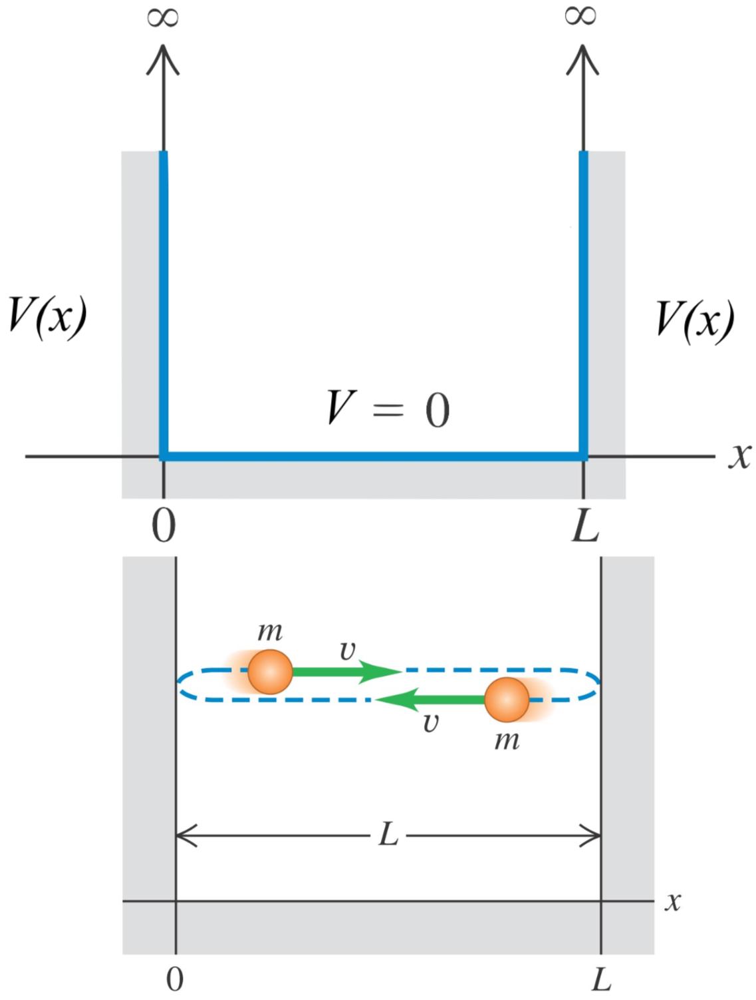
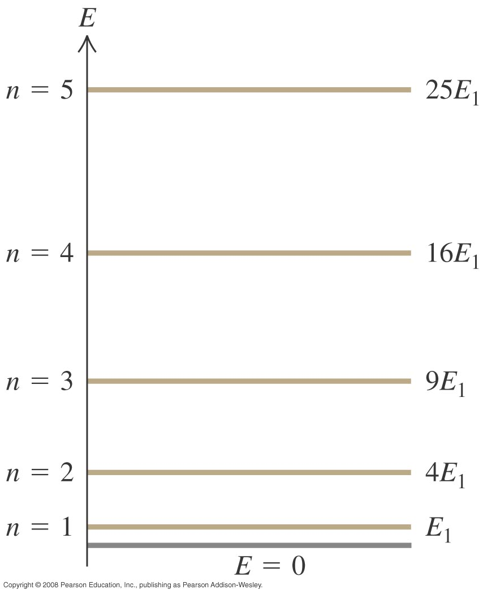
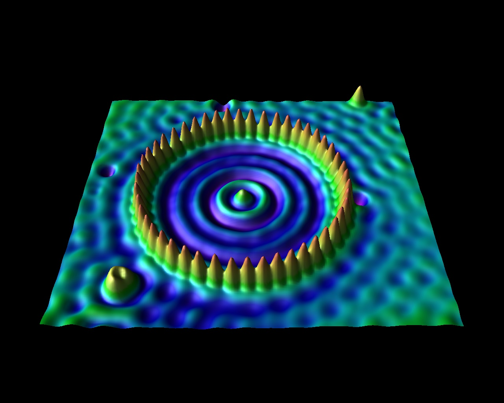
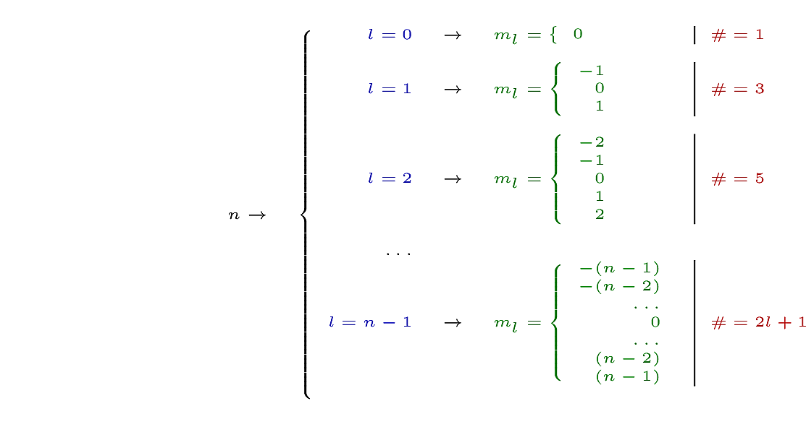
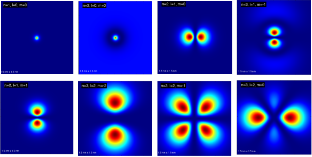

# <span class="my-sub-header">QM III: Measurements I</span> Mommy, Where do wave functions come from?

<br>
```{r,fig.cap='From [xkcd](http://xkcd.com)',out.width='85%'}
knitr::include_graphics('https://imgs.xkcd.com/comics/quantum_mechanics.png')
```

`r me.quote('The universe is not only stranger than we imagine, it is stranger than we [can] imagine','[Arthur Eddington](https://en.wikipedia.org/wiki/Arthur_Eddington) or/and [J. B. S. Haldane](https://en.wikipedia.org/wiki/J._B._S._Haldane)')`
<br>

`r me.quote('There is no quantum world. There is only an abstract quantum description.','[Niels Bohr](https://en.wikipedia.org/wiki/Niels_Bohr)')`
<br>

`r me.quote('Anyone who is not shocked by quantum theory has not understood it.','[Niels Bohr](https://en.wikipedia.org/wiki/Niels_Bohr)')`

## What we have in store

<br>
```{r video-chap-07-main, out.extra='style="border: none;"', out.width='99%', fig.cap="Time to delve deeper!"}
knitr::include_url('https://www.youtube.com/embed/h82yy_dakMQ')
```

Measurements are central to all disciplines of science. No matter how sophisticated a model is theoretically, it has little practical value if it is not related to measurable quantities.  Despite being weird and abstract QM enjoys reliable experimental support. It has a robust formalism (i.e. a good recipe) to make predictions of measurements. This has allowed QM to reward us with many, **many** revolutionary, life-altering technologies (e.g. LASERS,  NMR). This in its own, is justification enough for us to learn and trust this quantum description of our Universe. However, QM has done a lot more; it has shaken our core beliefs and robbed us of this 'thing' we call 'reality'.

In this chapter, we will focus on the features of the quantum recipe that will help us study how atoms form molecules. We will delve into **just enough** depth for us to achieve this. However, we will also try to get a flavour of this devastating  'loss of reality'.

## Measurements

The formalism (i.e. recipe) of QM allows us to answer questions such as:
1. What (different) values will we observe if we measure a property?
1. What is the probability for us to 'see' (measure) one of these values?
1. What value is most likely?

All these questions are essential in our quest to understand how QM describes molecules. So, let's start by understanding how QM treats measurements. For this, we need to start with `r me.t("operators")`.

### Operators {#sec-qm-operators}

```{r}
fn2 <- '^[This operator has a special name; the <span class="high">Hamiltonian</span>]'
```

We discussed the phenomenon of quantisation in section \@ref(#sec-quantisation). How can we recast this experimental observation into the language of mathematics? QM does this by representing each measurable quantity (e.g. energy, momentum, position) with an `r me.t("operator")`^[An **operator** is just a fancy word for a mathematical instruction. $+$, $-$, $\times$ and $/$ are examples of operators that you know. $\dfrac{d}{dx}$ is another example. It just says \'**differentiate w.r.t $x$**\'!<br>
Similarly, the (momentum) operator, $\hat{p} \equiv \dfrac{\hbar}{\imath}\dfrac{d}{dx}$, says differentiate w.r.t. $x$ and then multiply by $\dfrac{\hbar}{i}$.].

$\hat{H}$`r fn2`, $\hat{T}$, $\hat(V)$ $\hat{p}$ and $\hat{x}$ are the operators for total energy, K.E., P.E., momentum and position respectively. Shown below are the 'meanings' of these operators:

|         | Position  |                     Momentum                     |                        Kinetic energy                        |   Potential energy   |                     Total energy                      |
| ------- | :-------: | :----------------------------------------------: | :----------------------------------------------------------: | :------------------: | :----------------------------------------------------------: |
| Symbol  | $\hat{x}$ |                    $\hat{p}$                     |                          $\hat{T}$                           |      $\hat{V}$       |                          $\hat{H}$                           |
| Meaning |    $x$    | $\displaystyle \dfrac{\hbar}{i}\,\dfrac{d}{d x}$ | $\displaystyle -\dfrac{\hbar^{2}}{2m}\dfrac{d^{2}}{d x^{2}}$ | $\displaystyle V(x)$ | $\displaystyle -\dfrac{\hbar^{2}}{2m}\dfrac{d^{2}}{d x^{2}}+V(x)$ |

Please note that $\hbar \equiv \dfrac{h}{2\pi}$.

### Using operators {-}

We can apply an operators on a function. For example lets apply the momentum operator ($\hat{p}$) to the function $f(x) = x^2$:

$$
\hat{p} f(x) = \hat{p}\left(x^2\right) = -i \hbar\,\frac{d}{d x} \left(x^2\right) = -i \hbar\,\frac{d x^2}{d x}  = -2ix\hbar
$$

### Eigenfunctions and Eigenvalues of an operator{-}

It turns out that every operator has a unique set of 'favourite' functions that behave in a special way, different from any other function.

For example lets use $f_{p_{0}}(x) = \dfrac{1}{\sqrt{2\pi\hbar}}e^{ip_0x/\hbar}$ with the moementum operator.

\begin{align*}
\hat{p} f_{p_{0}}(x) &= \hat{p}\left(\dfrac{1}{\sqrt{2\pi\hbar}}e^{ip_0x/\hbar}\right) \\
&= -i \hbar\,\frac{d}{d x} \left(\dfrac{1}{\sqrt{2\pi\hbar}}e^{ip_0x/\hbar}\right) \\
&= -i \hbar\times\dfrac{1}{\sqrt{2\pi\hbar}}\left(\frac{d\, e^{ip_0x/\hbar}}{d x} \right) \\
&= -i \hbar\times\dfrac{1}{\sqrt{2\pi\hbar}}\left(\dfrac{i p}{\hbar} e^{ip_0x/\hbar} \right) \\
&= p_0\left(\dfrac{1}{\sqrt{2\pi\hbar}}e^{ip_0x/\hbar}\right) \\
\text{i.e.}\qquad \hat{p} f_{p_{0}}(x)&= p_0 f_{p_{0}}
\end{align*}

Did you see what just happend? When we applied the operator $\hat{p}$ to $f_{p_{0}}(x)$ , we **got back the same function** but with the constant $p_0$ in front. The special function $f_{p_{0}}(x)$ is called an `r me.t("eigenfunction")` of the operator $\hat{p}$.  The constant $p_0$ is called the `r me.t("eigenvalue")` corresponding to the eigenfunction $f_{p_{0}}(x)$.

To recap, equations of the type shown below are called **eigevalue equations**.
$$
\hat{O}f_n = o_n f_n  (\#eq:gen-operator)
$$
$f_n$ is the **eigenfunction** of the operator $\hat{O}$ that corresponds to the **eigenvalue** $o_n$.

### QM & Measurements

Now we are ready to understand how QM mathematically represents measurements and quantisation.

:::definition
QM says that measurement of **certain** properties (e.g. energy, momentum) will give only **discrete** (i.e. quantised) values. <br>We can find the list^[Also called the **spectrum**.] of possible, quantised values (e.g. $E_n$, $p$) by solving the appropriate **eigenvalue** equations.
:::

Here are the eigenvalue equations for energy, momentum and position.

\begin{align}
\text{Energy:}&\quad\quad\hat{H}\psi_n = E_n \psi_n (\#eq:qm-rule-02-energy)\\[5pt]
\text{Momentum:}&\quad\quad\hat{p}\phi_p = p \phi_p (\#eq:qm-rule-02-momentum) \\[5pt]
\text{Position:}&\quad\quad\hat{x}f_x = x f_x (\#eq:qm-rule-02-position)
\end{align}

<br>

$\psi_n$ is the eigenfunction of the operator $\hat{H}$ that corresponds to the eigenvalue $E_n$.<br>
$\phi_p$ is the eigenfunction of the operator $\hat{p}$ that corresponds to the eigenvalue $p$.<br>
$f_x$ is the eigenfunction of the operator $\hat{x}$ that corresponds to the eigenvalue $x$.<br>

Notice that there is a whole **family** of functions (corresponding to different values of $n$) that satisfy each of these equations. Each eigenvalue represents a quantised value. I.e. a value we are **allowed** to see if we measure energy, momentum or position.

By the way, \@ref(eq:qm-rule-02-energy) is what we normally refer to as the `r me.t('Schrödinger equation')`.

## Mommy, where do wave functions come from? {#sec:-qm-mommy-where-do-wavefunctions}

```{r fig-pib, fig.cap='The 1D particle-in-a-box is a simple system. A particle of mass $m$ is trapped in a 1D box of length $L$. The box has infinitely high walls and the particle has only K.E.'}

```
What we call wave functions are `r me.t("really the eigenfunctions of the various operators!")`. So, we **just** need to solve the eigenvalue equations to discover the eigenfunctions (i.e. the wave functions) and the corresponding eigenvalues (i.e. the quantised values).

It is good for you to see how we solve for an eigenfunction at least once. Then you will see how quantisation **naturally** comes about due to the boundary conditions. So, let's solve for the eigenfunctions of the energy operator ($\hat{H}$) for the particle-in-a-box (PIB) system.

### Energy states for the PIB system

```{r, child='_my-latex.Rmd'}

```

The `r me.t("particle-in-a-box")` system shown in figure \@ref(fig:fig-pib) is one of the simplest systems that still allows a rigorous discussion of quantum ideas. The system consists of a particle of mass $m$ that is trapped in a 1D box of length $L$ that has infinitely strong walls. So, the particle cannot escape the box ^[This would require an infinite amount of energy.]. We take the PE inside the box to be zero. This means any change to the particle's energy is solely kinetic.

Since the potential energy outside the box is infinite, we do not expect to find the particle in the regions $x \leq 0$ and $x \geq L$. Hence,
\[
\psi(x) = 0 \text{$\qquad$ for $\qquad$} x \leq 0 \text{$\qquad$ and $\qquad$} x \geq L
\]

The energy eigenvalue equation is:
\begin{align*}
\hat{H} \psi &= E \psi  \\
\text{i.e.} -\dfrac{\hb^2}{2m} \daa{\psi}{x} + V(x) &= E\,\psi \\
\text{i.e.} -\dfrac{\hb^2}{2m} \daa{\psi}{x} + 0 &= E\,\psi \qquad\text{(Because $PE = 0$)}\\
	\text{i.e.}\quad\quad  \daa{\psi}{x} &= -k^2 \,\psi \quad \left(\text{where}\quad k = \dfrac{\sqrt{2mE} }{\hb}\right)
\end{align*}

#### Possible solutions {-}

Notice that a solution to above equation must be such that a double differentiation yields the same function. Possible functions that we can use as solutions are $\sin x$, $\cos x$, $e^{\pm x}$ and $e^{\pm\,i x}$.

**However**, a solution **must** also satisfy the boundary conditions at both ends of the well. Specifically,

\begin{align}
	\psi(0) &=0 (\#eq:pib-bounL)\\
	\psi(L)&=0 (\#eq:pib-bounR)
\end{align}

Hence, $e^{\pm x}$ is not suitable because $e^{\pm L} \neq 0$.

A more suitable solution will be,

\begin{align*}
	\psi(x) &= A\,\cos kx + B\,\sin kx\\
	\Rightarrow \quad\dfrac{d \psi}{d x} &= k (-A\, \sin kx + B\,\cos kx)\\
	\Rightarrow\quad\dfrac{d^2 \psi}{d x^2} &= k^2 (-A\, \cos kx - B\,\sin kx)\\
	\text{i.e.} \quad \dfrac{d^2 \psi}{d x^2} &= -k^2 \psi (\#eq:paSol)
\end{align*}


#### Finding the Constants {-}
We now have a solution that satisfies the eigenvalue equation for energy for the PIB. Our solution also needs to be more specific in that it must match the boundary conditions.

Specifically:

**For the left boundary:**

\[\psi(0) = A\,\cos k \times 0 + B\,\sin k \times 0 =0 \Rightarrow A =0 \]

**For the right boundary:**

\[\quad\psi(L) =  B\,\sin k \times L =0 \Rightarrow kL =n\pi\quad  \text{($n$ is a integer)} \]

So, now we have:
$$
 \psi(x)=B \sin \left(\dfrac{n \pi}{L}x\right) \quad\text{ and }\quad kL = n\pi
$$

The negative values of $n$ are not physically different from the positive ones^[Why?] and $n=0 \Rightarrow \psi(x) = 0$, which is not an interesting  solution.


#### Quantisation {-}

```{r fig-pib-levels, fig.cap='The allowed values of the total energy, $E_{n}$ of the particle.'}

```

For the solution we have found to work, the boundary conditions require:

\begin{align}
	kL&=n\pi\\
	\text{i.e.} \dfrac{\sqrt{2mE} }{\hb} &= \dfrac{n\pi}{L} \quad \\
	\Rightarrow E &= \dfrac{n^2 \pi^2 \hb^2}{2m L^2}
\end{align}


Since the boundary conditions only allow $n$  to take integer values, this means the energy can only have certain discrete values (!!!)

Therefore it is better to write a subscript $n$:

$$
 E_n = \dfrac{n^2 \pi^2 \hb^2}{2m L^2} (\#eq:paEn)
$$

`r me.t("Quantization")` of properties (e.g. energy, momentum, angular momentum$\ldots$) is a common feature of the quantum world. However, quantisation is not evident at energies and masses that **we** are accustomed to^[This is because $\hb$ is so small.]. It is important to realise that quantisation occurs due to a **geometric** constraint(!) as was seen in the above derivation.

#### Using Normalisation {-}
We can determine $B$ by remembering that the probability of finding the particle in the box is unity (this is called the  `r me.t("normalization")` condition):

$$
{\int_{x=0}^{x=L} |\psi|^2\,dx =1}
$$

Using this with our particle:

\begin{align}
	\int_{x=0}^{x=L} |\psi|^2\,dx = B^2 \int_{x=0}^{x=L}  \sin^2 \left(\dfrac{n \pi}{L}x\right) dx &= 1\\
	\Rightarrow \quad B^2 \int_{x=0}^{x=L} \dfrac{1}{2}\left[1- \cos \left(2\dfrac{n \pi}{L}x\right)\right] dx &= 1\\
	\text{i.e.} \quad B^2\left[x - \left(\dfrac{L}{2n\pi}\right) \sin \left(\dfrac{2n \pi}{L}x\right)\right]_{x=0}^{x=L} &= 2\\
	\Rightarrow B &= \sqrt{\dfrac{2}{L}}
\end{align}

So, we **finally** have the wave functions for the energy states for the PIB:

$$
\psi_n(x) =\sqrt{\dfrac{2}{L}} \sin \left(\dfrac{n \pi}{L}x\right)
$$


<!----------------------------------------------------------------------->
## Other solved systems
<!----------------------------------------------------------------------->

The essence of what we learnt from the particle-in-a-box system applies to all other systems, be it in 1D, 2D or 3D.
Specifically,

* if we want the wave functions (i.e. the eigenfunctions), we solve the corresponding eigenvalue equations and
* impose the boundary conditions to get the corresponding quantised values (i.e. the eigenvalues).

We do not need to look at the derivations of these other systems as they do not add many new things. Also, they are significantly more mathematically challenging. However, let's quickly visit the solutions to these systems and recognise how the boundary conditions 'shape' these solutions. In this sense **quantum mechanics is very much like music**.

### Particle-in-a-1D-ring

```{r, child='_my-latex.Rmd'}

```

```{r fig-fig-waveFunctions, engine='python',fig.cap='The wave functions for $n = \\pm 2$ and $n = 0$'}
import matplotlib.pyplot as plt
from sympy import *

plt.rcParams['figure.figsize'] = 10, 10
plt.rcParams['axes.facecolor'] = '#fffff8'

L, R = symbols('L R')
x, t = symbols('x \\theta')
n = symbols('n')

L = 1
R = L/(2*pi)
n = 2

wf_pos = sqrt(2/L)*sin(2*n*pi*x/L)
wf_zero = sqrt(1/L)
wf_neg = sqrt(2/L)*cos(2*n*pi*x/L)

p_pos = (R*cos(t),R*sin(t),wf_pos.subs(x,R*t),(t,0,2*pi))
p_zero = (R*cos(t),R*sin(t),wf_zero +.01*sin(t),(t,0,2*pi))
p_neg = (R*cos(t),R*sin(t),wf_neg.subs(x,R*t),(t,0,2*pi))

my_plot = plotting.plot3d_parametric_line(p_pos,p_zero,p_neg, show = False, legend = True)

p = my_plot[0]
p.line_color = 'darkred'
p.line_width = 20
p.label = '$n > 0$'

p = my_plot[1]
p.line_color = 'darkblue'
p.label = '$n = 0$'

p = my_plot[2]
p.line_color = 'darkgreen'
p.label = '$n < 0$'

my_plot.show()
```

If we solve the operator eqution for energy^[I.e. $\hat{H}\psi_n = E_n \psi_n$] for this system, we will end up with the following eigenvalues and eigenstates for energy.

$$
E_n = \dfrac{(2n)^2\pi^2 \hbar^2}{2mL^2}
$$

\begin{align}
	\text{For $n=0$}:\quad\psi_{n=0} &= \sqrt{\dfrac{1}{L}} \\
	\text{For $n>0$}:\quad\psi_{n >0}&=\sqrt{\dfrac{2}{L}} \sin \left(\dfrac{2n\pi}{L}x\right)\\
	\text{For $n<0$}:\quad\psi_{n < 0}&=\sqrt{\dfrac{2}{L}} \cos \left(\dfrac{2n\pi}{L}x\right)
\end{align}

Notice how this system allows for $n=0$^[With energy zero!] and also negative values of $n$.


### Particle in a 2D Box

$$\label{equ:pib2D_en}
E_{n_x,n_y}= \dfrac{\pi^2\hbar^2}{2m}\left(\dfrac{n_x^2}{L_x^2}+\dfrac{n_y^2}{L_y^2}\right)
$$

$$
\psi_{n_x,n_y}(x,y) = 2\,\sqrt{\dfrac{1}{L_x\,L_y}} \sin \left(\dfrac{n_x\,\pi\,}{L_x}x\right)\sin \left(\dfrac{n_y\,\pi\,}{L_y}y\right)
$$

<!----------------------------------------------------------------------->
#### Degeneracy {-}
<!----------------------------------------------------------------------->

The 2D PIB has a feature that the 1D PIB does not have; `r me.t("degeneracy")`! Certain combinations of $n_x$ and $n_y$ can yield^[Provided that $L_x$ and $L_y$ are also in a specific ratio] different states that have the same energy.For example when $L_x=L_y$, $\psi_{1,2}$ \&  $\psi_{2,1}$  or $\psi_{5,3}$ \&  $\psi_{3,5}$  are degenerate as $E_{1,2}=E_{2,1}$  and $E_{3,5}=E_{5,3}$ respectively. Degeneracy reflects inherent symmetries in a system. The Figures shows more possible degenerate states.

### Particle in a Disc

What will happen if we trap a particle in a 2D disc? Figure \@ref(fig:fig-qm-3-ibm) shows a **real** image of the electron density of electrons trapped in an atomic corral.

```{r fig-qm-3-ibm, fig.cap="This is a real image from IBM. The corral is made from atoms. The 'waves' are the electron density!",out.width='50%',fig.align='center'}

```

<!-- ### Particle on 3D Sphere -->

<!-- ## What happens after a measuremnts -->

<!-- ### Significance of a measurement -->

<!-- Here are a few examples of some quantum measurements:  -->

<!-- * Measuring the position of **an** electron in a double slit experiment (like in section \@ref(sec:electron-double-slit)).  -->
<!-- * Measuring the position of **a** photon in a double slit experiment. -->
<!-- * Measuring the polarisation of **a** photon. -->
<!-- * Measuring the spin orientation of a particle in a Stern-Gerlach (section \@ref(sec:stern-gerlach)) type experiment.  -->

<!-- A measurement is a *really,  really* big deal in QM. When you make a measurement, you will get one of the possible quantised values. I.e. you will get an **eigenvalue** of the **operator** corresponding to the property you are measuring. **You** also cause the system to take on a state (i.e. the eigenfunction) corresponding to this eigenvalue.  -->
<!-- We refer to this as `r me.t("collapsing")` the wave function. We will talk more of this later. For the moment lets talk about a very useful, real experiment. -->

<!-- <!-- ### Particle on 3D Sphere -->

<!----------------------------------------------------------------------->
## The many faces of Schrödinger
<!----------------------------------------------------------------------->

```{r, child='_my-latex.Rmd'}

```

As we have seen with the 1D PIB, 2D PIB and particle-in-a-ring, the Schrödinger equation takes many forms. In fact, the Schrödinger equation can be extended to higher dimensions and other coordinate systems.

Here are some examples are:

\begin{align}
\text{1D cartesian:} \quad \hat{H} &\equiv \left[-\dfrac{\hbar  ^2}{2m} \daa{}{x} + V(x)\right]\\
\text{2D cartesian:} \quad \hat{H} &\equiv \left[-\dfrac{\hbar  ^2}{2m} \left(\paa{}{x} + \paa{}{y} \right)+ V(x,y)\right]\\
\text{3D cartesian:} \quad \hat{H} &\equiv \left[-\dfrac{\hbar  ^2}{2m} \left(\paa{}{x} + \paa{}{y} + \paa{}{z} \right)+ V(x,y,z)\right]\\
\text{2D polar:} \quad \hat{H} &\equiv \left[-\dfrac{\hbar  ^2}{2m} \left(\paa{}{r} + \dfrac{1}{r}\pa{}{r} +  \dfrac{1}{r^2}\paa{}{\phi}\right)+ V(r,\phi)\right]
\end{align}


However, the essence of all these equations is always the same, and can be expressed as:

$$
\hat{H} \psi= E \psi\\
$$

## The hydrogen atom: A real 3D system

### Music in 3D

The hydrogen atom is one of the most important analytically solvable 3D systems in QM. Before proceeding, however, it is good to remind ourselves that **'quantum mechanics is like music'**. This is true even in 3D. Look at this cool video of an experiment done on bouncing droplets.

`r cap <- 'Remember how the wave functions of the partilce-in-a-box followed the waves in a string. The wave functions of the 3D hydrogen atom system also has a similar connection to **music in 3D**.'`

```{r vid-bouncing-droplets, out.extra='style="border: none;"', out.width='99%', fig.cap=cap}
knitr::include_url('https://www.youtube.com/embed/RPdKKlehv_E')
```

These modes of vibrations are called sperical harmonics. They are what gives the orbitals (i.e. the wave function) of the hydrogen atom their shapes!

### The hydrogen atom system

```{r tab-h-states,fig.cap='Possible states of a hydrogen atom for a given value of $n$.',out.width='100%'}

```
<!-- `r me.table('Possible states of a hydrogen atom for a given value of $n$.','h-states')` -->

The hydrogen atom is a system that consists of a proton and an electron. Solving the operator equation for energy^[i.e. $\hat{H}\psi = E \psi$] gives us the possible energy states of this system. Due to its 3D nature and the various symmetries involved, we need three ^[Four if you take the spin of the electron into account.] quantum numbers ($n,l,m_l$) to describe the various allowed^[i.e. allowed to be seen.] states of the hydrogen atom. All these quantum numbers can take only integer values under the following constraints:

1. $n$ (**principle** quantum number) must be non-zero and non-negative.
1. $l$ (**orbital** quantum number) must be non-negative and less than $n$.
1. $m_l$ (**magnetic** quantum number) can range from $-l$ to $+l$ ($2l+1$ possible states)

More specifically, the allowed values are:
$$
\begin{array}{rl}
	n &=1, 2, 3,\ldots \infty\\
 l&=0,1,2,3,\ldots,n-1\\
 m_l&=-l,\ldots,-1,0,1,\ldots,l
	\end{array}
$$

### Energy

The allowed energies (i.e. kinetic and electric potential energy) of the system is given by:


$$%(\#eq:eq:hydroEnergy)
{E_n = -\left[\frac{m_e}{2 \hbar^2} \left(\frac{e^2}{4 \pi \epsilon_0}\right)^2\right]\frac{1}{n^2} = \frac{E_1}{n^2}}
$$

$$
E_1 = -\left[\frac{m_e}{2 \hbar^2} \left(\frac{e^2}{4 \pi \epsilon_0}\right)^2\right] = -13.6~\text{eV}
$$

Irrespective of what the values of $l$, $m_l$ all these states will have the same energy because energy only depends on the (principle) quantum number, $n$. This leads to a $2n^2$ \q{degeneracy} of the energy state^[This means there are $2n^2$ states with the same energy.].

### Possible states
Notice how these combination of $(n, l,m_l)$ yields $n^2$ possible states as can be seen in table \@ref(tab:tab-h-states) and the following equation:

$$
1+3+5+\ldots +2l+1 = \sum_{l=0}^{n-1} (2l +1) = n^2
$$

Incorporating the electron spin(i.e. up spin and down spin) gives a total of $2n^2$.

### The hydrogen Wave Functions

```{r fig-projectionsOfH, fig.cap='Projections of the some total wave functions of hydrogen.',fig.margin=T,out.width='100%'}

```

Shown below are some of the wave functions for the hydrogen atom.

$$
\newcommand{\sol}[3]{\psi_{{n=#1},\,{l=#2},\,{m_{l}=#3}}}
%
\begin{align*}
\sol{1}{0}{0} &=\, \frac{1}{\sqrt{\pi}a_{0}^{3/2}}e^{-r/a_{0}}\\
\sol{2}{0}{0} &=\, \frac{1}{4\sqrt{2\pi}a_{0}^{3/2}}\left(2- \frac{r}{a_{0}}\right)e^{-r/2a_{0}}\\
\sol{2}{1}{0}&=\, \frac{1}{4\sqrt{2\pi}a_{0}^{3/2}}\frac{r}{a_{0}}e^{-r/2a_{0}}\cos\theta\\
\sol{2}{1}{+1}&=\,\frac{1}{8\sqrt{\pi}a_{0}^{3/2}}\frac{r}{a_{0}}e^{-r/2a_{0}}\sin\theta e^{ i \phi}\\
\sol{2}{1}{-1}&=\,\frac{1}{8\sqrt{\pi}a_{0}^{3/2}}\frac{r}{a_{0}}e^{-r/2a_{0}}\sin\theta e^{- i \phi}
\end{align*}
$$

To directly plot these 3D wave functions will require a 4D space! So, we need to resort to other methods to visualize them. Figure \@ref(fig:fig-projectionsOfH) shows the projections of some the wave functions on a plane.

## My 3 Cents

1. QM associates an operator with each property (observable) of a system we can measure. These operators have eigenfunctions and eigenvalues corresponding to the system.
2. The eigenvalues of the operator are the values of the property (e.g. energy) that we will ‘see’ when we make a measurement. The corresponding eigenfunctions are the wave functions related to the states we measured.
3. We can carry over our understanding(e.g. how to use the wave function) of wave functions from the 1D particle-in-a-box into higher dimensions (2D, 3D). The Hydrogen atom is a crucial 3D system that will be the workhorse for the analysis of the $H_2^+$ molecule late in A2M.


