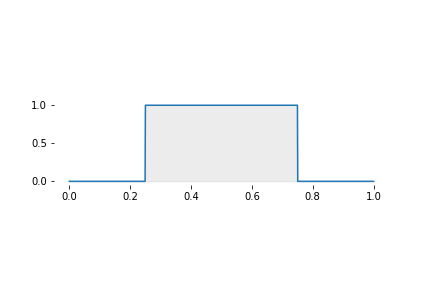
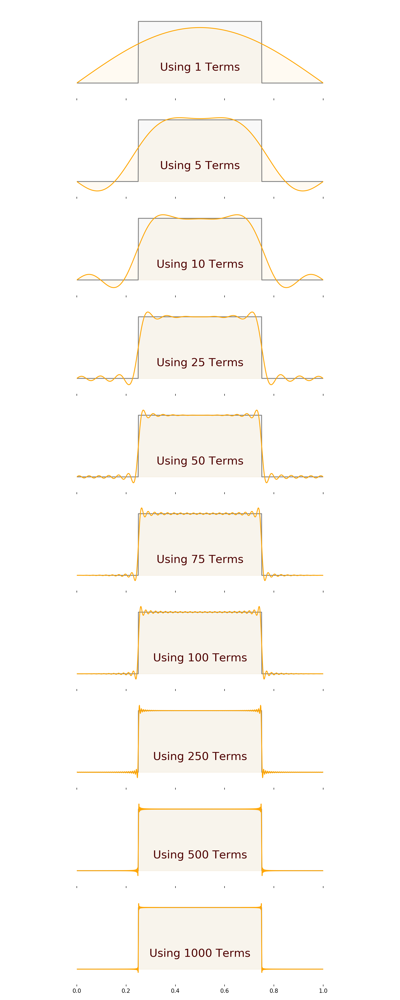
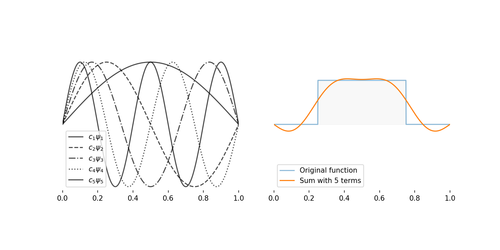

# <span class="my-sub-header">QM V: Measurements III</span> The Meaning of it All!

<br>

```{r,echo=FALSE,out.width='100%',fig.margin=F,fig.cap='Image from [IAS](https://www.ias.edu/ideas/2014/ambainis-quantum-computing)'}
knitr::include_graphics('https://www.ias.edu/sites/default/files/styles/grid_feature_teaser/public/images/featured-thumbnails/ideas/dt_c120417.jpg?itok=_AqJ9MtK')
```

`r me.quote('We ought then to regard the present state of the universe as the effect of its anterior state and as the cause of the one that is to follow. Given for one instant an intelligence which could comprehend all the forces by which nature is animated and the respective situation of all the beings who compose it- an intelligence sufficiently vast to submit these data to analysis - it would embrace in the same formula the movements of the greatest bodies of the universe and those of the lightest atom; for it, nothing would be uncertain and the future, as the past, would be present to its eyes. The human mind offers, in the perfection which it has been able to give to astronomy, a feeble idea of this intelligence. Its discoveries in mechanics and geometry, added to that of universal gravity, have enabled it to comprehend in the same analytical expressions the past and the future states of the world.','[Pierre Simon Laplace](https://en.wikipedia.org/wiki/Pierre-Simon_Laplace)')`

## What we have in store

```{r, child='_my-latex.Rmd'}

```

<br>
```{r video-chap-09-main, out.extra='style="border: none;"', out.width='99%', fig.cap="The meaning of it all."}
knitr::include_url('https://www.youtube.com/embed/QW0l2MK0kGU')
```

We are ready to conclude our short journey into the quantum realm. In this chapter, we will piece everything we learnt together into understanding how QM describes **reality**. It will turn out that the deterministic Universe that Laplace describes is non-existent. I will show you two features of wave functions called `r me.t("Orthonomality")` and `r me.t("Completeness")`. These will empower us to see the meaning of all we have discussed! You will be able to understand the Schrodinger's Cat paradox and see what it means when QM says there is no 'objective reality'! We will also look at the famous (real) Stern-Gerlach experiment to convince ourselves that the (weird and abstract) QM description of the Universe is not just an intricate story, but a fact! We will end this chapter by deriving the powerful Ritz's Variational Principle, which will be our primary tool to attack the H$2^+$ molecule.

A lot is going to happen in this chapter. Don't panic! The basic ideas of quantum mechanics are more **weird** than mathematically challenging.

## Orthonormality
```{r, child='_my-latex.Rmd'}

```

Let's look at an important property of wave functions called `r me.t("Orthonomality")`. The idea behind this is quite simple. You already know it because you use the $xyz$ Cartesian coordinate system!

When you specify a coordinate $(x,y,z)$ you **understand** that $x$, $y$ and $z$ are unique and **not related** (independent). $x$, $y$ and $z$ describe entirely different 'positions' of the point. You cannot get the meaning of $y$ by looking at $x$ or $z$. This happens because of the $x$, $y$, $z$ axes being perpendicular (orthogonal) to each other.

The wave functions (eigenfunctions) in QM also has a similar 'perpendicularness' or normality to each other. For example, for the particle-in-a-box system, this means that  $\psi_3$ is perpendicular (orthogonal) to $\psi_{10}$. Please don't try to visualise this; it will hurt your head. Instead, let's look at how QM defines orthonomality; it's easier.

:::definition
For any two integer values of $n$ and $m$,
$$
\def\ab{{\color{myRed}\psi}}
\def\ab{{\psi}}
\begin{equation}
\int_{x=-\infty}^{x=+\infty} \ab_m^*\,\ab_n\,dx = \left\{\begin{array}{cl}
1 & m=n\\
0 & m \neq n
\end{array}\right.
\end{equation}
$$

:::

We call this property 'ortho'-'normal' because when $m=n$, it reduces to the familiar normalisation condition.


```{r}
fn0 <- '^[$\\v{i}$, $\\v{j}$ and $\\v{k}$ are unit (i.e. with a length of one) vectors along the $x$, $y$ and $z$ directions]'
```

### Orthonomarlity in the PIB system

Lets check if this is true for the energy wave functions of the PIB system (section \@ref(sec:-qm-mommy-where-do-wave functions)) which is given by:

\begin{equation}
\psi_n(x) =\sqrt{\dfrac{2}{L}} \sin \left(\dfrac{n \pi}{L}x\right)
\end{equation}

Here goes:

\begin{align*}
\newcommand\ta[1]{\sqrt{\dfrac{2}{L}} \sin \left(\dfrac{{#1} \pi}{L}x\right)}
\newcommand\tb[1]{\sin \left(\dfrac{{#1} \pi}{L}x\right)}
\newcommand\myInta[1]{\int_{x=-\infty}^{x=+\infty} {#1}\,dx}
\newcommand\myInt[1]{\int_{x=0}^{x=L} {#1}\,dx}
%
\myInta{\psi_{m}^*\psi_{n}} &= \myInt{\psi_{m}^*\psi_{n}}\\
&= \myInt{\left[\ta{m}\right]^*\ta{n}}\\
& =\dfrac{2}{L} \myInt{\tb{m}\tb{n}}\\
&=\left.\dfrac{2}{L}\begin{cases} - \dfrac{L}{4 \pi n} \sin{\left (\dfrac{2 \pi}{L} n x \right )} + \dfrac{x}{2} &  m = n \\\dfrac{L}{\pi \left(m^{2} - n^{2}\right)} \left[n \sin{\left (\dfrac{\pi x}{L} m \right )} \cos{\left (\dfrac{\pi x}{L} n \right )}- m \sin{\left (\dfrac{\pi x}{L} n \right )} \cos{\left (\dfrac{\pi x}{L} m \right )} \right] & m \neq n \end{cases}\right|_{x=0}^{x=L} \\
&=\begin{cases}1 & m = n\\ 0 &  m \neq m\end{cases}
\end{align*}

Notice that when $n=m$ we are just dealing with the normalisation condition.

Here is the SymPy code for you to try it on your own.

```python
from sympy import *
init_printing()

x = symbols('x', real = True)
n, m = symbols('n m', integer = True, positive = True)
L = symbols('L', real = True, positive = True)

f = lambda n: sin(n*pi*x/L)

rst = integrate(f(n)*f(m),x)
rst = simplify(rst)
print(latex(rst))
```

## Completeness

Completeness is a super cool property of the QM wave functions. To try to understand what completeness means, think, again, about the $(x,y,z)$ coordinates. The quantities $x$, $y$ and $z$ are **enough** to describe **all** points. So, we can say they are **complete**.

QM wave functions are also, complete in that they can **together** ‘recreate’ **any** other (finite) function that satisfies the boundary conditions.

Again, it is easier to think of this mathematically.

:::definition
Completeness means, for any finte function $f(x)$ that satisfies the boundary conditions:
$$
\def\ab{{\color{myRed}\psi}}
f(x) = c_1\,\ab_1 + c_2\,\ab_2 + c_3\,\ab_3+\ldots =\sum_{n=0}^{n=\infty} c_n\,\ab_n (\#eq:qm-complete)
$$
The various values of $c$ (i.e. $c_1,c_2,c_3,\ldots$) that allows $f(x)$ to be recreated like this can be found by:
$$
c_m = \int  \ab_m^*\,f(x)\,dx (\#eq:qm-complete-cs)
$$
:::

### The Equation for $c_n$

Let me quickly show you where equation \@ref(eq:qm-complete-cs) comes from.

We start with the statement \@ref(eq:qm-complete) of completeness. Lets say we are interested in finding $c_2$. Here is how we can do this; we multiply by $\psi_2^*$ and then integrate so that orthonomality kills of all the terms except the one with $c_2$!

$$
\newcommand\ab[1]{{\color{myRed}\psi_{#1}}}
\def\fc{\psi^*_2}
\begin{align*}
f(x) &= c_1\,\ab{1} + c_2\,\ab{2} + c_3\,\ab{3}+\ldots \\[1em]
\renewcommand\ab[1]{\fc\,{\color{myRed}\psi_{#1}}}
\Rightarrow \fc f(x) &= c_1\,\ab{1} + c_2\,\ab{2} + c_3\,\ab{3}+\ldots  \\[1em]
\renewcommand\ab[1]{\int_{-\infty}^{+\infty}\fc\,{\color{myRed}\psi_{#1}}\,dx}
\Rightarrow\int_{-\infty}^{+\infty}\fc f(x)dx &= c_1\,\ab{1} + c_2\,\ab{2} + c_3\,\ab{3}+\ldots \\[1em]
\renewcommand\ab[1]{\underbrace{\int_{-\infty}^{+\infty}\fc\,{\color{myRed}\psi_{#1}}\,dx}_{0}}
\renewcommand\ac[1]{\underbrace{\int_{-\infty}^{+\infty}\fc\,{\color{myRed}\psi_{#1}}\,dx}_1}
\text{i.e}\quad\int_{-\infty}^{+\infty}\fc f(x)dx &= c_1\,\ab{1} + c_2\,\ac{2} + c_3\,\ab{3}+\ldots \\[1em]
\therefore \quad c_2 &= \int_{-\infty}^{+\infty}\fc f(x)dx
\end{align*}
$$


### Completeness in the PIB system

```{r fig-qm-5-square,out.width='100%',fig.cap='Let\'s understand completeness by using this function in the PIB system.'}

```

Let me demonstrate that completeness is true with an example in the PIB system. For this lets take $f(x)$ to be the function shown in figure \@ref(fig:fig-qm-5-square) and described mathematically as:

$$
f(x) = \left\{\begin{array}{cl}
0 & x \lt \dfrac{1}{4}L\\
1 & \dfrac{1}{4}L \leq x \leq \dfrac{3}{4}L\\
0 & x \gt \dfrac{3}{4}L\\
\end{array}\right.
$$

Lets calculate the values of $c_n$ so that:

$$
\newcommand\ab[1]{{\color{myRed}\psi_{#1}}}
f(x) = c_1\,\ab{1} + c_2\,\ab{2} + c_3\,\ab{3}+\ldots \\
$$
with:

$$
\psi_n(x) =\sqrt{\dfrac{2}{L}} \sin \left(\dfrac{n \pi}{L}x\right)
$$

Using equation \@ref(eq:qm-complete-cs),

$$
\begin{align*}
c_n &= \int_{-\infty}^{-\infty}\psi_n^*f(x)dx \\[1em]
&= \int_{0}^{L}\psi_n^*f(x)dx \\[1em]
&= \int_{0}^{L/4}\psi_n^*f(x)dx + \int_{L/4}^{3/4L}\psi_n^*f(x)dx + \int_{3/4L}^{L}\psi_n^*f(x)dx \\[1em]
&= 0 + \int_{L/4}^{3L/4}\psi_n^*\times 1 \,dx + 0 \\[1em]
&= \sqrt{\dfrac{2}{L}} \int_{L/4}^{3/4L}\sin \left(\dfrac{n \pi x}{L}\right)\;dx \\[1em]
&= -\sqrt{\dfrac{2}{L}} \times \dfrac{L}{n \pi} \left.\cos \left(\dfrac{n \pi x}{L}\right)\right|_{L/4}^{3/4L}\\[1em]
c_n&= \dfrac{\sqrt{2L}}{n \pi}\left[ \cos\left(\dfrac{n \pi}{4}\right)-\cos\left(\dfrac{3 n \pi}{4}\right) \right]
\end{align*}
$$
```{r fig-qm-5-sum,out.width='100%',fig.cap='The effect of adding more and more terms'}

```

Let's take $L=1$ and calculate a few of these values using Python:

```{r qm-5-calculate-cs, engine='python',echo=T}
import numpy as np
for n in range(1,21):
  v = n*np.pi/4
  c = np.cos(v)-np.cos(3*v)
  c *= np.sqrt(2)/(n*np.pi)
  print(f'n = {n}\t--->\t{c:10.4}')
```

Notice, for this function $f(x)$, all the even $c_n$'s are practically zero.

Let's use these values of $c_n$ to see if the completeness claim is valid. This is shown in figure \@ref(fig:fig-qm-5-sum). The more terms of the equation \@ref(eq:qm-complete) we add, the more perfectly we get to the square function. Figure \@ref(fig:fig-qm-5-components) shows the five terms along with their sum.

This will work for **any** finite function you can think of! Orthonormality and Completeness are true for the wave functions of all (e.g. hydrogen atom) systems.

```{r fig-qm-5-components,fig.margin=F,fig.cap='The components that go into creating the sum for fives terms'}

```

## Rules of the game QM Game!

```{r, child='_my-latex.Rmd'}

```

Before proceeding, let me summarise all the important ideas we have discussed so far. I am going to write these down as the 'Rules of QM'.  Please use all the experience you have gained so far to ensure that you **understand** the rules in the context of measurements. I.e. ask yourself how the rule is related to measurements (because this is something more familiar and tangible). Ask what does the rule enable us to do (e.g. predict $\ex{x}$)?

```{r, qm-05-rules,echo=F}
qm_rule_01 <- "**Every** system has a wave function ($\\Psi$).<br>The square of the wave function ($|\\Psi|^2$) is the probability density."
qm_rule_02 <- "The predictive tools of quantum mechanics should **always** to be understood using probability and an **ensemble**."
qm_rule_03 <- "QM says that measurement of **certain** properties (e.g. energy, momentum) will give only **discrete** (i.e. quantised) values.\n
We can find the of possible, quantised values (e.g.$E_n$, $p$) by solving the appropriate **eigenvalue** equations."
qm_rule_04 <- "A measurement is an **important, significant event**.<br> A measurement **changes the wave function** of the system **into the eigenfunction corresponding to the eigenvalue** that was just measured."
qm_rule_05 <- "The wave functions (eigenfunctions of operators) of QM are orthonormal and complete."
```

### A Summary of the Rules

:::definition
#### Rule 1 {-}
`r qm_rule_01`

#### Rule 2 {-}

`r qm_rule_02`

#### Rule 3 {-}
`r qm_rule_03`

#### Rule 4 {-}
`r qm_rule_04`

#### Rule 5 {-}
`r qm_rule_05`
:::

## Understanding QM Measurements, finally!

With the ideas we have developed so far, we can finally discuss what happens when we make a measurement. We can also provide a probability of what **will** happen!

This is best done with a simple example. So, let’s go back to a PIB system in a state given by the wave function $f(x) = \sqrt{\dfrac{30}{L^5}}\, x (L-x)$. Let's say we are going to make an energy measurement of this system. We already know how to predict $\ex{E}$  using our idea of an ensemble. But, can QM tell us more specific information like the probability of measuring $E_3$? Yes! Yes, it can.

We now know that the energy wave functions $\psi_n(x) =\sqrt{\dfrac{2}{L}} \sin \left(\dfrac{n \pi}{L}x\right)$ are complete. We also know the values $c_n$ to write:

$$
f(x) =  \sqrt{\dfrac{30}{L^5}}\, x (L-x) = c_1 \psi_1 + c_2 \psi_2 + c_3 \psi_3\ldots
$$

Does the RHS remind you of something from waves? What does this **mean**? Here is the origin of the idea of `r me.t("superposition")` in QM. The above equation says that $f(x)$ is made up by superposing many (pure) energy states corresponding to $n=1,2,3,..$ . So, $f(x)$ has **no fixed energy**. Therefore, when you make an (ensemble) measurement, you will get different values of energy!

In addition, we know that the values of $c_n$ are not equal. I.e $c_1 \neq c_2 \neq c_3\ldots$. This means not every $\psi_n$ contribute equally to the sum that makes up $f(x)$. Why is this important you ask? Let’s see by calculating $\ex{E}$^[Although it looks intimidating, the steps are very straightforward. Please take it one, line at a time.].

$$
\def\XA{\left(\begin{array}{c}
\displaystyle \brabcd \\
\displaystyle + \\
\displaystyle \brabcde
\end{array}\right)}
\begin{align*}
\ex{E} &=\int f^{*}\h{\b f} \,dx \\
       &=\int \bra^{*}\h{\color{myBlue}\bra}\,dx \\
       &=\int \bra^{*}{\color{myBlue}\braa}\,dx\\
       &=\int \bra^{*}{\color{myBlue}\braaa}\,dx \\
       &= \XA\\
 \ex{E}&=\ABC
\end{align*}
$$
Do you see the important meaning of the last line?<br> The $|c_n|^2$ are probabilities! More specifically, if you measure the energy of a PIB system in the state $f(x)$, **$\mathbf{|c_n|^2}$ is the probability of an energy measurement giving a value $\mathbf{E_n}$**. Alternatively, we can say that **$\mathbf{|c_n|^2}$ is the probability of $f(x)$ collapsing to $\psi_n$ during a measurement**!

This method of seeing $f(x)$ as a superposition of eigenfunctions works for other observables (e.g. position, momentum) too. In this way, we can understand how QM sees and predicts the result of a measurement. This should become more clearer after the discussion in the next section.

### Schrödinger's Cat

```{r video-chap-09-sheldon, out.extra='style="border: none;"', out.width='99%', fig.cap="Sheldon talks about Schrödinger's cat."}
knitr::include_url('https://www.youtube.com/embed/pNTMYNj2Ulk')
```

Before we move on, lets quickly talk a bit about the famous [Schrödinger's cat](https://en.wikipedia.org/wiki/Schr%C3%B6dinger%27s_cat#:~:text=Schr%C3%B6dinger's%20cat%20is%20a%20thought,Copenhagen%20interpretation%20of%20quantum%20mechanics.) thought experiment. It is clear, that if we open the box, we will see only one of two possibilities: $\psi_\text{Cat Dead}$ or  $\psi_\text{Cat Alive}$. Before we make the measurement, this feline system is in a **superposition of states** which can be given by:
$$
f = \dfrac{1}{\sqrt{2}}\psi_\text{Cat Dead}+\dfrac{1}{\sqrt{2}}\psi_\text{Cat Alive}
$$

This **does not mean** that the cat is **both dead and alive**. Because $(1/\sqrt{2})^2=0.5$, this only means there is a $50-50$ chance of a measurement finding the cat dead **or** alive. There is no point in talking about what the cat is when we do not measure it! There is no reality beyond a measurement; lets talk a bit more about this next.

## Goodbye Objective Reality

$$
\newcommand\wfc[1]{\phi_\text{#1}}
\newcommand\pc[1]{a_\text{#1}\phi_\text{#1}}
\newcommand\pcc[1]{c_\text{#1}\phi_\text{#1}}
%
\newcommand\wfs[1]{\psi_{#1}}
\newcommand\ps[1]{b_{#1}\psi_{#1}}
$$

Allow me to use a made-up scenario to explain the subtle and weird ideas of this section.

Imagine there is an object that has two measurable properties (observables) called **shape** and **colour**. Each property has three eigenfunctions/eigenvalues, as shown in the tables below. Remember that all these eigenfunctions are orthonormal and complete.

<div style="width:50%;">

**Shape**

|  Eigenfunction   | Eigenvalue  |
| :--------------: | :---------: |
| $\psi_\triangle$ | $\triangle$ |
|   $\psi_\circ$   |   $\circ$   |
|  $\psi_\square$  |  $\square$  |

</div>
<div style="width:50%;">

**Colour**

|    Eigenfunction     | Eigenvalue |
| :------------------: | :--------: |
|  $\phi_\text{ red}$  |    red     |
| $\phi_\text{ green}$ |   green    |
| $\phi_\text{ blue}$  |    blue    |

</div><br>


You are given **one** (not an ensemble) of these objects in some state$f$ and asked to conduct the following measurements one after the other on the **same** object.

1. Measure colour.
2. Measure shape.
3. Measure colour (again).

If you got red for the 1st measurement, and $\circ$ for the second measurement, what colour will you get for the 3rd measurement?<br>
The answer is **not necessarily** red!

Let us try to understand this. In the following, $a, b, c$ are constants like the $c_n$ from the previous section.

| #    | Measurement  of | State before measurement | How the state is seen for the <u>next</u> measurement   | State after measurement | Probability of this result |
| ---- | :-------------: | :----------------------: | :------------------------------------------------------ | :---------------------: | :------------------------: |
| 1st  |     colour      |           $f$            | $f = \pc{red} + \pc{green}+ \pc{blue}$                  |       $\wfc{red}$       |     $|a_\text{red}|^2$     |
| 2nd  |      shape      |       $\wfc{red}$        | $\wfc{red} = \ps{\triangle} + \ps{\circ}+ \ps{\square}$ |    $\wfs{\triangle}$    |       $|b_\circ|^2$        |
| 3rd  |     colour      |    $\wfs{\triangle}$     | $\wfs{\triangle} = \pcc{red} + \pcc{green}+ \pcc{blue}$ |            ?            |                            |


Let us try to understand this. (In the following, $a, b, c$ are constants like the $c_n$ from the previous section). The reason you do not **always** get red in the 3rd measurement is that the 2nd measurement collapses the system into an eigenfunction of shape. This shape eigenfunction can only be 'recreated' with a superposition of colour states. So, if you do this experiment over, and over the colour of the third measurement will keep on changing.

So, what **is** the shape and colour of the object? Can we say it is a red circle? No! If it were, then the 3rd measurement should always give red; which it doesn't! So, the logical conclusion from these arguments is that there is no red circle We cannot claim there is a red circle, in existence of which we are making measurements. I.e. there is no objective reality! Instead, there is an object, and it has properties, and **we give it** shape or colour **when we measure** it! I.e. reality is subjective!

Please understand that I have grossly distorted a deeper argument into something seemingly simple^[and inaccurate]. I just wanted to give you a flavour of how QM has utterly obliterated our deterministic (Laplace like) idea of reality. There is **a lot** more to the story. If you like to dig deeper, you can start with @Herbert1987 or @Mermin1985a.

To wrap this section up, here is another explanation about measurements from a few individuals you might know!

```{r video-chap-09-gerald, out.extra='style="border: none;"', out.width='99%', fig.cap="GEH1027 Video Project: Visualising Quantum Measurements with Simple Vectors. Thanks to Melodies, Zhi and Joon Kiat"}
knitr::include_url('https://www.youtube.com/embed/WLV8t1UElos')
```

```{r,fig.cap='From [xkcd](http://xkcd.com). Apologies for the profanity. But, if you think this is funny, you may have understood what we have been discussing about measurements.',out.width='85%',fig.margin=F}
knitr::include_graphics('https://imgs.xkcd.com/comics/schrodinger.jpg')
```

## Stern-Gerlach Experiment {#sec:stern-gerlach}

Now lets look at a real experiment that demonstrates the QM features we have discussed so far.

We know that all fundamental particles have a property called spin. Spin is a form of angular momentum^[Rougly, angular momentum is about going in circles, linear momentum is about moving straing]. The [Stern–Gerlach experiment](https://en.wikipedia.org/wiki/Stern%E2%80%93Gerlach_experiment) was designed^[More correctly the Stern–Gerlach experiment was used to demonstrate a quantum property called <span class="high">space quantisation</span>. We will discuss this in detail later when we come to the hydrogen atom] to measure the component^[Remember angular momentum is a vector.] of this **spin angular momentum** of an atom in a certain fixed direction.

It is also an excellent tool to understand the role of **measurements** in QM and the idea of the `r me.t("collapse of the wave function")`. For the present purpose, we do not have to understand much of the details of the experiment. All we have to understand are the main features of the experiment.

A large number (a beam) of electrons are sent through a (non-uniform) magnetic field. This causes the beam to split into two^[This splitting is not expected classically, (seen from the video)]. This splitting into two beams is a demonstration of quantisation. It indicates that there are only two possible values for the property we are measuring. This split can be **up and down** or **left and right**, or any two opposites directions depending on the orientation of the magnet. Video \@ref(fig:vid-stern-gerlach) shows a video explanation.

```{r vid-stern-gerlach,fig.cap='An explanation of the Stern-Gerlach experiment.'}
knitr::include_url('https://www.youtube-nocookie.com/embed/rg4Fnag4V-E')
```

The following applet from PheT allows us to understand further what happens in a  Stern-Gerlach experiment.

<!-- ```{r,out.width='100%',fig.align='center'} -->
<!-- knitr::include_url('http://phet.colorado.edu/sims/stern-gerlach/stern-gerlach_en.html',height = '800px') -->
<!-- ``` -->

<iframe src="https://phet.colorado.edu/sims/stern-gerlach/stern-gerlach_en.html" width="800" height="600" scrolling="no" allowfullscreen></iframe>
<caption>Animation from Phet.</caption>

## Ritz's Variational Principle
<br>

`r me.quote('The variational principle is extraordinarily powerful, and embarrassingly easy to use.','David J. Griffith (Introduction to Quantum Mechanics)')`

We are now done with the theories of QM for A2M. Now, we just need to solve the H_2^+ molecule to wrap up^[and also to fulfil my promise to you]. To do this, we need to derive an extremely powerful, but absurdly simple rule called the Variational Principle. But, first you need to understand why we need the Variational Principle in the first place.

The QM recipe for solving/understanding a system sort of goes like this:

1. Figure out the potential energy\,(V) of your system.
1. Identify the boundary conditions that restrict your system.
1. Write down the Hamiltonian in the form of the eigenvalue equation.
$$
\hat{H}\psi_{n} = E_{n}\psi_{n}
$$
1. Suffer (a bit or a lot) and figure out the $\psi_{n}$ and $E_{n}$.

Analytical solutions like that of the particle-in-a-box are rare. There are only a handful of systems (e.g. particle-in-a-box, harmonic oscillator, rigid rotator, hydrogen atom) that can be solved this way. This is because the Hamiltonian (i.e. the energy operator) is complicated in 3D and becomes progressively more complicated with each additional particle that is included. The complexity is so mathematically challenging that it is impossible to solve such equations for real atoms that contain tens of electrons. Therefore we forced to use approximate methods such as the Variational Principle. This not only allows us to solve complicated problems of QM, but it can turn some into ‘embarrassingly simple’  problems.

### Variational Principle: Statement

Because it is (very) hard to derive the wave function of a real system; the strategy we use is to make an educated guess of the wave function. Let's call this guess $f$. We then try to improve and optimise this guess. But, sometimes, we can even estimate other properties (e.g. lowest energy level $E_1$) with just such a guess.

:::definition
The **Variational Principle**  states that for any function $f$ (that satisfies the relevant boundary conditions)
$$
w \geq E_{1}
$$
Where $E_{1}$ is the ground state energy of the system and
$$
w =  \frac{\displaystyle \int f^{*} \hat{H} f \,dx}{\displaystyle \int f^{*}f \,dx}
$$
:::

Notice the similarity between the $w$ and $\ex{E}$. $w$ is an estimate for the `real' $E_{1}$.

The variational principle is very easy to prove and use. Let's first look at how it is used followed by a proof.

### Using the Variational Principle with the PIB system

Let me demonstrate the Variational Principle by using it with the simple PIB system. Because we already know what the answer should be, we will also get to see how the result of the Variational Principle compares with the real deal.

What the Variational Principle gives us is an estimate (for the upper bound) for the first energy level of a system.

Let's first write down the Hamiltonian for the PIB system.
$$
\hat{H} = -\frac{\hbar^{2}}{2m} \dfrac{d^2}{dx^2} + 0
$$

Let's pretend we do not know the wave function. Let's use a trial wave function that satisfies the boundary conditions such as:
$$
\def\f{{\color{myGreen}A x (L-x)}}
f = \f
$$

Let's work out some mathematics first so that it is easier in the next step:
$$
\h f=\h \f = -\frac{\hbar^{2}}{2m} \dfrac{d^2}{dx^2} \f = -\frac{\hbar^{2}}{2m}\daa{\f}{x} = \frac{\hbar^{2}}{m}A
$$

Using the Variational Principle:
$$
\begin{align}
w&=\frac{\displaystyle \int f^{*} \h {f} \,dx}{\displaystyle \int f^{*}f \,dx}
= \frac{\displaystyle \int \left[ \f \right]^{*}\left(\frac{\hbar^{2}}{m}A\right) \,dx}{\displaystyle \int \left[ \f \right]^{*} [\f]\,dx}
= \frac{5 \hbar^{2}}{m L^{2}}
= \frac{10}{\pi^{2}}\left( \frac{1^2\pi^{2} \hbar^{2}}{2 m L^{2}}\right)
=1.01321 E_{1}
\end{align}
$$
Did you see that! We got a decent estimate for $E_1$ with a fraction of the work. The problem, however, is that in a real system, we wouldn't know that we are so close to the real value.

### Variational Principle: Derivation

<span class="marginnote" style="color:black;">
(2) Substituting the series in place of $f$.<br><br>
(6) Moving the operator $\h$ into the second parenthesis.<br><br>
(7) Using the fact that: $\h\psi_{n}= \e{n} \psi_{n}$<br><br>
(8) Expanding the terms with  like index in the numerator & denominator and usinf Orthonormality $\Rightarrow$  1 or 0<br><br>
(9) Substituting $E_1$ in place of all $E_n$. Inequality is because  $\e{1}< \e{2} < \e{3}\ldots$<br><br>
(12) QED!
</span>

$\psi_{n}$ are the wave functions of $\hat{H}$. We **do not** know these $\psi_{n}$, but that does not matter!

$$
f = \t{1}+\t{2}+\t{3}\ldots\t{n} = \sum_{i} \t{i} \mnote{Completeness of $\psi_{n}$}\st
$$

$$
\def\ds{\displaystyle}
\def\XA{\left(
\begin{array}{c}
\ds \brabcd \\
\ds + \\
\ds \brabcde
\end{array}\right)}
\def\XB{{\left(
\begin{array}{c}
\ds \brabcdf \\
\ds + \\
\ds \brabcdef
\end{array}\right)}}
\begin{align}
w&=\dfrac{\ds \int f^{*} \h {\b f} \,dx}{\ds \int f^{*}f \,dx}\mnote{Start of the variational principle}\st
w&= \dfrac{\ds\int \bra^{*} \h{\color{myBlue}\bra}  \,dx}{\ds\int \bra^{*}{\color{myBlue}\bra} \,dx}\st
w&= \dfrac{\ds\int \bra^{*}{\color{myBlue}\braa}  \,dx}{\ds\int \bra^{*}{\color{myBlue}\bra} \,dx}\st
w&= \dfrac{\ds\int \bra^{*}{\color{myBlue}\braaa}  \,dx}{\ds\int \bra^{*}{\color{myBlue}\bra} \,dx}\\[0.5cm]
{w} &= \dfrac{\XA}{\XB}\st
w&=\dfrac{\ABC}{\ABCD}\\[0.5cm]
&\geq \dfrac{\e{1} |c_{1}|^{2} + \e{1}|c_{2}|^{2} + \e{1}|c_{3}|^{2} \ldots \e{1}|c_{n}|^{2}}{ |c_{1}|^{2} + |c_{2}|^{2} + |c_{3}|^{2} \ldots |c_{n}|^{2}}\\[0.5cm]
w&\geq \e{1} \left(\dfrac{|c_{1}|^{2} + |c_{2}|^{2} + |c_{3}|^{2} \ldots |c_{n}|^{2}}{ |c_{1}|^{2} + |c_{2}|^{2} + |c_{3}|^{2} \ldots |c_{n}|^{2}}\right)\st
\ie w &\geq \e{1}
\end{align}
$$

## A Quick Tour of Multivariate Calculus

We need to quickly familiarise ourselves with multivariate calculus to handle the 3D systems. Most of the mechanical aspects can be done with SymPy. But, first you need to understand what you are doing.

### Partial Derivatives

We evaluate a **partial derivative** with respect to a variable, by treating all other variables as constant.

#### Example 1 {-}
If $f(x,y) = y^2 \sin x$ then:
\[
\begin{matrix}
\pa{f}{x} = y^2 \cos x & \text{and}&
\pa{f}{y} = 2y \sin x
\end{matrix}
\]

#### Example 2 {-}
If $f(x,y,z) = x^2+y^2+z^2$ then:
\[\begin{matrix}
\pa{f}{x} = 2x+0+0  & \text{and}&
\pa{f}{y} = 0 +2y+0 & \text{and}&
\pa{f}{z} = 0+0+2z
\end{matrix}\]

The partial derivative $\pa{f}{x}$ tells us **how $f$ changes with (only) $x$**, when the **other variables are held constant**.

### Multivariate calculus

```{r video-chap-09-calculus, out.extra='style="border: none;"', out.width='99%', fig.cap="Multivariate integrations."}
knitr::include_url('https://www.youtube.com/embed/zwgettRKNyw')
```

Let me demonstrate how to **use** calculus in multiple dimensions and different coordinates systems. You should pay particular attention to the **volume element** that defines the volume, area or length in the coordinate system you are using.

#### Example: Volume of a cuboid in Cartesian Coordinates. {-}

Let's start with an elementary example. Let’s evaluate the volume of a cuboid of dimensions $L_{x}$ $L_{y}$ and $L_{z}$.

Consider a point $(x,y,z)$ inside this cuboid.  Around this point we can imagine the tiny box of lengths $\delta x$, $\delta y$, $\delta z$ creating a small **element of volume** given by:

$$
\delta V  \approx \delta x\, \delta y\, \delta z
$$

We can then use our understanding of integration to sum in all three dimensions to write the total volume as:
$$
\newcommand\ia[1]{\int_{{#1}=0}^{{#1}=L_{#1}}}
V = \int dV \quad =\ia{x}\ia{y}\ia{z} dxdydz
$$

We can easily simplify this as:
$$
\begin{align*}
V  	&=\ia{x}\ia{y}\ia{z} dxdydz \\[1em]
  	&=\ia{x}dx\,\ia{y}dy\,\ia{z} dz\\[1em]
	&= L_x L_y L_z
\end{align*}
$$

#### Example: Area of a Circle {-}

Let's find the area of a circle of radius $R$, from scratch.

Lets work in $(r,\theta)$ **polar coordinates**. We can do this using Cartesian coordinates. But the maths will be more difficult. Using polar coordinates makes the solution simple and elegant.

Consider a point $(r,\theta)$ in the circle. If we increase $r$ by a small amount $\delta r$ and $\theta$ by a small amount $\delta \theta$ we end up drawing out a small **element of area** given by;
$$
\delta A \approx r \delta \theta\, \delta r
$$
Notice that this is **not** just $\delta \theta\, \delta r$ because we need the **area** associated with each of the increments.

We can now use our understanding of integration to sum in both dimensions to write the total area as:

$$
\newcommand\ia[2]{\int_{{#1}=0}^{{#1}={#2}}}
A = \int dA \quad =\ia{r}{R}\ia{\theta}{2 \pi} r d\theta dr
$$

We evaluate this as::
$$
\begin{align*}
A  	&=\ia{r}{R}\ia{\theta}{2 \pi} r d\theta dr \\[1em]
  	&=\ia{r}{R}rdr\ia{\theta}{2 \pi} d\theta  \\[1em]
	&= \left.\dfrac{1}{2}r^2\right|_{r=0}^{r=R} \times \left.\theta\right|_{\theta=0}^{\theta=2\pi} \\[1em]
A	&= \pi R^2
\end{align*}
$$


#### Example: Volume of a Sphere {-}

```{r volume-element-rtp,fig.cap='The volume element associated with spherical polar coordinates',out.width='100%'}
knitr::include_graphics('http://hyperphysics.phy-astr.gsu.edu/hbase/math/immath/sphcoordel.gif')
```


Let's find the volume of a sphere of radius $R$, from scratch.

Lets work in $(r,\theta, \phi)$ **spherical polar coordinates**. Using Cartesian coordinates for this is ill advised.

Consider a point $(r,\theta,\phi)$ within the sphere. If we increase $r$ by a small amount $\delta r$ and $\theta$ by a small amount $\delta \theta$ and  $\phi$ by a small amount $\delta \phi$ we end up drawing out a small **element of volume** given by;
$$
\delta V  \approx r^2 \sin \theta\, \delta r\, \delta \theta\, \delta \phi
$$

We can then use our understanding of integration to sum in all three dimensions to write the total volume as:
$$
\newcommand\ia[2]{\int_{{#1}=0}^{{#1}={#2}}}
V = \int dV \quad =\ia{r}{R}\ia{\theta}{\pi}\ia{\phi}{2\pi} r^2 \sin \theta\, d r\, d \theta\, d \phi
$$
Notice that this is **not** just $\delta r\,\delta \theta\, \delta \phi$ because we need the **volume** associated with each of the increments. This is a tad more complicated than the previous cases. It would help if you referred to figure \@ref(fig:volume-element-rtp) to convince yourself of this.

You should also take note of the limits. $\theta$ goes from $0$ to $\pi$ while $\phi$ goes all the way to $2 \pi$ so as to cover all directions **once**. If both go to $2 \pi$ we will be double-counting!

We evaluate this as::
$$
\newcommand\ia[2]{\int_{{#1}=0}^{{#1}={#2}}}
\begin{align*}
V &=\ia{r}{R}\ia{\theta}{\pi}\ia{\phi}{2\pi} r^2 \sin \theta\, d r\, d \theta\, d \phi \\
 &=\ia{r}{R}r^2dr\,\ia{\theta}{\pi} \sin \theta\,\ia{\phi}{2\pi} d \phi \\
 &= \left(\dfrac{1}{3}R^3-0\right)\times [-1 \times\left(\cos \pi - \cos 0\right)]\times\left(2\pi-0\right)\\
 &=  \dfrac{4}{3}\pi R^3
\end{align*}
$$

#### Using SymPy

Let me quickly show you how to use SymPy to do these calculations. You have to note that SymPy will add the $dr$, $d\theta$ and $d\phi$ for you. But you need to complete the rest of the volume element.

```{r,engine='python',echo=T}
from sympy import *
init_printing()
r, t, p = symbols('r \\theta \\phi')    # Using LaTeX symbols
R = symbols('R')

# Area of the circle
integrate(r,(r,0,R),(t,0,2*pi))

# Volume of the sphere
integrate(r**2*sin(t),(r,0,R),(t,0,pi),(p,0,2*pi))
```

#### Wave functions in higher dimensions

$\newcommand\btw[1]{{#1} \text{ and } {#1}+d{#1}}$

You should be careful to use the appropriate volume element when dealing with higher dimensional wave functions. In general the probability density must be matched with the correct volume element, $d\tau$, as indicated below:


| Coordinate system | Dimension |        Volume element <br />($d\tau$)         |                            Usage                             | Probability of finding the particle between… |
| :---------------: | :-------: | :-------------------------------------------: | :----------------------------------------------------------: | :------------------------------------------: |
|     Cartesian     |    1D     |                     $dx$                      |                      $|\psi(x)|^2\; dx$                      |                  $\btw{x}$                   |
|     Cartesian     |    3D     |                   $dxdydz$                    |                  $|\psi(x,y,z)|^2\; dxdydz$                  | $\btw{x}$, <br />$\btw{y}$, <br />$\btw{z}$  |
|       Polar       |    2D     |                $rd\theta\, dr$                |              $|\psi(r,\theta)|^2\; rd\theta dr$              |         $\btw{r}$,<br>$\btw{\theta}$         |
|  Spherical Polar  |    3D     | $r^2\; \sin \theta\, d r\, d \theta\, d \phi$ | $|\psi(r,\theta,\phi)|^2 r^2 \sin \theta\, d r\, d \theta\, d \phi$ | $\btw{r}$<br>$\btw{\theta}$,<br>$\btw{\phi}$ |

## My 3 Cents

1. Everything that we have discussed about QM can be neatly summarised into the five 'Rules of QM'
2. The idea of completeness allows us to better understand how a measurement collapses a wave function by explicitly providing a probability (i.e. $|c_n|^2$).
3. Most real systems are impossible to solve analytically. Instead we need to resort to approximate methods. The Variational Principle is one of these. **The Variational Principle gives us an estimate of the 1st energy level by using an approximate wave function**.
