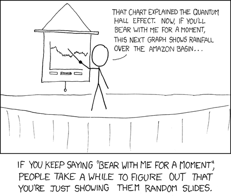

### Individual Viva Voce (25%) {sec-viva}

This viva-voce assessment is in place of a written final examination. Instead, we will have an exam by viva-voce during Week 13. We have opted for a viva-voce format with the hope of obtaining a more refined assessment of the students’ abilities, grasp of the topics and temperament. The main aspects being evaluated are: 

* **Basics**: Grasp of the basic ideas and skills encountered in the course. 
* **Simple Applications** : Simple applications of the concepts and skills encountered in the course. 
* **Advanced Applications** : More advanced uses of the ideas and skills encountered in the course. 
* **Extrapolate** : Ability to extend the ideas and knowledge encountered in the class, beyond the curriculum. 
* **Strategy** : Develop the skill to manage your time and use resources at your disposal to deliver an optimal presentation. 

The viva is Open Universe (i.e. you can bring any notes any material you like). This is an assessment of your ability to conduct a reasonable scientific discussion and not how much you can remember. 

### Group Presentations (25%) {sec-presentation}

```{r,echo=FALSE,fig.cap='From [xkcd](http://xkcd.com)',out.width='100%'}

```
Part of being a good scientist is the ability to communicate your ideas to others, clearly and succinctly.  This important science communication skill requires thought and a lot of practice.  We have, therefore incorporated a presentation into A2M. This is a group activity worth 25% of the final grade.

The experimental techniques of science are excellent examples of interdisciplinary collaboration.   Be it PCR, NMR, XRD or any of the wide range of techniques; there is always a lot of science, mathematics and engineering involved. Therefore, the focus of the A2M Presentations will be **experimental techniques**.

#### What you have to do {-}

```{r}
sd <- '<br>$-$\\quad'
```

**Pick an experimental technique** that your group thinks is important and worth learning. The only constraint is that the experimental technique must be related to a topic (e.g. waves, charge, fields) that was discussed in A2M.<br>Indicate your choice of technique at <a href='https://docs.google.com/spreadsheets/d/1Lfv6_zGpyMlymQlG2aOu4TH60hn6a5rWWt2g8uJomWw/edit?usp=sharing' target="_blank">this</a> Google sheet as soon as possible.

**Make a short, 3-minute video briefing** on your proposed presentation topic.
	<!-- * This presentation will take place *Friday 26th October*. -->
	
* You should submit this short video by (Week 10) Sunday 25 October.
* This short video should include:
	`r sd` Which technique you have picked.
	`r sd` Why you think the technique is important and worth learning.
  `r sd` How it is connected to the content of A2M.
  `r sd` A tentative plan for your presentation.
* This short presentation is to meant for us to provide feedback on your proposed topic.

**Deliver a 25-minute presentation** followed by a 10-minute Q & A session.

* This presentation will take place **Saturday 14th November**.
* This presentation should be targeted towards all your classmates.
* It should be structured to **teach** about the technique and its use. I.e. how it works, how it is useful.


#### Things to note{-}

*  Each group must pick its own technique; no duplication is allowed.
*  All members of the group must participate in the presentation and Q&A for the final presentation.
<!-- *  You may choose any mode of delivery of your choosing. -->
*  If you need to purchase any items for demonstrations or as props kindly speak to the lecturer or the mentors for help with this.


#### Some Tips {-}

* The number of slides should roughly be a slide per minute or less.
* Use the rubric to guide you.
* Don't be afraid to experiment.
* Keep things simple.
* Practice, practice, practice!