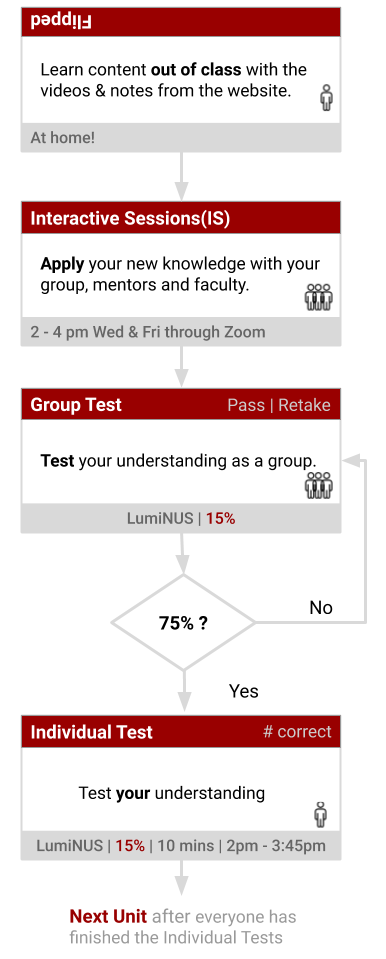
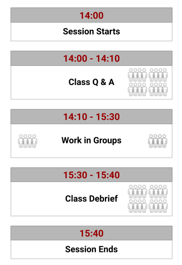

# Our Journey from A to M

```{r setup, include=FALSE}
library(msmbstyle)
# invalidate cache when the package version changes
knitr::opts_chunk$set(tidy = F, cache.extra = packageVersion('msmbstyle'), # msmb
                      echo = F, warning=F, cache=F, message=F, 
                      fig.margin = T)
options(htmltools.dir.version = FALSE)
library(reticulate)
use_python("/home/chammika/miniconda3/bin/python")
```

```{r input-index,child='_my-setup.Rmd'}
install.packages
```


<!-- Clark -->
<!-- ```{r setup, include=FALSE, cache=FALSE} -->
<!-- knitr::opts_chunk$set(echo = T, message=F, warning=F, error=F, comment=NA, R.options=list(width=220),   #code  -->
<!--                       dev.args=list(bg = 'transparent'), dev='svglite',                                 #viz -->
<!--                       fig.align='center', out.width='75%', fig.asp=.75,                  -->
<!--                       cache.rebuild=F, cache=T)                                                         #cache -->
<!-- ``` -->


> To see a World in a Grain of Sand<br>
And a Heaven in a Wild Flower<br>
Hold Infinity in the palm of your hand<br>
And Eternity in an hour

> `r tufte::quote_footer('Auguries of Innocence<br>--- William Blake ---')`

## Filipped Group based Mastery

University courses typically (traditionally) introduce new concepts in lectures, get you to practise applying these concepts with homework and discuss these during tutorials. We will **not** conduct A2M conduct this way. Instead, A2M will adopt a **flipped**, **grouped based mastery** approach. 
Here is what these terms mean and why they might be good for you.

### Flipped {-}

| What it means                                                | Why it might be good for you                                       |
| ------------------------------------------------------------ | ------------------------------------------------------------ |
| – Homework and lectures have switched places (flipped).<br />– You will learn new content out of class at a pace comfortable to you.<br />– You will learn to apply this knowledge in class with the support of the lecturer, mentors and classmates | – You are in control! You are not forced to follow the pace of the lecturer as in a typical lecture.<br />– Applying/using new knowledge is harder. This is where you need the most help. This will happen in the interactive sessions. |

### Mastery {-}

| What it means                                                | Why it might be good for you                                      |
| ------------------------------------------------------------ | ------------------------------------------------------------ |
| – You can proceed through the course after you have achieved a minimal level of mastery of a topic.<br />– The lecturer and mentors will keep supporting your learning until you and your team has achieved a satisfactory level of mastery. | – The focus is on achieving at least the minimum level of learning necessary for mastery.<br />– Your group will will have multiple opportunities to retake the mastery test. |

However, the maximum score will decrease as you retake the group test. This is to discourage randomly picking answers until you pass.

### Groups {-}

```{marginfigure,echo=T}
"*I couldn’t do it. I couldn’t reduce it to the freshman level. That means we don’t really understand it.* (Richard Feynman)"
```


| What it means                                                | Why it might be good for you                                       |
| ------------------------------------------------------------ | ------------------------------------------------------------ |
| – The different approaches and different perspectives of different individuals (mentors, teammates and lecturer) will be incorporated into your learning. <br />– You will proceed through A2M as a group. | – Instead of passively retaining what we have learnt, we will attempt to use our learning to solve problems.<br />– Explaining things to others will strengthen your own understanding. |

`r cap <- 'Typical workflow for a chpater. You are expected to complete each chapter as a group at a pace comfortable to all the group members'`


```{r fig-unit-flow, fig.margin = T, fig.cap=cap,out.width='85%' }

```

## How to take the course

The content of A2M has been structures into 13 units as shown below. You are to study these units with your groups according scheme shown in the flowchart of figure \@ref(fig:fig-unit-flow). 

```{r tab-table-of-units,fig.cap="The learning units for the flipped group based mastery A2M.",eval=T}
library(readr)
library(kableExtra)

col_types <- cols(
  Order = col_double(),
  Name = col_character(),
  When = col_character()
)
a2m_units <- read_csv("my-files/a2m-units.csv",col_types = col_types)

a2m_units %>%
  kable() %>%
  kable_styling(full_width = F,position = "left") %>%
  row_spec(8:14,  background = "#eeeeee") %>%
  collapse_rows()
```


### Interactive Sessions (IS)

```{r fig-class-flow,fig.cap="Typical workflow of a session.", out.width='40%', fig.margin=F}

```

The ISs on Wednesdays and Fridays will have additional activities related to the content of the unit. You need to work on these activities collectively as a group, with the guidance of the mentors and staff. The typical workflow for an IS is shown in figure \@ref(fig:fig-class-flow). You do **not** have to finish a unit it a single session. Take it at a pace, comfortable for **everyone** in the group. When the group is confident you have understood the concepts in the unit, you can take the **Group Test**

#### Learning by Teaching {-}

At this point, allow me to highlight the value of **'learning by teaching'**. There is a growing body of scientific evidence (e.g. @Kobayashi2019, @Koh2018) that indicates teaching allows the **teacher** to understand and retain a topic better. Also, renowned teachers such as Richard Feynman have said that if you cannot simplify an explanation, then perhaps you haven't understood the subject well enough (see the quote in the sidebar).  So, please bear this in mind when you work in your group. The more you help others understand, the more you deepen **your** understanding.

### Group Test

The Group Test will be available in LumiNUS. We will (randomly) assign one person to key in the answers, on behalf of the group. **Every member in the group must be involved in working on the test**. There is **no** time limit for the Group Test. 

On completion of the Group Test, the result (Pass or Retake) will be shown on the display board. You will have to retake the test if your group scores less than 75%. Once you finish the Group Test, everyone can proceed to the **Individual Test**.

### Individual Test

The Individual Test is a short **timed** test taken individually. This will be available only after your group has completed the Group Test. Your group can proceed to the next unit, once **everyone** has finished the Individual Tests.


### Important Features

**Please** keep in mind:

- **You are in control**: The setup allows a lot of freedom for you to take responsibility for your learning. Please exercise this privilege.
- **Focus on understanding**: Know that the focus of this course is on understanding and applying (not memorising and regurgitating).
- **Use the support structures**: We have put in place several support structures (dedicated staff and mentors, online videos and notes, questioning and feedback) to aid your learning. So, please use them until you are convinced you have learnt.

## Mathematics in A2M

 > "The miracle of the appropriateness of the language of mathematics to the formulation of the laws of physics is a wonderful gift which we neither understand nor deserve". 

> `r tufte::quote_footer('--- Eugene Wigner')`

The use of mathematics is inevitable on a quantum journey such as A2M. I understand that some of you might find the use of math, daunting. So, please allow me to share a slightly different perspective of mathematics that might help you.

Mathematics is a language! It is a language that is compact, efficient and exquisitely elegant. Like any other language, Mathematics tells stories. However, Mathematics is a language that can open the door to a whole cognitive realm (Watch the TED talk by Lera Boroditsky).
It is essential to realise that knowing mathematics is not necessarily the same as being able to derive fancy equations. If you are not Math or Physics major, it is often sufficient to understand the essence of the mathematical concept (e.g. what differentiation is telling us about the variables). You can then get software^[Mathematica, Maple, Wolfram Alpha, SymPy, MATLAB] to do the mechanical manipulation.

So, when you are using Mathematics **always focus** on asking **what stories equations are telling us**. Every time you write a mathematical equation, ask your self what story are you are saying.

```{r embed-video-Boroditsky, out.extra='style="border: none;"', out.width='99%', fig.cap="How language shapes the way we think.", echo = FALSE,fig.margin=T}
knitr::include_url('https://embed.ted.com/talks/lera_boroditsky_how_language_shapes_the_way_we_think')
```

## My 3 Cents worth
* Mathematics is a language that is worth learning because it will allow you to think of the world differently. What is essential (if you are not from Physics or Maths) is to focus on the essence of the concept and leave the mechanical manipulation to software (or hire a chimp).

* The best way to learn is to teach. The more ways you see a topic; the more ways you understand it.

* We have gone to extraordinary lengths to give you control of the pace of learning and to provide a support structure. Please make the most of them.